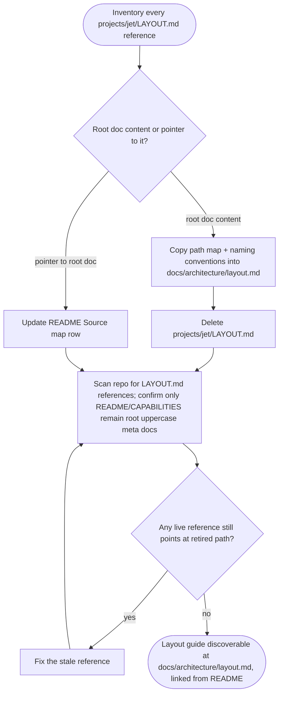

# jet: move root layout meta doc into scoped architecture documentation

## Logic
<!-- type: logic lang: mermaid -->


## Config
<!-- type: config lang: yaml -->

```yaml
meta_doc_migration:
  project: jet
  legacy_doc_path: projects/jet/LAYOUT.md
  canonical_doc_path: projects/jet/docs/architecture/layout.md
  preserved_content:
    - top_level_path_map
    - crate_package_naming_conventions
    - two_halves_of_jet_table
    - parity_workspace_table
  pointer_updates:
    - path: projects/jet/README.md
      location: "Source map table"
      from: "`projects/jet/LAYOUT.md`"
      to: "`projects/jet/docs/architecture/layout.md`"
  remaining_root_uppercase_meta_docs:
    - projects/jet/README.md
  verification:
    local_checks:
      - aw td check projects/jet/tech-design/logic/move-root-layout-meta-doc-into-scoped-architecture-documentation.md
      - aw capability report --project jet
    stale_source_scan:
      command: rg -n "projects/jet/LAYOUT.md" --glob '!projects/jet/tech-design/**'
      allowed_contexts:
        - projects/jet/tech-design (historical TD text that explicitly names the retired root doc)
```

## Unit Test
<!-- type: unit-test lang: mermaid -->

```mermaid
---
id: jet-project-architecture-and-authoring-clarity-verification
requirements:
  legacy_root_doc_removed:
    id: R1
    text: "projects/jet/LAYOUT.md no longer exists as a project-root uppercase meta doc."
    kind: functional
    risk: medium
    verify: test ! -e projects/jet/LAYOUT.md
  no_new_root_uppercase_meta_doc_introduced:
    id: R5
    text: "No new project-root uppercase meta doc replaces projects/jet/LAYOUT.md; README.md and CAPABILITIES.md remain the only Jet project-root uppercase meta docs."
    kind: regression
    risk: low
    verify: find projects/jet -maxdepth 1 -regex '.*/[A-Z][A-Z_-]*\.md'
  no_stale_root_doc_references_remain:
    id: R4
    text: "No live reference outside the TD historical record still points at the retired projects/jet/LAYOUT.md path."
    kind: regression
    risk: medium
    verify: ! rg -n "projects/jet/LAYOUT.md" --glob '!projects/jet/tech-design/**'
  readme_source_map_repointed:
    id: R3
    text: "The Jet README Source map row references projects/jet/docs/architecture/layout.md instead of the retired projects/jet/LAYOUT.md path."
    kind: regression
    risk: medium
    verify: grep -q 'projects/jet/docs/architecture/layout.md' projects/jet/README.md
  scoped_doc_preserves_content:
    id: R2
    text: "projects/jet/docs/architecture/layout.md exists and preserves the top-level path map and crate/package naming conventions from the retired root doc."
    kind: functional
    risk: high
    verify: test -e projects/jet/docs/architecture/layout.md && grep -q 'Cargo package name' projects/jet/docs/architecture/layout.md
---
flowchart TD
    r1[R1 legacy root doc removed] --> test_e_projects_jet_layout_md[test ! -e projects/jet/LAYOUT.md]
    r2[R2 scoped doc preserves content] --> test_e_projects_jet_docs_architecture_layout_md_grep_q_cargo_package_name_projects_jet_docs_architecture_layout_md[test -e projects/jet/docs/architecture/layout.md && grep -q 'Cargo package name' projects/jet/docs/architecture/layout.md]
    r3[R3 readme source map repointed] --> grep_q_projects_jet_docs_architecture_layout_md_projects_jet_readme_md[grep -q 'projects/jet/docs/architecture/layout.md' projects/jet/README.md]
    r4[R4 no stale root doc references remain] --> rg_n_projects_jet_layout_md_glob_projects_jet_tech_design[! rg -n "projects/jet/LAYOUT.md" --glob '!projects/jet/tech-design/**']
    r5[R5 no new root uppercase meta doc introduced] --> find_projects_jet_maxdepth_1_regex_a_z_a_z_md[find projects/jet -maxdepth 1 -regex '.*/[A-Z][A-Z_-]*\.md']
```

## Changes
<!-- type: changes lang: yaml -->

```yaml
changes:
  - path: projects/jet/docs/architecture/layout.md
    action: create
    section: logic
    impl_mode: hand-written
    reason: "Scoped home for the layout path-role map and crate/package naming conventions, replacing the project-root uppercase meta doc; content copied verbatim from the retired projects/jet/LAYOUT.md."
  - path: projects/jet/LAYOUT.md
    action: delete
    section: logic
    impl_mode: hand-written
    reason: "Removes the project-root uppercase meta doc once its content is preserved at the scoped docs/architecture/layout.md path, per WI #1169 acceptance criteria."
  - path: projects/jet/README.md
    action: update
    section: config
    impl_mode: hand-written
    reason: "Repoints the Source map table row from projects/jet/LAYOUT.md to projects/jet/docs/architecture/layout.md and registers the jet-project-architecture-and-authoring-clarity capability (Capability Index row + H3 field-style section + work-root table) so the migration is capability-tracked; already applied ahead of this TD per standard aw-td-writer capability-registration practice."
```
