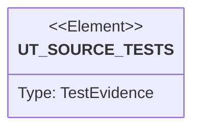

# Semantic TD: jet/tests/codegen

## Schema
<!-- type: schema lang: yaml -->

```yaml
semantic_domain:
  key: "jet/tests/codegen"
  source_group: "projects/jet/tests/codegen"
  coverage_kind: semantic
  evidence:
    source_units:
      - path: "projects/jet/tests/codegen/openapi_golden.rs"
        language: "rust"
        ownership_state: "handwrite"
        generator_primitives: ["service_method", "test_case"]
        symbols:
          - name: "full_opts"
            kind: "function"
            public: false
          - name: "file"
            kind: "function"
            public: false
          - name: "minimal_matches_golden_snapshots"
            kind: "function"
            public: false
          - name: "axios_backend_matches_golden_and_is_surface_invariant"
            kind: "function"
            public: false
          - name: "generation_is_deterministic"
            kind: "function"
            public: false
          - name: "openapi_31_nullable_and_compositions"
            kind: "function"
            public: false
          - name: "openapi_30_petstore_shapes"
            kind: "function"
            public: false
          - name: "generated_typescript_typechecks"
            kind: "function"
            public: false
          - name: "tool_available"
            kind: "function"
            public: false
        source_evidence_node:
          layer: "backend"
          ecosystem: "rust"
          role: "test"
          section_type: "unit-test"
          domain: "projects/jet/tests/codegen"
```

## Unit Test
<!-- type: unit-test lang: mermaid -->



## Changes
<!-- type: changes lang: yaml -->

```yaml
coverage_kind: semantic
changes:
  - path: "projects/jet/tests/codegen/openapi_golden.rs"
    action: modify
    section: schema
    description: |
      Existing source behavior is covered by this feature/domain semantic TD.
    impl_mode: hand-written
    replaces:
      - "<handwrite-tracker:projects-jet-tests-codegen-openapi-golden-rs>"
```
