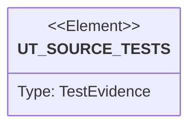

# Semantic TD: jet/tests/harness

## Schema
<!-- type: schema lang: yaml -->

```yaml
semantic_domain:
  key: "jet/tests/harness"
  source_group: "projects/jet/tests/harness"
  coverage_kind: semantic
  evidence:
    source_units:
      - path: "projects/jet/tests/harness/mod.rs"
        language: "rust"
        ownership_state: "handwrite"
        generator_primitives: ["data_model", "service_method", "test_case"]
        symbols:
          - name: "repo_root"
            kind: "function"
            public: true
          - name: "tool_available"
            kind: "function"
            public: true
          - name: "require_tools"
            kind: "function"
            public: true
          - name: "ensure_release_jet"
            kind: "function"
            public: true
          - name: "GateRun"
            kind: "struct"
            public: true
          - name: "run_evidence_script"
            kind: "function"
            public: true
          - name: "evidence_path"
            kind: "function"
            public: true
          - name: "run_stdout_report_script"
            kind: "function"
            public: true
          - name: "assert_checks_green"
            kind: "function"
            public: true
        source_evidence_node:
          layer: "backend"
          ecosystem: "rust"
          role: "test"
          section_type: "unit-test"
          domain: "projects/jet/tests/harness"
```

## Unit Test
<!-- type: unit-test lang: mermaid -->



## Changes
<!-- type: changes lang: yaml -->

```yaml
coverage_kind: semantic
changes:
  - path: "projects/jet/tests/harness/mod.rs"
    action: modify
    section: schema
    description: |
      Existing source behavior is covered by this feature/domain semantic TD.
    impl_mode: hand-written
    replaces:
      - "<handwrite-tracker:jet-tests-harness>"
  - path: "projects/jet/tests/harness/mod.rs"
    action: verify
    section: unit-test
    description: |
      Preserve the observed test-harness source-test evidence graph while
      semantic coverage is promoted toward deterministic generator primitives.
    impl_mode: hand-written
```
