# jet stories: close epic #1001 AC2/AC3 — README parity evidence + TD source_units + fixture suite

## Logic

```mermaid
---
id: jet-stories-close-epic-1001-ac2-ac3-flow
entry: audit_closed_wis
nodes:
  audit_closed_wis:
    kind: start
    label: "Audit epic #1001's 15 closed member WIs (#981,\n#987-#1000, landed via PR #1070) for the concrete\ntest paths each one actually added"
  classify_area:
    kind: decision
    label: "Does an existing cargo test already prove this\nfeature area (decorators/parameters/globals/loaders,\ncontrols, toolbar, measure/outline/highlight, actions,\ninteractions/play, a11y, story source, autodocs, MDX,\nmanager UX, index.json, headless test runner)?"
  cite_existing:
    kind: process
    label: "Cite the concrete test path: csf.rs::tests::\nparses_render_path_core_fields (decorators/\nparameters/globals/globalTypes/loaders/autodocs tag);\nstories_build.rs::static_manager_keeps_dev_feature_\nparity_checklist (toolbar/controls/actions/\ninteractions/a11y/source/docs/search/theme/index.json);\nmanager.rs::tests::manager_toolbar_renders_viewport_\nbackground_zoom_and_custom_parameters (toolbar+\nmeasure+outline+shortcuts); mdx.rs::tests::\ncompiles_core_doc_blocks + stories_build.rs::\nmdx_docs_pages_render_core_blocks_in_static_export\n(MDX); cli.rs run_stories_smoke_tests / `jet test\n--stories` (headless-Chromium play() runner)"
  gap_found:
    kind: process
    label: "GAP: no in-repo evidence proves decorators + a\nplay() interaction + argTypes overrides + an MDX\ndocs page compile and wire together for ONE story -\nonly the external, manually-run Storybook oracle\nharness (compare_storybook_oracle.mjs) exercises\nthis combination"
  more_areas:
    kind: decision
    label: "More feature areas left to classify?"
  rewrite_readme:
    kind: process
    label: "Rewrite README.md's Component Workbench summary\nrow + detailed Promise/Gate Inventory/EC Dimensions\nto enumerate the full shipped surface with the\ncataloged test-path citations"
  update_schema:
    kind: process
    label: "Add mdx.rs and optimizer.rs entries (symbols +\nownership_state) to jet-stories.md's schema\nsource_units list"
  design_fixture:
    kind: process
    label: "Design one small in-repo fixture (Widget.tsx +\nWidget.stories.tsx with decorators + argTypes\noverride + play() + Widget.mdx docs page) under\ntests/stories/fixtures/parity/, closing the gap\nfound above"
  add_fixture_test:
    kind: process
    label: "Author tests/stories/parity_fixture.rs asserting\nbuild_stories_static compiles the fixture with zero\ndiagnostics, the emitted module preserves the\ndecorators/argTypes/play source text, and the MDX\ndocs page wires to the Interactive story"
  verify:
    kind: process
    label: "cargo test -p jet --test stories_parity_fixture;\ngrep source_units for mdx.rs/optimizer.rs; aw td\ncheck; aw capability report --project jet"
  done:
    kind: terminal
    label: "README enumerates the full parity surface with\nconcrete citations; jet-stories.md source_units\nlist is complete; a passing in-repo fixture proves\ndecorators+play+argTypes+MDX work together without\nan external Storybook install"
edges:
  - { from: audit_closed_wis, to: classify_area }
  - { from: classify_area, to: cite_existing, label: "yes" }
  - { from: classify_area, to: gap_found, label: "no (combined play scenario)" }
  - { from: cite_existing, to: more_areas }
  - { from: gap_found, to: more_areas }
  - { from: more_areas, to: classify_area, label: "yes" }
  - { from: more_areas, to: rewrite_readme, label: "no" }
  - { from: rewrite_readme, to: update_schema }
  - { from: update_schema, to: design_fixture }
  - { from: design_fixture, to: add_fixture_test }
  - { from: add_fixture_test, to: verify }
  - { from: verify, to: done }
---
flowchart TD
    audit_closed_wis([Audit epic #1001's 15 closed member WIs for concrete test paths added]) --> classify_area{Does an existing cargo test already prove this feature area?}
    classify_area -->|yes| cite_existing[Cite the concrete existing test path per feature area]
    classify_area -->|no combined play scenario| gap_found[GAP: no in-repo evidence proves decorators+play+argTypes+MDX together]
    cite_existing --> more_areas{More feature areas left to classify?}
    gap_found --> more_areas
    more_areas -->|yes| classify_area
    more_areas -->|no| rewrite_readme[Rewrite README Component Workbench row + detailed block with cataloged citations]
    rewrite_readme --> update_schema[Add mdx.rs and optimizer.rs to jet-stories.md source_units]
    update_schema --> design_fixture[Design decorators+argTypes+play+MDX fixture under tests/stories/fixtures/parity/]
    design_fixture --> add_fixture_test[Author tests/stories/parity_fixture.rs static-build verification]
    add_fixture_test --> verify[cargo test; grep source_units; aw td check; aw capability report]
    verify --> done([README enumerates full surface; source_units complete; fixture passes])
```

<!-- type: logic lang: mermaid -->



## Config
<!-- type: config lang: yaml -->

```yaml
readme_parity_evidence:
  target: "projects/jet/README.md"
  capability: "component-workbench"
  action: "rewrite summary row + detailed Gate Inventory / EC Dimensions block"
  feature_area_citations:
    decorators_parameters_globals_loaders_autodocs:
      test: "projects/jet/src/stories/csf.rs::tests::parses_render_path_core_fields"
    controls_toolbar_actions_interactions_a11y_source_docs_search_theme_index_json:
      test: "projects/jet/tests/stories/stories_build.rs::static_manager_keeps_dev_feature_parity_checklist"
    toolbar_measure_outline_highlight_zoom_shortcuts:
      test: "projects/jet/src/stories/manager.rs::tests::manager_toolbar_renders_viewport_background_zoom_and_custom_parameters"
    mdx_docs_page_compile:
      test: "projects/jet/src/stories/mdx.rs::tests::compiles_core_doc_blocks"
    mdx_docs_page_static_export:
      test: "projects/jet/tests/stories/stories_build.rs::mdx_docs_pages_render_core_blocks_in_static_export"
    headless_interactions_play_runner:
      test: "projects/jet/src/cli.rs::run_stories_smoke_tests (invoked by `jet test --stories`)"
  gate_inventory_replacement: "stale 5-test Gate Inventory is replaced by the six citations above, one row per feature area, superseding the pre-epic-1001 CSF/manager/HMR/Controls/static-export-only listing"
schema_source_units_update:
  target: "projects/jet/tech-design/semantic/jet-stories.md"
  section_path: "schema.semantic_domain.evidence.source_units"
  add:
    - path: "projects/jet/src/stories/mdx.rs"
      language: "rust"
      ownership_state: "handwrite"
      reason: "MDX docs-page compiler added by epic #1001 (#996); missing from source_units despite being covered by tests/compiles_core_doc_blocks and stories_build.rs::mdx_docs_pages_render_core_blocks_in_static_export."
    - path: "projects/jet/src/stories/optimizer.rs"
      language: "rust"
      ownership_state: "handwrite"
      reason: "Stories-mode dependency optimizer added by epic #1001; already carries an explicit HANDWRITE gap marker (missing-generator:logic:stories-dep-optimizer) in-source but was never registered in the semantic schema's source_units list."
parity_fixture_suite:
  root: "projects/jet/tests/stories/fixtures/parity/"
  files:
    - path: "projects/jet/tests/stories/fixtures/parity/Widget.tsx"
      role: "minimal React component under test (props surface for argTypes override)"
    - path: "projects/jet/tests/stories/fixtures/parity/Widget.stories.tsx"
      role: "CSF story file: default export decorators + one Interactive story with an argTypes override and a play() interaction"
    - path: "projects/jet/tests/stories/fixtures/parity/Widget.mdx"
      role: "MDX docs page wired to the Interactive story via <Story of={...} />"
  verifying_test: "projects/jet/tests/stories_parity_fixture.rs"
  verifying_test_assertions:
    - "build_stories_static compiles the fixture with zero diagnostics"
    - "the emitted static module preserves the decorators/argTypes/play() source text verbatim"
    - "the MDX docs page's compiled output wires to the Interactive story (docs_pages() resolves the story ref)"
  verification_commands:
    - "cargo test -p jet --test stories_parity_fixture"
    - "rg -n 'mdx.rs|optimizer.rs' projects/jet/tech-design/semantic/jet-stories.md"
    - "aw td check projects/jet/tech-design/validate/jet-stories-close-epic-1001-ac2-ac3-readme-parity-evidence-td-so.md"
```

## Unit Test
<!-- type: unit-test lang: mermaid -->

```mermaid
---
id: jet-stories-close-epic-1001-ac2-ac3-verification
requirements:
  no_stale_pre_epic_only_gate_inventory_remains:
    id: R6
    text: "README no longer describes the Component Workbench capability as only pre-epic scope (CSF discovery/manager/HMR/Controls/static export) with a stale 5-test Gate Inventory."
    kind: regression
    risk: low
    verify: aw capability report --project jet
  parity_fixture_files_exist:
    id: R3
    text: "The parity fixture suite (Widget.tsx, Widget.stories.tsx with decorators+argTypes+play(), Widget.mdx) exists under tests/stories/fixtures/parity/."
    kind: functional
    risk: medium
    verify: test -e projects/jet/tests/stories/fixtures/parity/Widget.tsx && test -e projects/jet/tests/stories/fixtures/parity/Widget.stories.tsx && test -e projects/jet/tests/stories/fixtures/parity/Widget.mdx
  parity_fixture_preserves_source_semantics:
    id: R5
    text: "The static build output for the fixture preserves the decorators, argTypes override, and play() call source text verbatim, and the MDX docs page resolves to the Interactive story."
    kind: regression
    risk: medium
    verify: cargo test -p jet --test stories_parity_fixture -- --nocapture
  parity_fixture_test_passes:
    id: R4
    text: "tests/stories_parity_fixture.rs asserts build_stories_static compiles the fixture with zero diagnostics and passes."
    kind: functional
    risk: high
    verify: cargo test -p jet --test stories_parity_fixture
  readme_gate_inventory_cites_feature_area_tests:
    id: R1
    text: "projects/jet/README.md Component Workbench detailed block cites at least the six concrete test paths for decorators/globals/loaders/autodocs, controls/toolbar/actions/interactions/a11y/source/docs/search/theme/index.json, toolbar measure/outline/zoom, MDX compile, MDX static export, and the headless play() runner."
    kind: functional
    risk: medium
    verify: grep -c 'parses_render_path_core_fields\|static_manager_keeps_dev_feature_parity_checklist\|manager_toolbar_renders_viewport_background_zoom_and_custom_parameters\|compiles_core_doc_blocks\|mdx_docs_pages_render_core_blocks_in_static_export\|run_stories_smoke_tests' projects/jet/README.md
  schema_source_units_include_mdx_and_optimizer:
    id: R2
    text: "jet-stories.md's schema source_units list includes both mdx.rs and optimizer.rs entries."
    kind: functional
    risk: medium
    verify: grep -c 'projects/jet/src/stories/mdx.rs\|projects/jet/src/stories/optimizer.rs' projects/jet/tech-design/semantic/jet-stories.md
---
flowchart TD
    r1[R1 readme gate inventory cites feature area tests] --> grep_c_parses_render_path_core_fields_static_manager_keeps_dev_feature_parity_checklist_manager_toolbar_renders_viewport_background_zoom_and_custom_parameters_compiles_core_doc_blocks_mdx_docs_pages_render_core_blocks_in_static_export_run_stories_smoke_tests_projects_jet_readme_md[grep -c 'parses_render_path_core_fields\|static_manager_keeps_dev_feature_parity_checklist\|manager_toolbar_renders_viewport_background_zoom_and_custom_parameters\|compiles_core_doc_blocks\|mdx_docs_pages_render_core_blocks_in_static_export\|run_stories_smoke_tests' projects/jet/README.md]
    r2[R2 schema source units include mdx and optimizer] --> grep_c_projects_jet_src_stories_mdx_rs_projects_jet_src_stories_optimizer_rs_projects_jet_tech_design_semantic_jet_stories_md[grep -c 'projects/jet/src/stories/mdx.rs\|projects/jet/src/stories/optimizer.rs' projects/jet/tech-design/semantic/jet-stories.md]
    r3[R3 parity fixture files exist] --> test_e_projects_jet_tests_stories_fixtures_parity_widget_tsx_test_e_projects_jet_tests_stories_fixtures_parity_widget_stories_tsx_test_e_projects_jet_tests_stories_fixtures_parity_widget_mdx[test -e projects/jet/tests/stories/fixtures/parity/Widget.tsx && test -e projects/jet/tests/stories/fixtures/parity/Widget.stories.tsx && test -e projects/jet/tests/stories/fixtures/parity/Widget.mdx]
    r4[R4 parity fixture test passes] --> cargo_test_p_jet_test_stories_parity_fixture[cargo test -p jet --test stories_parity_fixture]
    r5[R5 parity fixture preserves source semantics] --> cargo_test_p_jet_test_stories_parity_fixture_nocapture[cargo test -p jet --test stories_parity_fixture -- --nocapture]
    r6[R6 no stale pre epic only gate inventory remains] --> aw_capability_report_project_jet[aw capability report --project jet]
```

## Changes
<!-- type: changes lang: yaml -->

```yaml
changes:
  - path: projects/jet/README.md
    action: update
    section: config
    impl_mode: hand-written
    reason: "Rewrite the Component Workbench (Stories) summary row and detailed Promise/Gate Inventory/EC Dimensions block to enumerate the full shipped parity surface (decorators/parameters/globals/loaders/autodocs, controls, toolbar, measure/outline/highlight, actions, interactions/play, a11y, story source, MDX, manager UX, index.json, headless test runner) citing the six concrete test paths captured in this TD's Config section, replacing the stale pre-epic-1001 5-test Gate Inventory."
  - path: projects/jet/tech-design/semantic/jet-stories.md
    action: update
    section: config
    impl_mode: hand-written
    reason: "Add mdx.rs and optimizer.rs entries to the schema section's source_units list (path/language/ownership_state/generator_primitives/symbols/source_evidence_node, matching the existing csf.rs/manager.rs entry shape), closing AC2."
  - path: projects/jet/tests/stories/fixtures/parity/Widget.tsx
    action: create
    section: config
    impl_mode: hand-written
    reason: "Minimal React component fixture exposing a props surface (a string label prop + a numeric count prop) for the parity fixture's argTypes override and Controls-panel exercise."
  - path: projects/jet/tests/stories/fixtures/parity/Widget.stories.tsx
    action: create
    section: config
    impl_mode: hand-written
    reason: "CSF story file for Widget.tsx: default-export meta with a decorator (wrapping preview markup) and an Interactive named-export story carrying an argTypes override plus a play() interaction, combining the three feature areas the epic #1001 external Storybook oracle harness alone previously covered."
  - path: projects/jet/tests/stories/fixtures/parity/Widget.mdx
    action: create
    section: config
    impl_mode: hand-written
    reason: "MDX docs page wired to the Interactive story via a Story doc-block reference, giving in-repo evidence that decorators + play + argTypes + MDX compile and wire together for one story, closing the epic #1001 AC2 in-repo-evidence gap without an external Storybook install."
  - path: projects/jet/tests/stories_parity_fixture.rs
    action: create
    section: unit-test
    impl_mode: hand-written
    reason: "Verifying test asserting build_stories_static compiles the Widget parity fixture with zero diagnostics, the emitted static module preserves the decorators/argTypes/play() source text verbatim, and the MDX docs page's compiled output resolves to the Interactive story — the concrete proof for AC3 and requirements R3-R5."
```
