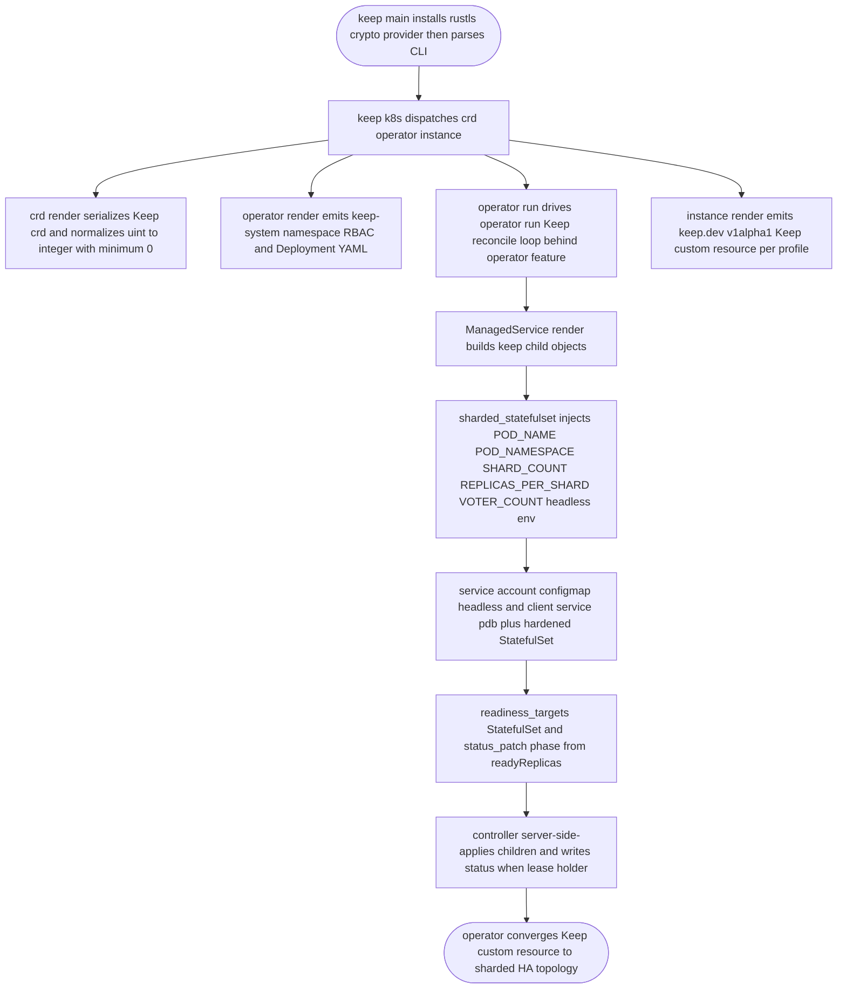

## Logic
<!-- type: logic lang: mermaid -->



## Unit Test

```mermaid
---
id: keep-operator-adoption-tests
requirements:
  crd_flatten:
    id: R1
    text: "KeepSpec flattens operator::ClusterSpec so the CRD schema carries image, imagePullPolicy, shardCount, replicasPerShard, voterCount, and resources."
    kind: behavior
    risk: medium
    verify: test
  render_downward_api:
    id: R2
    text: "ManagedService for Keep renders the sharded StatefulSet whose container env carries the downward-API quartet plus headless service env raft-host consumes, with replicas = shardCount * replicasPerShard, and status_patch derives phase from readyReplicas."
    kind: behavior
    risk: high
    verify: test
  k8s_cli:
    id: R3
    text: "keep k8s crd render, operator render and run, and instance render --profile parse and dispatch, with operator run gated behind the operator feature."
    kind: behavior
    risk: medium
    verify: test
  crd_openapi_compat:
    id: R4
    text: "The generated CRD is Kubernetes-OpenAPI compatible: no format uint32 or uint64 remains and unsigned integer fields keep minimum 0."
    kind: behavior
    risk: high
    verify: test
  rustls_provider:
    id: R5
    text: "The process-level rustls crypto provider install is idempotent and safe to call before command parsing."
    kind: behavior
    risk: medium
    verify: test
elements:
  operator_tests:
    kind: test
    path: projects/keep/tests/operator.rs
  keep_cli:
    kind: test
    path: projects/keep/src/bin/keep.rs
relations:
  - { from: operator_tests, verifies: crd_flatten }
  - { from: operator_tests, verifies: render_downward_api }
  - { from: operator_tests, verifies: crd_openapi_compat }
  - { from: operator_tests, verifies: rustls_provider }
  - { from: keep_cli, verifies: k8s_cli }
---
requirementDiagram
    requirement R1 {
      id: R1
      text: "KeepSpec flattens ClusterSpec"
      risk: medium
      verifymethod: test
    }
    requirement R2 {
      id: R2
      text: "render downward-api statefulset"
      risk: high
      verifymethod: test
    }
    requirement R3 {
      id: R3
      text: "keep k8s cli verbs"
      risk: medium
      verifymethod: test
    }
    requirement R4 {
      id: R4
      text: "crd openapi compatible"
      risk: high
      verifymethod: test
    }
    requirement R5 {
      id: R5
      text: "rustls crypto provider install"
      risk: medium
      verifymethod: test
    }
    element operator_tests {
      type: "rs/#[test]"
    }
    element keep_cli {
      type: "rs/#[test]"
    }
    operator_tests - verifies -> R1
    operator_tests - verifies -> R2
    operator_tests - verifies -> R4
    operator_tests - verifies -> R5
    keep_cli - verifies -> R3
```

<!-- type: unit-test lang: mermaid -->



## Changes
<!-- type: changes lang: yaml -->

```yaml
changes:
  - path: projects/keep/Cargo.toml
    action: modify
    section: logic
    impl_mode: hand-written
    description: "Add the operator feature and its optional deps (kube, k8s-openapi, schemars, operator, serde_yaml, rustls); wire a private rustls-provider feature enabled by operator/raft/client/self-update/issue."
  - path: projects/keep/src/lib.rs
    action: modify
    section: logic
    impl_mode: hand-written
    description: "Declare pub mod tls (always) and #[cfg(feature = operator)] pub mod operator."
  - path: projects/keep/src/tls.rs
    action: create
    section: logic
    impl_mode: hand-written
    description: "install_default_crypto_provider: once-guarded aws_lc_rs rustls provider install, compiled real behind the rustls-provider feature and a no-op otherwise."
  - path: projects/keep/src/operator/mod.rs
    action: create
    section: logic
    impl_mode: hand-written
    description: "operator module root: crd_yaml() that serializes the Keep CRD and normalizes uint formats, plus re-exports of Keep/KeepSpec/KeepStatus and run."
  - path: projects/keep/src/operator/crd.rs
    action: create
    section: logic
    impl_mode: hand-written
    description: "KeepSpec (#[serde(flatten)] cluster: operator::ClusterSpec + keep engineShards/logLevel/graceSecs/storage/storageClass), the Keep CustomResource (keep.dev/v1alpha1), and KeepStatus."
  - path: projects/keep/src/operator/render.rs
    action: create
    section: logic
    impl_mode: hand-written
    description: "render(&Keep) -> Vec<Value>: service_account, keep ConfigMap, sharded_statefulset (downward-API env + /data PVC) hardened with probes/securityContext/tmp, headless + client Service, and PDB via operator::render helpers."
  - path: projects/keep/src/operator/reconcile.rs
    action: create
    section: logic
    impl_mode: hand-written
    description: "impl operator::ManagedService for Keep (MANAGER, render, readiness_targets = StatefulSet, status_patch) and pub async fn run() = operator::run::<Keep>()."
  - path: projects/keep/src/bin/keep.rs
    action: modify
    section: logic
    impl_mode: hand-written
    description: "Call keep::tls::install_default_crypto_provider() before Cli::parse(); add the K8s command tree (crd render, operator render|run, instance render --profile dev|staging|prod|template) with operator run gated behind the operator feature; add CLI parse tests for the new verbs."
  - path: projects/keep/k8s/operator/crd.yaml
    action: create
    section: logic
    impl_mode: hand-written
    description: "Generated Keep CustomResourceDefinition, checked in so `keep k8s crd render` works without the operator feature (include_str fallback)."
  - path: projects/keep/k8s/operator/rbac.yaml
    action: create
    section: logic
    impl_mode: hand-written
    description: "keep-system Namespace, operator ServiceAccount, ClusterRole (keeps + status, statefulsets, services/configmaps/serviceaccounts, poddisruptionbudgets, leases) and ClusterRoleBinding."
  - path: projects/keep/k8s/operator/deployment.yaml
    action: create
    section: logic
    impl_mode: hand-written
    description: "Operator controller Deployment running `keep k8s operator run` from the keep image with downward-API POD_NAME/POD_NAMESPACE for leader election."
  - path: projects/keep/k8s/operator/kustomization.yaml
    action: create
    section: logic
    impl_mode: hand-written
    description: "Kustomization installing crd.yaml + rbac.yaml + deployment.yaml for the operator control plane."
  - path: projects/keep/tests/operator.rs
    action: create
    section: unit-test
    impl_mode: hand-written
    description: "operator-feature integration tests: R1 CRD flatten schema, R2 render downward-API StatefulSet + replicas + status phase, R4 no uint32/uint64 with minimum 0, R5 idempotent rustls provider install."
```
