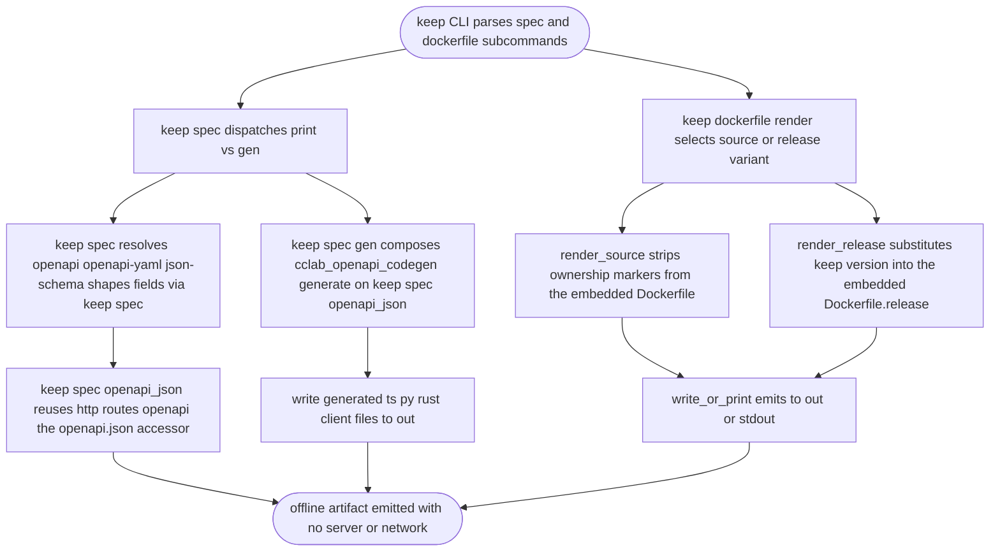
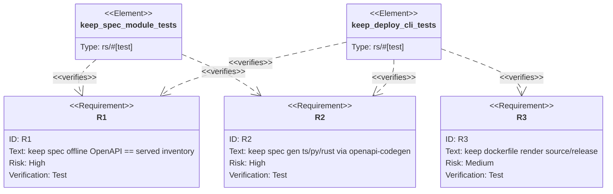

## Logic
<!-- type: logic lang: mermaid -->



## Unit Test
<!-- type: unit-test lang: mermaid -->



## Changes
<!-- type: changes lang: yaml -->

```yaml
changes:
  - path: projects/keep/Cargo.toml
    action: modify
    section: logic
    impl_mode: hand-written
    description: "Add the cclab-openapi-codegen dependency (always linked, for keep spec gen) and make serde_yaml a non-optional dependency (keep spec --format openapi-yaml always works); drop dep:serde_yaml from the operator feature list."
  - path: projects/keep/src/lib.rs
    action: modify
    section: logic
    impl_mode: hand-written
    description: "Declare pub mod spec so the offline self-description surface is reachable from the binary and tests."
  - path: projects/keep/src/spec.rs
    action: create
    section: logic
    impl_mode: hand-written
    description: "New offline spec module: openapi_json/openapi_yaml/json_schema_json reuse http::routes::openapi (the /openapi.json accessor); request_shapes is a keep operation cookbook and value_catalog mirrors the KvValue enum."
  - path: projects/keep/src/bin/keep.rs
    action: modify
    section: logic
    impl_mode: hand-written
    description: "Add the Spec and Dockerfile commands (mirroring lumen): Spec dispatches openapi/openapi-yaml/json-schema/shapes/fields and a gen subcommand that composes cclab_openapi_codegen::generate on keep::spec::openapi_json; Dockerfile render renders the source/release variants with marker stripping + keep@version substitution; add clap parse tests."
  - path: projects/keep/Dockerfile.release
    action: modify
    section: logic
    impl_mode: hand-written
    description: "Reconcile the committed KEEP_VERSION / image tag to keep's current version so keep dockerfile render --variant release reproduces the committed file byte-for-byte (render is the source of truth)."
  - path: projects/keep/tests/spec_cli.rs
    action: create
    section: unit-test
    impl_mode: hand-written
    description: "Assert the keep::spec surface: openapi_json is valid OpenAPI 3.x with keep data-plane paths, openapi_yaml parses, json_schema exposes component schemas, request_shapes carry request bodies, value_catalog matches the KvValue variants, and cclab_openapi_codegen::generate composes on keep's OpenAPI for ts/py/rust."
  - path: projects/keep/tests/deploy_cli.rs
    action: create
    section: unit-test
    impl_mode: hand-written
    description: "Drive the compiled keep binary: keep spec emits the same OpenAPI inventory as http::routes::openapi (the /openapi.json source), keep spec gen --lang ts writes client files to a temp dir, and keep dockerfile render --variant source|release reproduces the committed Dockerfiles (with keep@version substitution)."
```
