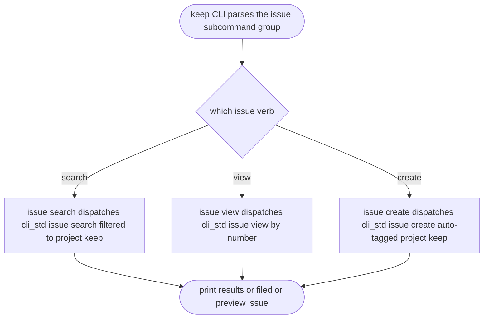
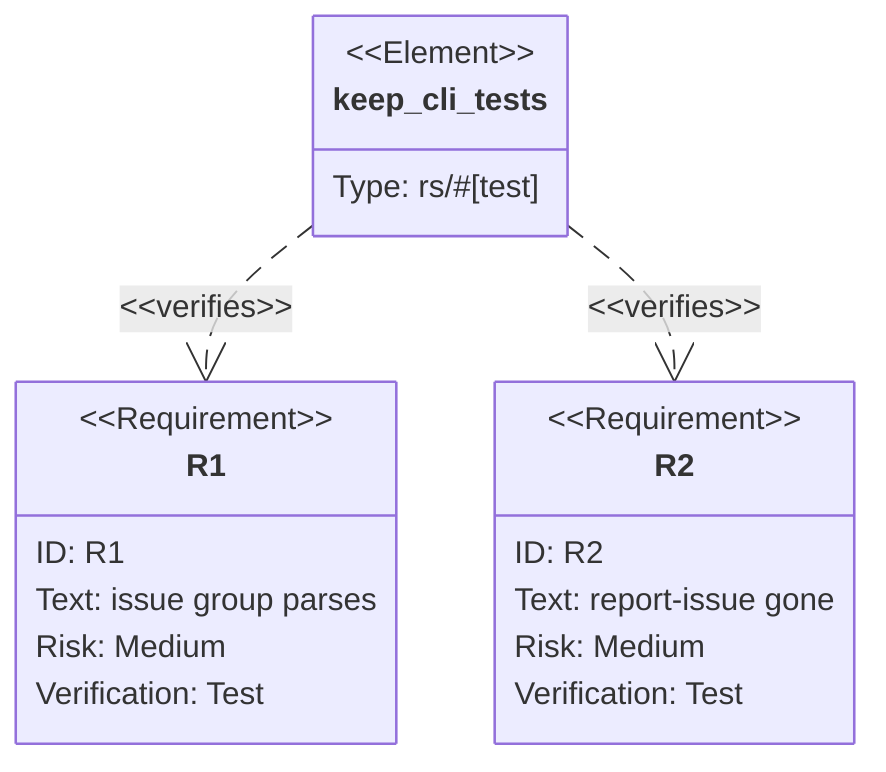

## Logic
<!-- type: logic lang: mermaid -->



## Unit Test
<!-- type: unit-test lang: mermaid -->



## Changes
<!-- type: changes lang: yaml -->

```yaml
changes:
  - path: projects/keep/Cargo.toml
    action: modify
    section: logic
    impl_mode: hand-written
    description: "Replace the report-issue feature with an issue feature gating cli-std/online so the issue group's network paths build, mirroring jet."
  - path: projects/keep/src/bin/keep.rs
    action: modify
    section: logic
    impl_mode: hand-written
    description: "Replace the ReportIssue clap command + ReportIssueArgs with an Issue subcommand group (search/view/create) dispatching to cli_std::issue::{search,view,create}; auto-tag project:keep on create and filter search to it; update the module doc comment."
  - path: projects/keep/src/bin/keep.rs
    action: modify
    section: unit-test
    impl_mode: hand-written
    description: "Add a #[cfg(test)] mod asserting keep issue search/view/create parse with their flags and that keep report-issue no longer parses."
```
