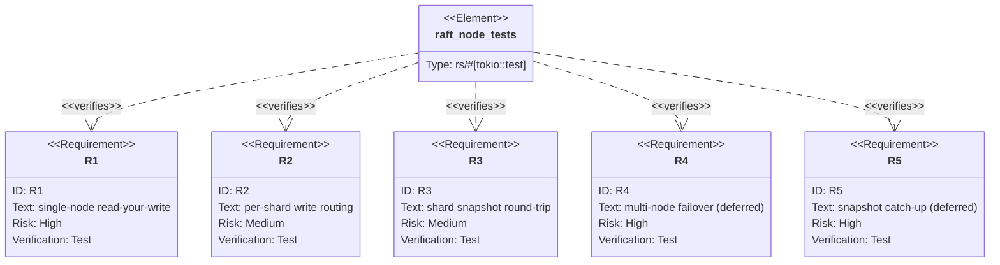

## Logic
<!-- type: logic lang: mermaid -->

```mermaid
---
id: keep-raft-host-adoption-contract
entry: build_hosts
nodes:
  build_hosts: { kind: start, label: "ShardHosts::new spawns one RaftHost per cluster.owned_shards() shard" }
  state_machine: { kind: process, label: "KvStateMachine(engine, cluster, shard) implements raft_host::RaftStateMachine" }
  topology: { kind: process, label: "shard_topology derives node_id/membership/peers; single-node = sole voter, HA = per-shard /shard/{id} peer URLs" }
  spawn: { kind: process, label: "RaftHost::spawn(node_id, membership, peers, RaftStore at data_dir/raft/shard-{id}, sm, SnapshotPolicy::EveryEntries)" }
  router: { kind: process, label: "ShardHosts::router nests each host.router() under /shard/{id} so peer Vote/Append/InstallSnapshot ride the h2c serve port" }
  write: { kind: process, label: "ShardHosts::write routes key to cluster.shard_for(key) host and calls host.propose(serde_json(WalOp))" }
  apply: { kind: process, label: "host sole applier decodes WalOp -> RecoveryManager::apply_one(engine); KvStateMachine advances applied_index" }
  ryw: { kind: process, label: "propose returns the applied index (read-your-write); the engine reflects the write" }
  snapshot: { kind: process, label: "snapshot() = shard-filtered dump_values wrapped with up_to; restore() = load_values + applied_index for InstallSnapshot catch-up" }
  stop: { kind: terminal, label: "per-shard groups replicate, fail over, and catch up via the shared host" }
edges:
  - { from: build_hosts, to: state_machine }
  - { from: state_machine, to: topology }
  - { from: topology, to: spawn }
  - { from: spawn, to: router }
  - { from: router, to: write }
  - { from: write, to: apply }
  - { from: apply, to: ryw }
  - { from: ryw, to: snapshot }
  - { from: snapshot, to: stop }
---
flowchart TD
    build_hosts([ShardHosts::new spawns one RaftHost per owned shard]) --> state_machine[KvStateMachine implements raft_host RaftStateMachine]
    state_machine --> topology[shard_topology derives node_id membership peers]
    topology --> spawn[RaftHost::spawn per shard with RaftStore and EveryEntries policy]
    spawn --> router[ShardHosts::router nests host.router under /shard/{id}]
    router --> write[ShardHosts::write routes key to its shard host propose]
    write --> apply[host sole applier decodes WalOp into RecoveryManager::apply_one]
    apply --> ryw[propose returns applied index read-your-write]
    ryw --> snapshot[snapshot shard-filtered dump_values restore load_values]
    snapshot --> stop([per-shard groups replicate fail over and catch up])
```

## Unit Test
<!-- type: unit-test lang: mermaid -->



## Changes
<!-- type: changes lang: yaml -->

```yaml
changes:
  - path: projects/keep/Cargo.toml
    action: modify
    section: logic
    impl_mode: hand-written
    description: "Add the optional raft-host dependency and make the raft feature pull dep:raft-host alongside dep:raft-core."
  - path: projects/keep/src/raft.rs
    action: modify
    section: logic
    impl_mode: hand-written
    description: "Replace RaftKv/ShardedRaft with KvStateMachine (raft_host::RaftStateMachine over KvEngine, shard-filtered snapshot/restore) and ShardHosts (HashMap<ShardId, Arc<RaftHost>>: per-shard spawn, shard_topology derivation, write routing via host.propose, and a router() that nests each host under /shard/{id})."
  - path: projects/keep/src/bin/keep.rs
    action: modify
    section: logic
    impl_mode: hand-written
    description: "When the raft feature is enabled and replica mode is on, build ShardHosts and merge its shard-scoped peer router onto the serve app so the h2c peer transport rides the serve port."
  - path: projects/keep/tests/raft_node.rs
    action: modify
    section: unit-test
    impl_mode: hand-written
    description: "Rewrite library tests onto ShardHosts/KvStateMachine: single-node read-your-write, per-shard routing, and shard snapshot round-trip; author ignored multi-process failover and snapshot-catch-up tests."
```
