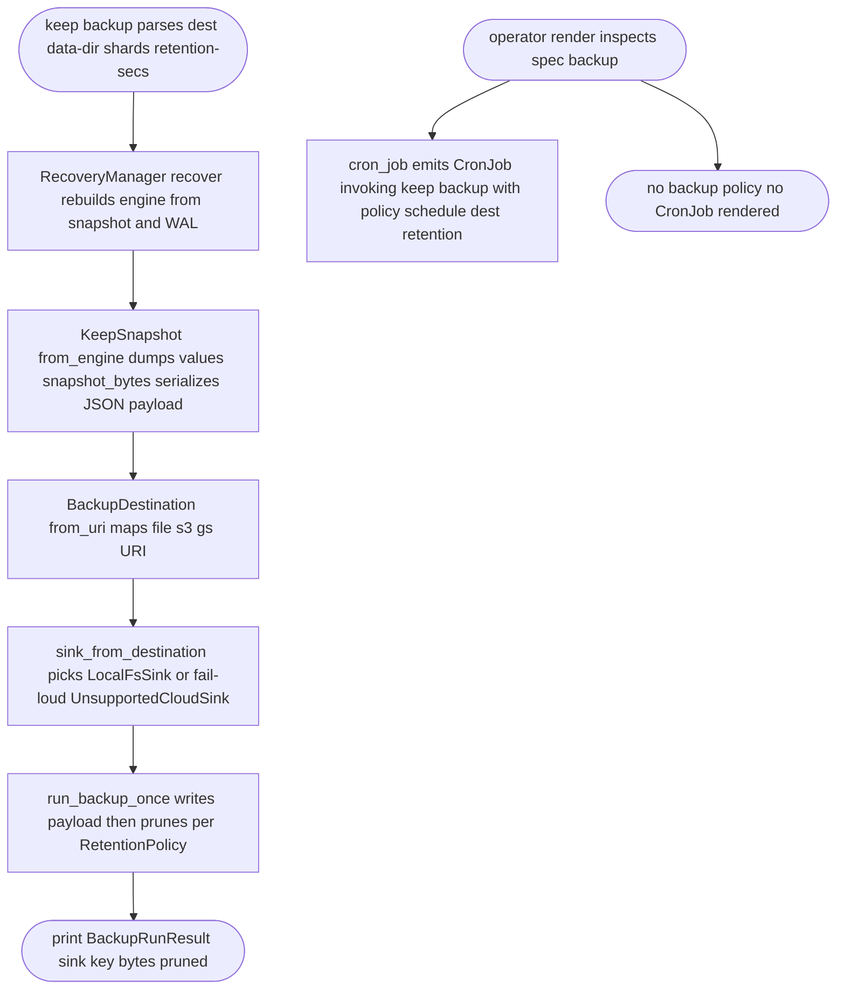
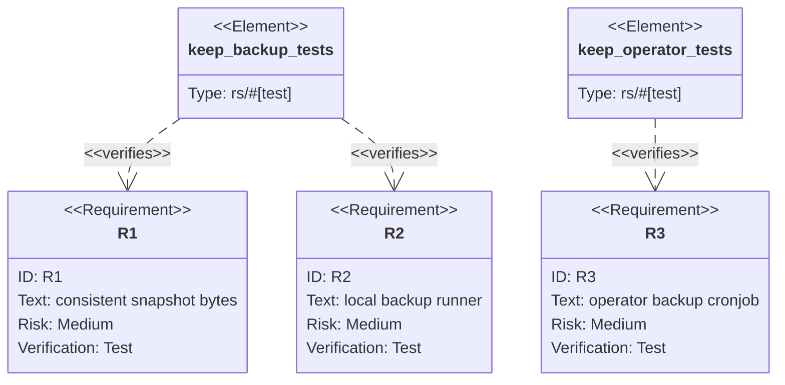

## Logic
<!-- type: logic lang: mermaid -->



## Unit Test
<!-- type: unit-test lang: mermaid -->



## Changes
<!-- type: changes lang: yaml -->

```yaml
changes:
  - path: projects/keep/Cargo.toml
    action: modify
    section: logic
    impl_mode: hand-written
    description: "Add the service-backup path dependency (always linked; used by the backup module and, behind the operator feature, by KeepSpec)."
  - path: projects/keep/src/lib.rs
    action: modify
    section: logic
    impl_mode: hand-written
    description: "Declare and export the new `backup` module."
  - path: projects/keep/src/backup.rs
    action: create
    section: logic
    impl_mode: hand-written
    description: "keep's backup adoption: re-export service_backup types (mirrors lumen's backup_sink), a KeepSnapshot payload built from engine.dump_values, snapshot_bytes/snapshot_bytes_from_data_dir, and run_backup that recovers the engine, serializes a consistent snapshot, and calls sink_from_destination + run_backup_once."
  - path: projects/keep/src/bin/keep.rs
    action: modify
    section: logic
    impl_mode: hand-written
    description: "Add the `keep backup` verb (--dest, --data-dir, --shards, --retention-secs) that builds a BackupDestination, runs run_backup, and prints the BackupRunResult."
  - path: projects/keep/src/operator/crd.rs
    action: modify
    section: logic
    impl_mode: hand-written
    description: "Add an optional `backup: Option<service_backup::BackupPolicy>` field to KeepSpec (schedule + destination + retention); the crd_yaml uint normalization already covers the retention maxAgeSeconds u64."
  - path: projects/keep/src/operator/render.rs
    action: modify
    section: logic
    impl_mode: hand-written
    description: "Render a backup CronJob via operator::render::cron_job when spec.backup is Some, invoking `keep backup` with the policy's schedule, destination URI, and retention; no CronJob otherwise."
  - path: projects/keep/tests/backup.rs
    action: create
    section: unit-test
    impl_mode: hand-written
    description: "R1/R2: snapshot_bytes round-trips the engine's key/value set, and run_backup_once writes then prunes an artifact at a file:// destination."
  - path: projects/keep/tests/operator.rs
    action: modify
    section: unit-test
    impl_mode: hand-written
    description: "R3: render emits a backup CronJob invoking `keep backup` when spec.backup is set and omits it otherwise; update the spec() helper for the new field."
```
