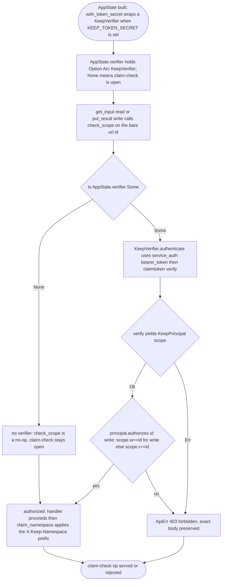
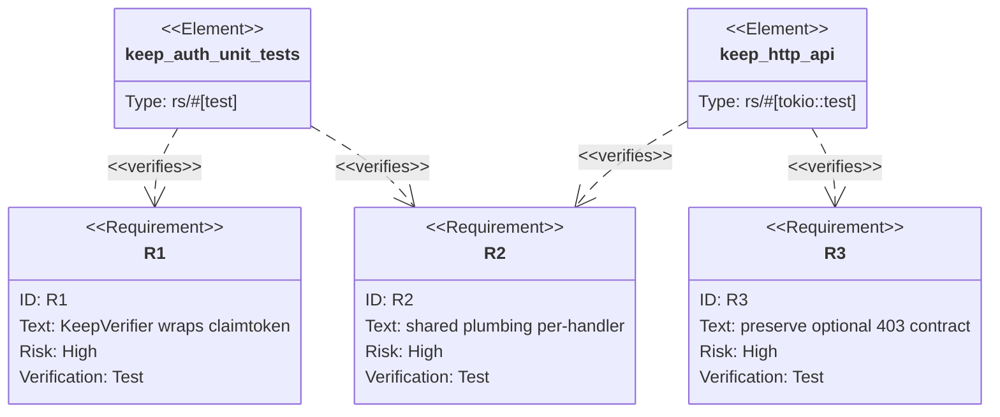

## Logic
<!-- type: logic lang: mermaid -->



## Unit Test
<!-- type: unit-test lang: mermaid -->



## Changes
<!-- type: changes lang: yaml -->

```yaml
changes:
  - path: projects/keep/Cargo.toml
    action: modify
    section: logic
    impl_mode: hand-written
    description: "Add the libs/service-auth dependency to Keep."
  - path: projects/keep/src/http/auth.rs
    action: create
    section: logic
    impl_mode: hand-written
    description: "New module: KeepPrincipal (concrete principal wrapping claimtoken::Scope, with authorizes(id, write)) and KeepVerifier implementing service_auth::Verifier by composing service_auth::bearer_token + claimtoken::verify."
  - path: projects/keep/src/http/mod.rs
    action: modify
    section: logic
    impl_mode: hand-written
    description: "Declare pub mod auth; replace AppState.token_secret with verifier: Option<Arc<KeepVerifier>>; with_token_secret builds a KeepVerifier so the optional (None=open) semantics and constructor API are preserved."
  - path: projects/keep/src/http/handlers.rs
    action: modify
    section: logic
    impl_mode: hand-written
    description: "Rewrite check_scope to delegate token verification to AppState.verifier (the shared Verifier) and keep the per-handler bare-id scope decision and the exact 403 forbidden body; no-op when no verifier; still called only by get_input and put_result."
  - path: projects/keep/src/http/auth.rs
    action: create
    section: unit-test
    impl_mode: hand-written
    description: "Unit tests: KeepVerifier authenticates a valid token to a KeepPrincipal, authorizes the bare id for read/write scope, and returns AuthError for missing/invalid/expired/out-of-scope tokens."
  - path: projects/keep/tests/http_api.rs
    action: modify
    section: unit-test
    impl_mode: hand-written
    description: "Extend claim-check auth tests: accepted scoped token 200, invalid token 403, out-of-scope token 403, and no-op when no secret, preserving the existing keep_ns_token_checks_bare_key contract."
```
