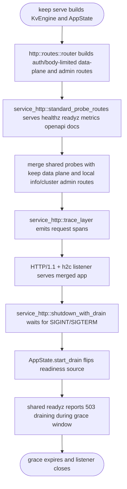
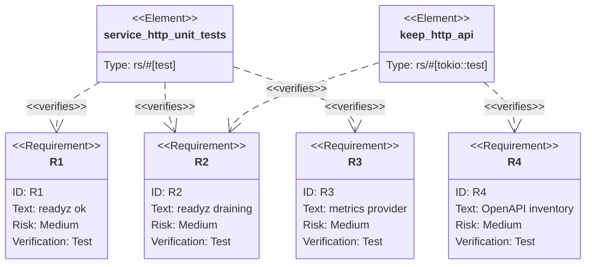

## Logic
<!-- type: logic lang: mermaid -->



## Unit Test
<!-- type: unit-test lang: mermaid -->



## Changes
<!-- type: changes lang: yaml -->

```yaml
changes:
  - path: projects/keep/Cargo.toml
    action: modify
    section: logic
    impl_mode: hand-written
    description: "Add the service-http dependency to Keep."
  - path: projects/keep/src/http/mod.rs
    action: modify
    section: logic
    impl_mode: hand-written
    description: "Implement service_http::ReadinessHook and MetricsProvider for AppState so the shared probe router reports Keep readiness and Prometheus metrics."
  - path: projects/keep/src/http/routes.rs
    action: modify
    section: logic
    impl_mode: hand-written
    description: "Build the router from service_http::standard_probe_routes for healthz/readyz/metrics/openapi/docs, merged with Keep's auth/body-limited data plane and local info/cluster admin routes; drop the hand-rolled probe routes."
  - path: projects/keep/src/bin/keep.rs
    action: modify
    section: logic
    impl_mode: hand-written
    description: "Serve the merged app and drain through service_http::serve, trace_layer, and shutdown_with_drain instead of the local hyper auto::Builder, GracefulShutdown, and signal handling."
  - path: projects/keep/tests/http_api.rs
    action: modify
    section: unit-test
    impl_mode: hand-written
    description: "Assert the shared probe contract: healthz/readyz/metrics/openapi inventory preserved and readyz draining returns 503."
```
