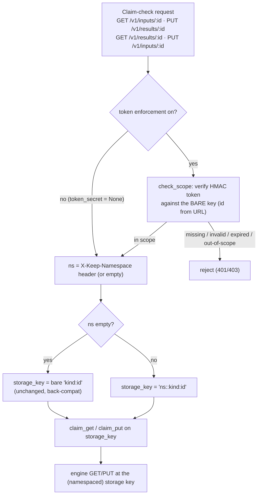

# Keep Per-Namespace Key Isolation

## Logic
<!-- type: logic lang: mermaid -->

```mermaid
---
id: keep-ns-isolation-logic
---
flowchart TD
  A["Claim-check request<br/>GET /v1/inputs/:id · PUT /v1/results/:id<br/>GET /v1/results/:id · PUT /v1/inputs/:id"] --> B{token enforcement on?}
  B -- "no (token_secret = None)" --> D["ns = X-Keep-Namespace header (or empty)"]
  B -- "yes" --> C["check_scope: verify HMAC token<br/>against the BARE key (id from URL)"]
  C -- "missing / invalid / expired / out-of-scope" --> E["reject (401/403)"]
  C -- "in scope" --> D
  D --> F{"ns empty?"}
  F -- "yes" --> G["storage_key = bare 'kind:id'<br/>(unchanged, back-compat)"]
  F -- "no" --> H["storage_key = 'ns::kind:id'"]
  G --> I["claim_get / claim_put on storage_key"]
  H --> I
  I --> J["engine GET/PUT at the (namespaced) storage key"]
```
