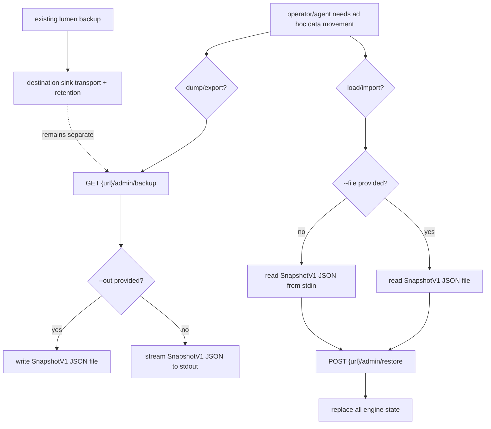

# TD: Lumen CLI snapshot data movement verbs

## Logic
<!-- type: logic lang: mermaid -->


## Unit Test
<!-- type: unit-test lang: mermaid -->


## Changes
<!-- type: changes lang: yaml -->

```yaml
changes:
  - path: projects/lumen/src/backup.rs
    action: modify
    section: logic
    impl_mode: hand-written
    description: "Add shared admin snapshot fetch/restore helpers used by backup, dump/export, and load/import."
  - path: projects/lumen/src/bin/lumen.rs
    action: modify
    section: logic
    impl_mode: hand-written
    description: "Add dump/export/load/import commands and route them through the shared admin snapshot helpers."
  - path: projects/lumen/src/spec.rs
    action: modify
    section: logic
    impl_mode: hand-written
    description: "Update the storage LLM topic to document the direct CLI snapshot movement verbs."
  - path: projects/lumen/tests/cli_convention.rs
    action: modify
    section: unit-test
    impl_mode: hand-written
    description: "Verify the new verbs are visible in the top-level help surface."
  - path: projects/lumen/tests/backup_restore_e2e.rs
    action: modify
    section: unit-test
    impl_mode: hand-written
    description: "Cover an HTTP export/import round trip through the CLI helper path."
```
