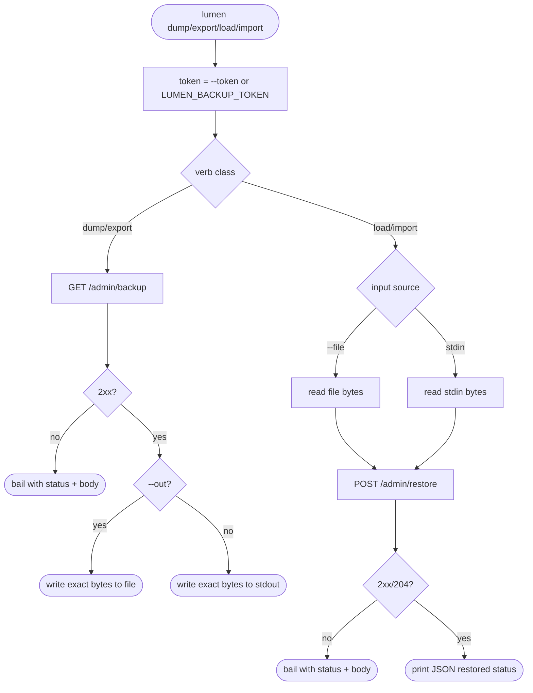
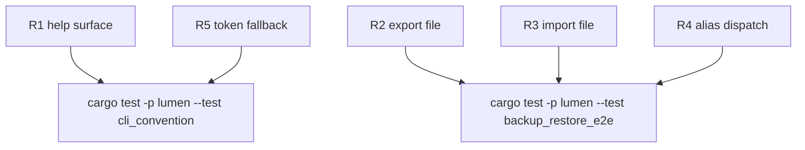

# TD: Lumen CLI snapshot data movement verbs

## Logic
<!-- type: logic lang: mermaid -->


## Unit Test
<!-- type: unit-test lang: mermaid -->


## Changes
<!-- type: changes lang: yaml -->

```yaml
changes:
  - path: projects/lumen/src/backup.rs
    action: modify
    section: logic
    impl_mode: hand-written
    description: "Factor `fetch_snapshot_bytes` and add `restore_snapshot_bytes` so direct CLI verbs and `lumen backup` share admin API HTTP behavior."
  - path: projects/lumen/src/bin/lumen.rs
    action: modify
    section: logic
    impl_mode: hand-written
    description: "Add top-level dump/export/load/import commands with `--url`, token fallback, `--out`, and `--file`/stdin routing."
  - path: projects/lumen/src/spec.rs
    action: modify
    section: logic
    impl_mode: hand-written
    description: "Document the direct CLI snapshot movement verbs in the storage LLM topic."
  - path: projects/lumen/tests/cli_convention.rs
    action: modify
    section: unit-test
    impl_mode: hand-written
    description: "Assert top-level help exposes dump/export/load/import and that token flags are present on each direct verb."
  - path: projects/lumen/tests/backup_restore_e2e.rs
    action: modify
    section: unit-test
    impl_mode: hand-written
    description: "Exercise export-to-file and import-from-file through the shared HTTP helper path."
```
