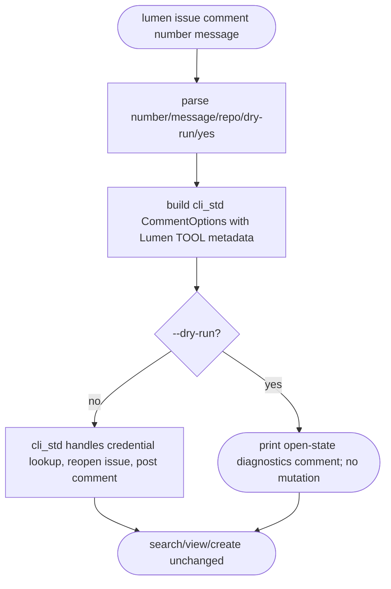
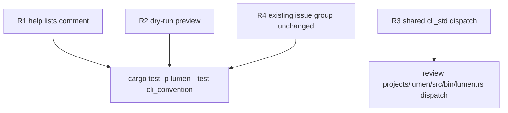

# TD: Lumen CLI issue comment follow-up

## Logic
<!-- type: logic lang: mermaid -->



## Unit Test
<!-- type: unit-test lang: mermaid -->



## Changes
<!-- type: changes lang: yaml -->

```yaml
changes:
  - path: projects/lumen/src/bin/lumen.rs
    action: modify
    section: logic
    impl_mode: hand-written
    description: "Add IssueCommand::Comment args and dispatch to cli_std::issue::comment with repo, dry-run, yes, and free-form message support."
  - path: projects/lumen/tests/cli_convention.rs
    action: modify
    section: unit-test
    impl_mode: hand-written
    description: "Assert `lumen issue --help` lists comment and `lumen issue comment ... --dry-run` prints the shared reopen/comment preview."
```
