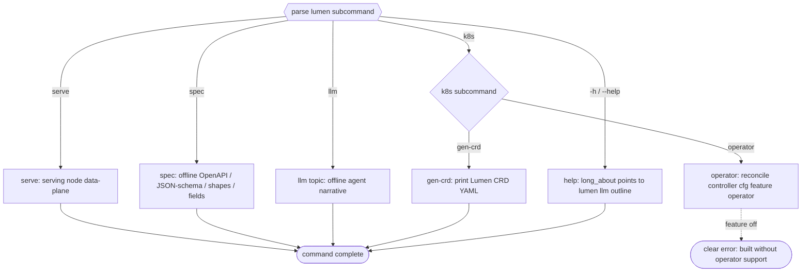

# TD: lumen CLI consolidation (single binary)

## Logic
<!-- type: logic lang: mermaid -->



## CLI
<!-- type: cli lang: yaml -->

```yaml
cli:
  name: lumen
  about: "Single agent-first CLI for the lumen search engine. Agents start here: lumen llm outline."
  commands:
    - name: serve
      about: "Run a serving node (HTTP API + background apply loop)."
      args:
        - {name: "--host", env: "LUMEN_HOST", default: "127.0.0.1"}
        - {name: "--port", env: "LUMEN_PORT", default: "7373"}
        - {name: "--wal", env: "LUMEN_WAL", default: "embedded", choices: ["embedded", "nats"]}
        - {name: "--persistence", env: "LUMEN_PERSISTENCE", default: "cbor", choices: ["cbor", "segment"]}
    - name: spec
      about: "Print the machine-readable integration contract (offline, no server)."
      args:
        - {name: "--format", default: "openapi", choices: ["openapi", "openapi-yaml", "json-schema"]}
        - {name: "--shapes", kind: "flag"}
        - {name: "--fields", kind: "flag"}
    - name: llm
      about: "Print agent-facing topics (offline). outline is the entry point."
      args:
        - {name: "topic", kind: "positional", default: "outline", choices: ["outline", "workflow", "integration", "quickstart", "recipes"]}
        - {name: "--format", default: "md", choices: ["md", "json"]}
    - name: k8s
      about: "Kubernetes operator and CRD generation (manifest/render only; lumen does not deploy)."
      commands:
        - name: operator
          about: "Run the Lumen CRD reconcile controller (container CMD; requires build feature operator)."
        - name: gen-crd
          about: "Print the Lumen CustomResourceDefinition YAML."
```

## Manifest
<!-- type: manifest lang: yaml -->

```yaml
dependencies:
  - { name: kube, spec: "0.98", features: [runtime, derive, client], optional: true }
  - { name: k8s-openapi, spec: "0.24", features: [v1_32], optional: true }
  - { name: schemars, spec: "0.8", optional: true }
```
