# TD: lumen CLI consolidation (single binary)

## Logic

```mermaid
---
id: lumen-cli-dispatch
entry: parse
nodes:
  parse: {kind: start, label: "parse lumen subcommand"}
  serve: {kind: process, label: "serve: run serving node (data-plane)"}
  spec: {kind: process, label: "spec: offline OpenAPI / JSON-schema / shapes / fields"}
  llm: {kind: process, label: "llm <topic>: offline agent narrative (outline=entry)"}
  dockerfile: {kind: process, label: "dockerfile render: source/release image artifact"}
  k8s: {kind: decision, label: "k8s subcommand"}
  crd: {kind: process, label: "k8s crd render: print Lumen CRD YAML"}
  operator_render: {kind: process, label: "k8s operator render: control-plane manifests"}
  operator_run: {kind: process, label: "k8s operator run: reconcile controller (cfg feature=operator)"}
  instance: {kind: process, label: "k8s instance render: app-namespace Lumen CR"}
  help: {kind: process, label: "--help: long_about points to 'lumen llm outline'"}
  nofeat: {kind: terminal, label: "clear error: built without operator support"}
  done: {kind: terminal, label: "command complete"}
edges:
  - {from: parse, to: serve, label: "serve"}
  - {from: parse, to: spec, label: "spec"}
  - {from: parse, to: llm, label: "llm"}
  - {from: parse, to: dockerfile, label: "dockerfile"}
  - {from: parse, to: k8s, label: "k8s"}
  - {from: parse, to: help, label: "-h/--help"}
  - {from: k8s, to: crd, label: "crd render"}
  - {from: k8s, to: operator_render, label: "operator render"}
  - {from: k8s, to: operator_run, label: "operator run"}
  - {from: k8s, to: instance, label: "instance render"}
  - {from: operator_run, to: nofeat, label: "feature off"}
  - {from: serve, to: done}
  - {from: spec, to: done}
  - {from: llm, to: done}
  - {from: dockerfile, to: done}
  - {from: crd, to: done}
  - {from: operator_render, to: done}
  - {from: instance, to: done}
  - {from: help, to: done}
---
flowchart TD
    parse{{parse lumen subcommand}} -->|serve| serve[serve: serving node data-plane]
    parse -->|spec| spec[spec: offline OpenAPI / JSON-schema / shapes / fields]
    parse -->|llm| llm[llm topic: offline agent narrative]
    parse -->|dockerfile| dockerfile[dockerfile render: source/release image artifact]
    parse -->|k8s| k8s{k8s subcommand}
    parse -->|-h / --help| help[help: long_about points to lumen llm outline]
    k8s -->|crd render| crd[crd render: print Lumen CRD YAML]
    k8s -->|operator render| operator_render[operator render: control-plane manifests]
    k8s -->|operator run| operator_run[operator run: reconcile controller cfg feature operator]
    k8s -->|instance render| instance[instance render: app-namespace Lumen CR]
    operator_run -. feature off .-> nofeat([clear error: built without operator support])
    serve --> done([command complete])
    spec --> done
    llm --> done
    dockerfile --> done
    crd --> done
    operator_render --> done
    instance --> done
    help --> done
```

<!-- type: logic lang: mermaid -->


## CLI
<!-- type: cli lang: yaml -->

```yaml
cli:
  name: lumen
  about: "Single agent-first CLI for the lumen search engine. Agents start here: lumen llm outline."
  commands:
    - name: serve
      about: "Run a serving node (HTTP API + background apply loop)."
      args:
        - {name: "--host", env: "LUMEN_HOST", default: "127.0.0.1"}
        - {name: "--port", env: "LUMEN_PORT", default: "7373"}
        - {name: "--wal", env: "LUMEN_WAL", default: "auto", choices: ["auto", "embedded", "nats", "relay", "raft"]}
        - {name: "--relay-url", env: "LUMEN_RELAY_URL", default: "http://localhost:7000"}
        - {name: "--relay-subject", env: "LUMEN_RELAY_SUBJECT", default: "lumen-wal"}
        - {name: "--relay-subscriber-id", env: "LUMEN_RELAY_SUBSCRIBER_ID", default: "POD_NAME/HOSTNAME"}
        - {name: "--persistence", env: "LUMEN_PERSISTENCE", default: "cbor", choices: ["cbor", "segment"]}
    - name: spec
      about: "Print the machine-readable integration contract (offline, no server)."
      args:
        - {name: "--format", default: "openapi", choices: ["openapi", "openapi-yaml", "json-schema"]}
        - {name: "--shapes", kind: "flag"}
        - {name: "--fields", kind: "flag"}
    - name: llm
      about: "Print agent-facing topics (offline). outline is the entry point."
      args:
        - {name: "--topic", default: "outline", choices: ["outline", "workflow", "integration", "quickstart", "recipes"]}
        - {name: "--format", default: "md", choices: ["md", "json"]}
    - name: dockerfile
      about: "Render source/release Dockerfiles for compose, kind, or registry builds."
      commands:
        - name: render
          args:
            - {name: "--variant", default: "release", choices: ["source", "release"]}
            - {name: "--version", kind: "optional", description: "Release tag for --variant release."}
            - {name: "--out", kind: "optional", description: "File or directory output path."}
    - name: k8s
      about: "Kubernetes artifacts split into cluster API, control plane, and app instance layers."
      commands:
        - name: crd
          commands:
            - name: render
              about: "Print the Lumen CustomResourceDefinition YAML."
        - name: operator
          commands:
            - name: run
              about: "Run the Lumen CRD reconcile controller (container CMD; requires build feature operator)."
            - name: render
              about: "Render operator namespace/RBAC/deployment YAML."
              args:
                - {name: "--namespace", default: "lumen-system"}
                - {name: "--out", kind: "optional"}
        - name: instance
          commands:
            - name: render
              about: "Render a namespaced kind:Lumen custom resource."
              args:
                - {name: "--profile", default: "dev", choices: ["dev", "staging", "prod", "template"]}
                - {name: "--name", kind: "optional"}
                - {name: "--namespace", kind: "optional"}
                - {name: "--image", kind: "optional"}
                - {name: "--relay-image", kind: "optional"}
                - {name: "--relay-url", kind: "optional"}
                - {name: "--out", kind: "optional"}
```
## Manifest
<!-- type: manifest lang: yaml -->

```yaml
dependencies:
  - { name: kube, spec: "0.98", features: [runtime, derive, client], optional: true }
  - { name: k8s-openapi, spec: "0.24", features: [v1_32], optional: true }
  - { name: schemars, spec: "0.8", optional: true }
```
## Unit Test

```mermaid
---
id: lumen-cli-consolidation-verification
requirements:
  single_cli_surface:
    id: R1
    text: "lumen --help lists serve/spec/llm/dockerfile/k8s/upgrade/issue; openapi-dump/bench/consumer binaries removed"
    kind: functional
    risk: medium
    verify: test
  deployment_artifact_subcommands:
    id: R5
    text: "lumen dockerfile render, k8s crd render, k8s operator render|run, and k8s instance render work; default image built with feature operator"
    kind: functional
    risk: high
    verify: test
  operator_feature_gate:
    id: R5b
    text: "build without feature operator is kube-free; operator run stays in --help and errors clearly"
    kind: functional
    risk: high
    verify: test
  output_parity:
    id: R4
    text: "lumen spec and lumen llm output unchanged; cargo test -p lumen green; perf gate unaffected"
    kind: functional
    risk: low
    verify: test
elements:
  cli_help_test:
    kind: test
    type: "rs/#[test]"
  deployment_artifact_dispatch_test:
    kind: test
    type: "rs/#[test]"
  parity_test:
    kind: test
    type: "rs/#[test]"
relations:
  - { from: cli_help_test, verifies: single_cli_surface }
  - { from: deployment_artifact_dispatch_test, verifies: deployment_artifact_subcommands }
  - { from: deployment_artifact_dispatch_test, verifies: operator_feature_gate }
  - { from: parity_test, verifies: output_parity }
---
requirementDiagram
    requirement single_cli_surface {
      id: R1
      text: "single CLI surface; redundant binaries removed"
      risk: medium
      verifymethod: test
    }
    requirement deployment_artifact_subcommands {
      id: R5
      text: "dockerfile + k8s crd/operator/instance render work; operator run works with feature"
      risk: high
      verifymethod: test
    }
    requirement operator_feature_gate {
      id: R5b
      text: "non-operator build kube-free; subcommand errors clearly"
      risk: high
      verifymethod: test
    }
    requirement output_parity {
      id: R4
      text: "spec and llm output unchanged; tests green; perf gate unaffected"
      risk: low
      verifymethod: test
    }
    element cli_help_test {
      type: "rs/#[test]"
    }
    element deployment_artifact_dispatch_test {
      type: "rs/#[test]"
    }
    element parity_test {
      type: "rs/#[test]"
    }
    cli_help_test - verifies -> single_cli_surface
    deployment_artifact_dispatch_test - verifies -> deployment_artifact_subcommands
    deployment_artifact_dispatch_test - verifies -> operator_feature_gate
    parity_test - verifies -> output_parity
```

<!-- type: unit-test lang: mermaid -->



## Changes
<!-- type: changes lang: yaml -->

```yaml
changes:
  - path: projects/lumen/src/bin/lumen.rs
    action: modify
    section: logic
    impl_mode: hand-written
    description: "Single-binary dispatch flow for serve/spec/llm/k8s subcommands."
  - path: projects/lumen/src/bin/lumen.rs
    action: modify
    section: cli
    impl_mode: hand-written
    description: "Agent-facing lumen CLI command tree and argument surface."
  - path: projects/lumen/Cargo.toml
    action: modify
    section: manifest
    impl_mode: hand-written
    description: "Operator dependencies remain feature-gated behind the operator feature."
  - path: projects/lumen/tests/spec_cli.rs
    action: modify
    section: unit-test
    impl_mode: hand-written
    description: "CLI/spec/LLM parity and operator dispatch test coverage."
```

# Reviews

### Review 1
**Verdict:** approved

- [logic] Codegen-ready Mermaid Plus flowchart: dispatch covers serve/spec/llm/dockerfile, layered k8s crd/operator/instance, help, and the feature-off operator run path. Contract complete.
- [cli] Command tree is the authoritative single-binary surface (serve/spec/llm/dockerfile/k8s crd|operator|instance) with key args/env/choices. Contract complete.
- [manifest] Operator-gated optional deps (kube/k8s-openapi/schemars) match the feature design. Contract complete.
- [unit-test] requirementDiagram with frontmatter binds R1/R5/R5b/R4 to test elements covering surface, operator dispatch, feature gate, and output parity. Contract complete.
