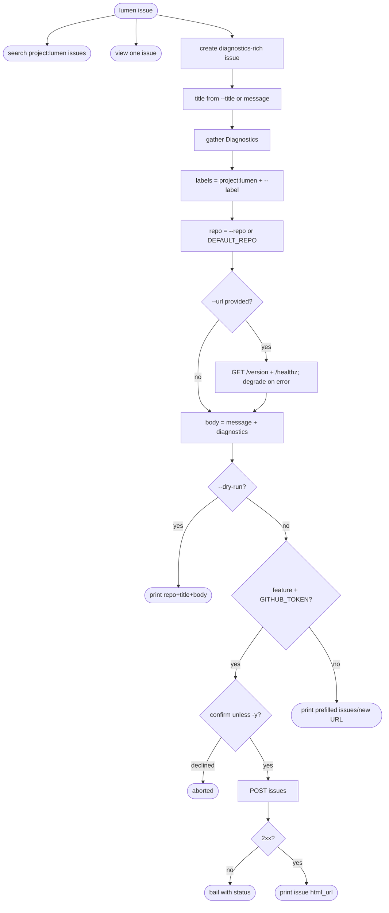
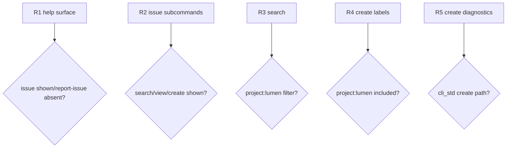

## Logic
<!-- type: logic lang: mermaid -->


## Unit Test
<!-- type: unit-test lang: mermaid -->



## Changes
<!-- type: changes lang: yaml -->

```yaml
changes:
  - path: projects/lumen/src/bin/lumen.rs
    action: modify
    section: logic
    impl_mode: hand-written
    description: "Replace the deprecated lumen report-issue command with the standard issue search/view/create group wired to cli_std::issue."
  - path: projects/lumen/tests/cli_convention.rs
    action: modify
    section: unit-test
    impl_mode: hand-written
    description: "Verify the standard issue group appears in help and deprecated report-issue is absent without relying on live GitHub reads/writes."
```

# Reviews

### Review 2
**Verdict:** approved

- [logic] Contract now matches the ecosystem CLI convention: Lumen exposes the
  `issue` group with read-only search/view and diagnostics-rich create. Create
  preserves the useful report path (`--url`, `--repo`, `--label`, `--dry-run`,
  `-y`) while delegating to `cli_std::issue::create` instead of the deprecated
  `report_issue` shim.
- [unit-test] Help-surface tests verify the agent-facing contract without
  network access: `llm`, `upgrade`, and `issue` appear, `report-issue` is gone,
  and `issue` lists `search`, `view`, and `create`.
