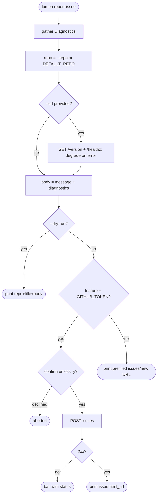
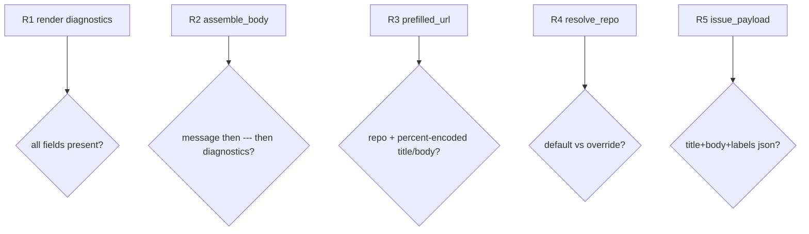

## Logic
<!-- type: logic lang: mermaid -->


## Unit Test
<!-- type: unit-test lang: mermaid -->



## Changes
<!-- type: changes lang: yaml -->

```yaml
changes:
  - path: projects/lumen/src/bin/lumen.rs
    action: modify
    section: logic
    impl_mode: hand-written
    description: "Wire the lumen report-issue command, flags, project label, and cli_std report_issue execution path."
  - path: libs/cli-std/src/report_issue.rs
    action: modify
    section: unit-test
    impl_mode: hand-written
    description: "Shared report-issue diagnostics, body assembly, URL prefill, repo resolution, payload shaping, and pure tests."
```

# Reviews

### Review 1
**Verdict:** approved

- [logic] Contract pins the binding behavior: a `Diagnostics` struct sourced from the build-time stamps + runtime consts, repo resolution (`--repo` else `DEFAULT_REPO`), optional node enrichment that degrades to an "unreachable" note, the `--dry-run` print-only exit, a gated submit path (feature + `GITHUB_TOKEN`) with confirmation and 2xx handling, and a no-token pre-filled-`issues/new` fallback. No path silently fails.
- [unit-test] R1–R5 isolate the pure seams (`render_diagnostics`, `assemble_body`, `prefilled_url` percent-encoding, `resolve_repo`, `issue_payload` JSON) so behavior is verified without network or filesystem access — matching testability=required and scope_control=strict.
