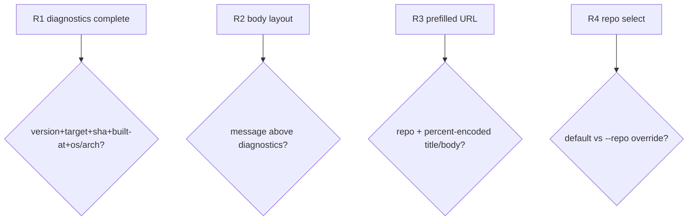

## Logic
<!-- type: logic lang: mermaid -->

```mermaid
---
id: lumen-report-issue-contract
entry: start
nodes:
  start:    { kind: start,    label: "lumen report-issue --title T [--message M] [--url U] [--repo R] [--label L] [--dry-run] [-y]" }
  diag:     { kind: process,  label: "Diagnostics{version=CARGO_PKG_VERSION, target=LUMEN_TARGET, git_sha=LUMEN_GIT_SHA, built_at=LUMEN_BUILT_AT, os=consts::OS, arch=consts::ARCH}" }
  repo:     { kind: process,  label: "repo = --repo else DEFAULT_REPO (owner/name)" }
  node:     { kind: decision, label: "--url provided?" }
  fetch:    { kind: process,  label: "GET {url}/version + {url}/healthz; on error append 'node: unreachable ({url})'" }
  body:     { kind: process,  label: "body = [message?] + '\\n\\n---\\n' + render(diagnostics)" }
  dry:      { kind: decision, label: "--dry-run?" }
  print:    { kind: terminal, label: "print 'repo: {repo}', 'title: {title}', body; submit nothing; exit 0" }
  cansubmit:{ kind: decision, label: "feature report-issue built AND GITHUB_TOKEN set?" }
  confirm:  { kind: decision, label: "stdin tty AND not -y -> confirm 'file issue to {repo}?'" }
  abort:    { kind: terminal, label: "'aborted'; exit 0" }
  post:     { kind: process,  label: "POST https://api.github.com/repos/{repo}/issues {title, body, labels} (bearer token, UA)" }
  okstatus: { kind: decision, label: "2xx?" }
  err:      { kind: terminal, label: "bail with GitHub status/message; exit non-zero" }
  created:  { kind: terminal, label: "print created issue html_url; exit 0" }
  fallback: { kind: terminal, label: "print 'set GITHUB_TOKEN to file directly', pre-filled {repo}/issues/new?title=&body= (percent-encoded), and body; exit 0" }
edges:
  - { from: start,     to: diag }
  - { from: diag,      to: repo }
  - { from: repo,      to: node }
  - { from: node,      to: fetch,     label: "yes" }
  - { from: node,      to: body,      label: "no" }
  - { from: fetch,     to: body }
  - { from: body,      to: dry }
  - { from: dry,       to: print,     label: "yes" }
  - { from: dry,       to: cansubmit, label: "no" }
  - { from: cansubmit, to: confirm,   label: "yes" }
  - { from: cansubmit, to: fallback,  label: "no" }
  - { from: confirm,   to: abort,     label: "declined" }
  - { from: confirm,   to: post,      label: "yes/-y" }
  - { from: post,      to: okstatus }
  - { from: okstatus,  to: err,       label: "no" }
  - { from: okstatus,  to: created,   label: "yes" }
---
flowchart TD
    start([lumen report-issue]) --> diag[gather Diagnostics]
    diag --> repo[repo = --repo or DEFAULT_REPO]
    repo --> node{--url provided?}
    node -->|yes| fetch[GET /version + /healthz; degrade on error]
    node -->|no| body[body = message + diagnostics]
    fetch --> body
    body --> dry{--dry-run?}
    dry -->|yes| print([print repo+title+body])
    dry -->|no| cansubmit{feature + GITHUB_TOKEN?}
    cansubmit -->|yes| confirm{confirm unless -y?}
    cansubmit -->|no| fallback([print prefilled issues/new URL])
    confirm -->|declined| abort([aborted])
    confirm -->|yes| post[POST issues]
    post --> okstatus{2xx?}
    okstatus -->|no| err([bail with status])
    okstatus -->|yes| created([print issue html_url])
```
## Unit Test
<!-- type: unit-test lang: mermaid -->



# Reviews

### Review 1
**Verdict:** approved

- [logic] Dispatch flow covers the documented branches: optional `--url` node enrichment with graceful degradation, the `--dry-run` print-only exit, the token-present submit path with confirmation, and the no-token pre-filled-URL fallback — no path silently fails.
- [unit-test] R1–R4 isolate the pure seams (diagnostics completeness, body layout, percent-encoded fallback URL, repo default/override), all `verify: test`, matching the testability gate without needing network access.
