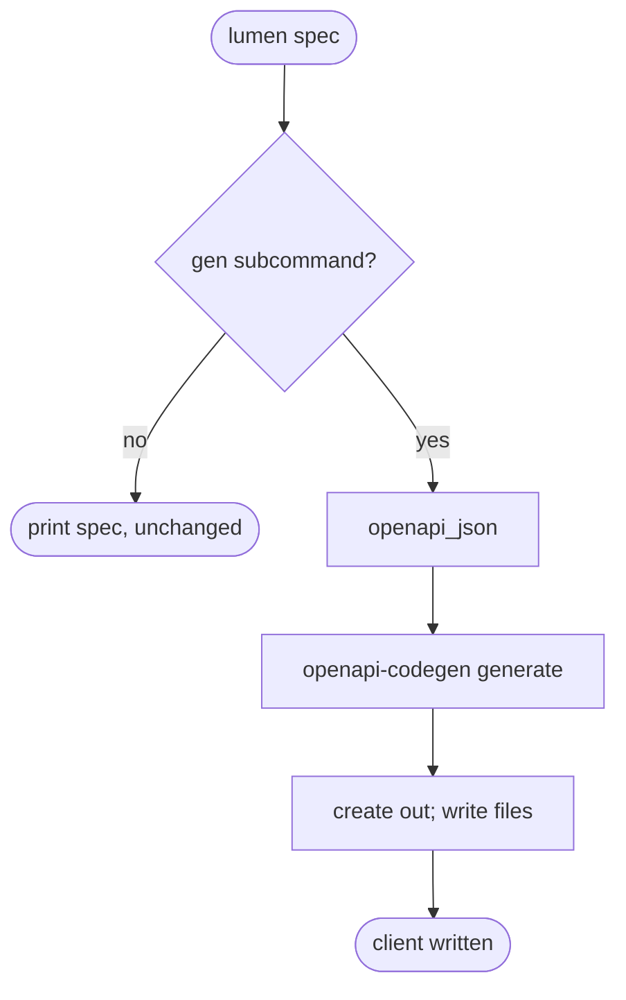
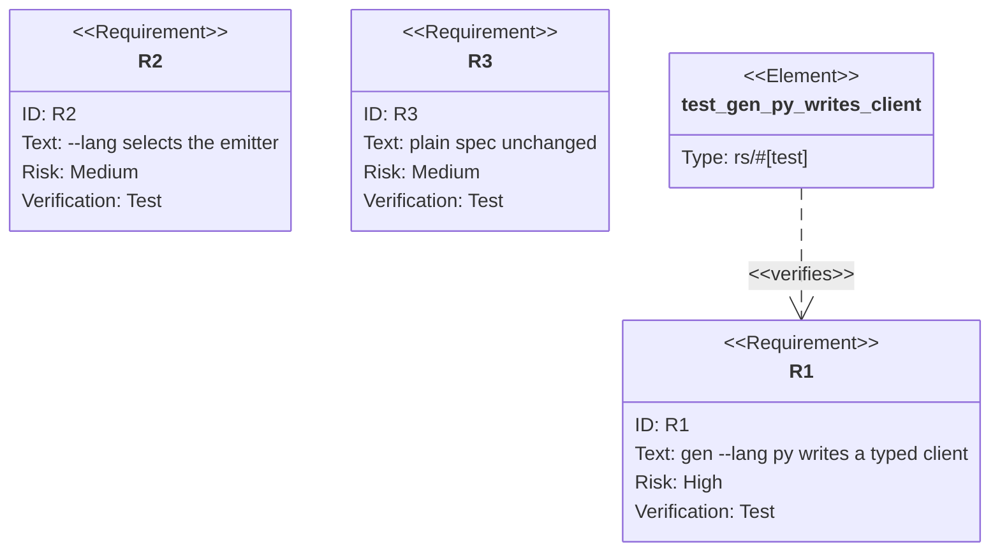

## Logic
<!-- type: logic lang: mermaid -->


## Unit Test
<!-- type: unit-test lang: mermaid -->



## Changes
<!-- type: changes lang: yaml -->

```yaml
changes:
  - path: projects/lumen/src/bin/lumen.rs
    action: modify
    section: logic
    impl_mode: hand-written
    description: "Wire `lumen spec gen` language selection and offline typed-client generation dispatch."
  - path: projects/lumen/tests/spec_gen_e2e.rs
    action: modify
    section: unit-test
    impl_mode: hand-written
    description: "Exercise Python, TypeScript, Rust emitter selection and plain `lumen spec` output."
```
