## Logic

```mermaid
---
id: lumen-upgrade-contract
entry: start
nodes:
  start:    { kind: start,    label: "lumen upgrade [--check] [--tag T] [--force] [-y]" }
  selfexe:  { kind: process,  label: "current_exe() -> install_path; env!(CARGO_PKG_VERSION) -> cur" }
  triple:   { kind: process,  label: "target = compile-time target triple (e.g. aarch64-apple-darwin)" }
  list:     { kind: process,  label: "GET api.github.com/repos/{repo}/releases (UA + optional GITHUB_TOKEN)" }
  pick:     { kind: process,  label: "tags lumen@X.Y.Z -> semver; pick = --tag T else max stable" }
  ckflag:   { kind: decision, label: "--check?" }
  report:   { kind: terminal, label: "print cur vs pick; exit 0" }
  cmp:      { kind: decision, label: "pick == cur and not --force?" }
  noop:     { kind: terminal, label: "'already up to date (X.Y.Z)'; exit 0" }
  findasset: { kind: decision, label: "asset 'lumen-{target}.tar.gz' in release?" }
  noasset:  { kind: terminal, label: "err 'no asset for {target}'; exit 1" }
  confirm:  { kind: decision, label: "tty and not -y -> confirm cur->pick?" }
  abort:    { kind: terminal, label: "'aborted'; exit 0" }
  dl:       { kind: process,  label: "download tarball + '.sha256' into temp dir beside install_path" }
  sha:      { kind: decision, label: "sha256(tarball) == published sha?" }
  shabad:   { kind: terminal, label: "err 'checksum mismatch'; drop temp; exit 1" }
  untar:    { kind: process,  label: "gz-decode + untar; read inner 'lumen-{target}/lumen' -> temp bin; chmod 0755" }
  persist:  { kind: process,  label: "write temp bin next to install_path (same dir = same fs)" }
  rename:   { kind: decision, label: "rename(temp_bin, install_path) ok?" }
  permbad:  { kind: terminal, label: "err 'cannot replace {path}: permission denied; re-run with sudo'; binary intact; exit 1" }
  done:     { kind: terminal, label: "'upgraded cur -> pick'; exit 0" }
edges:
  - { from: start,    to: selfexe }
  - { from: selfexe,  to: triple }
  - { from: triple,   to: list }
  - { from: list,     to: pick }
  - { from: pick,     to: ckflag }
  - { from: ckflag,   to: report,    label: "yes" }
  - { from: ckflag,   to: cmp,       label: "no" }
  - { from: cmp,      to: noop,      label: "yes" }
  - { from: cmp,      to: findasset, label: "no" }
  - { from: findasset,to: noasset,   label: "no" }
  - { from: findasset,to: confirm,   label: "yes" }
  - { from: confirm,  to: abort,     label: "declined" }
  - { from: confirm,  to: dl,        label: "yes/-y" }
  - { from: dl,       to: sha }
  - { from: sha,      to: shabad,    label: "no" }
  - { from: sha,      to: untar,     label: "yes" }
  - { from: untar,    to: persist }
  - { from: persist,  to: rename }
  - { from: rename,   to: permbad,   label: "no" }
  - { from: rename,   to: done,      label: "yes" }
---
flowchart TD
    start([lumen upgrade]) --> selfexe[current_exe + cur version]
    selfexe --> triple[compile-time target triple]
    triple --> list[GET releases]
    list --> pick[pick --tag or max stable semver]
    pick --> ckflag{--check?}
    ckflag -->|yes| report([print cur vs pick])
    ckflag -->|no| cmp{pick == cur and not --force?}
    cmp -->|yes| noop([already up to date])
    cmp -->|no| findasset{asset for target?}
    findasset -->|no| noasset([no asset; exit 1])
    findasset -->|yes| confirm{confirm unless -y?}
    confirm -->|declined| abort([aborted])
    confirm -->|yes| dl[download tarball + .sha256 to temp]
    dl --> sha{sha256 matches?}
    sha -->|no| shabad([checksum mismatch; exit 1])
    sha -->|yes| untar[untar inner lumen to temp bin]
    untar --> persist[place temp bin in install dir]
    persist --> rename{rename over install_path?}
    rename -->|no| permbad([permission denied; intact; exit 1])
    rename -->|yes| done([upgraded])
```

<!-- type: logic lang: mermaid -->


## Unit Test
<!-- type: unit-test lang: mermaid -->

```mermaid
---
id: lumen-upgrade-contract-verification
requirements:
  asset_name_for_target:
    id: R1
    text: "asset_name(target) returns 'lumen-<target>.tar.gz' and sha_name appends '.sha256'"
    kind: functional
    risk: high
    verify: test
  select_latest_stable:
    id: R2
    text: "select_version over ['lumen@0.4.0','lumen@0.4.3','lumen@0.4.10'] returns 0.4.10; an exact --tag overrides selection"
    kind: functional
    risk: high
    verify: test
  parse_tag_to_semver:
    id: R3
    text: "parsing 'lumen@1.2.3' yields semver 1.2.3; a non-lumen or malformed tag is skipped, not an error"
    kind: functional
    risk: medium
    verify: test
  sha_verify_matches:
    id: R4
    text: "verify_sha256 accepts bytes whose hex digest equals the expected string and rejects any other (case-insensitive hex)"
    kind: functional
    risk: high
    verify: test
  extract_inner_binary:
    id: R5
    text: "extract_binary reads 'lumen-<target>/lumen' from a gz tarball and returns its bytes; a tarball missing that entry errors"
    kind: functional
    risk: high
    verify: test
  already_current_noop:
    id: R6
    text: "decide_action returns UpToDate when selected == current and force is false; Install otherwise"
    kind: functional
    risk: medium
    verify: test
---
flowchart TD
    r1[R1 asset_name/sha_name] --> v1{lumen-target.tar.gz + .sha256?}
    r2[R2 select_version] --> v2{max stable / --tag override?}
    r3[R3 parse tag] --> v3{lumen@x.y.z -> semver; skip bad?}
    r4[R4 verify_sha256] --> v4{accept match, reject mismatch?}
    r5[R5 extract_binary] --> v5{inner lumen bytes / err if absent?}
    r6[R6 decide_action] --> v6{UpToDate vs Install?}
```

## Changes
<!-- type: changes lang: yaml -->

```yaml
changes:
  - path: projects/lumen/src/bin/lumen.rs
    action: modify
    section: logic
    impl_mode: hand-written
    reason: "Wire the upgrade command to release discovery, asset selection, checksum verification, and atomic binary replacement."
  - path: projects/lumen/tests/spec_cli.rs
    action: modify
    section: unit-test
    impl_mode: hand-written
    reason: "Cover the offline command surface and pure upgrade helpers that can be verified without replacing the running binary."
```

# Reviews

### Review 1
**Verdict:** approved

- [logic] Contract pins the binding behavior: `current_exe()` install path, compile-time target triple, GitHub releases listing with UA/optional token, semver selection with `--tag` override, and the fail-safe ordering — download to a temp file in the install dir, verify sha256, untar the inner `lumen-<target>/lumen`, then a single atomic `rename` over the running binary so a permission failure leaves it intact. Exit codes (0 success/check/no-op, 1 on no-asset/sha-mismatch/permission) are explicit.
- [unit-test] R1–R6 isolate the pure, unit-testable seams (`asset_name`/`sha_name`, `select_version`, tag→semver parse, `verify_sha256`, `extract_binary`, `decide_action`) so behavior is verified without network or filesystem mutation; consistent with scope_control=strict and testability=required.

## Changes
<!-- type: changes lang: yaml -->

```yaml
changes:
  - path: projects/lumen/src/bin/lumen.rs
    action: modify
    section: logic
    impl_mode: hand-written
    description: "Wire the lumen upgrade command and ToolInfo into the shared cli_std upgrade implementation."
  - path: libs/cli-std/src/upgrade.rs
    action: modify
    section: unit-test
    impl_mode: hand-written
    description: "Shared upgrade asset naming, version selection, checksum, extraction, and decision pure tests."
```
