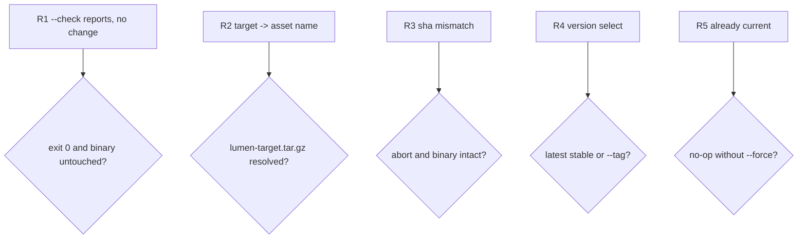

## Logic
<!-- type: logic lang: mermaid -->

```mermaid
---
id: lumen-upgrade-contract
entry: start
nodes:
  start:    { kind: start,    label: "lumen upgrade [--check] [--tag T] [--force] [-y]" }
  selfexe:  { kind: process,  label: "current_exe() -> install_path; env!(CARGO_PKG_VERSION) -> cur" }
  triple:   { kind: process,  label: "target = compile-time target triple (e.g. aarch64-apple-darwin)" }
  list:     { kind: process,  label: "GET api.github.com/repos/{repo}/releases (UA + optional GITHUB_TOKEN)" }
  pick:     { kind: process,  label: "tags lumen@X.Y.Z -> semver; pick = --tag T else max stable" }
  ckflag:   { kind: decision, label: "--check?" }
  report:   { kind: terminal, label: "print cur vs pick; exit 0" }
  cmp:      { kind: decision, label: "pick == cur and not --force?" }
  noop:     { kind: terminal, label: "'already up to date (X.Y.Z)'; exit 0" }
  findasset:{ kind: decision, label: "asset 'lumen-{target}.tar.gz' in release?" }
  noasset:  { kind: terminal, label: "err 'no asset for {target}'; exit 1" }
  confirm:  { kind: decision, label: "tty and not -y -> confirm cur->pick?" }
  abort:    { kind: terminal, label: "'aborted'; exit 0" }
  dl:       { kind: process,  label: "download tarball + '.sha256' into temp dir beside install_path" }
  sha:      { kind: decision, label: "sha256(tarball) == published sha?" }
  shabad:   { kind: terminal, label: "err 'checksum mismatch'; drop temp; exit 1" }
  untar:    { kind: process,  label: "gz-decode + untar; read inner 'lumen-{target}/lumen' -> temp bin; chmod 0755" }
  persist:  { kind: process,  label: "write temp bin next to install_path (same dir = same fs)" }
  rename:   { kind: decision, label: "rename(temp_bin, install_path) ok?" }
  permbad:  { kind: terminal, label: "err 'cannot replace {path}: permission denied; re-run with sudo'; binary intact; exit 1" }
  done:     { kind: terminal, label: "'upgraded cur -> pick'; exit 0" }
edges:
  - { from: start,    to: selfexe }
  - { from: selfexe,  to: triple }
  - { from: triple,   to: list }
  - { from: list,     to: pick }
  - { from: pick,     to: ckflag }
  - { from: ckflag,   to: report,    label: "yes" }
  - { from: ckflag,   to: cmp,       label: "no" }
  - { from: cmp,      to: noop,      label: "yes" }
  - { from: cmp,      to: findasset, label: "no" }
  - { from: findasset,to: noasset,   label: "no" }
  - { from: findasset,to: confirm,   label: "yes" }
  - { from: confirm,  to: abort,     label: "declined" }
  - { from: confirm,  to: dl,        label: "yes/-y" }
  - { from: dl,       to: sha }
  - { from: sha,      to: shabad,    label: "no" }
  - { from: sha,      to: untar,     label: "yes" }
  - { from: untar,    to: persist }
  - { from: persist,  to: rename }
  - { from: rename,   to: permbad,   label: "no" }
  - { from: rename,   to: done,      label: "yes" }
---
flowchart TD
    start([lumen upgrade]) --> selfexe[current_exe + cur version]
    selfexe --> triple[compile-time target triple]
    triple --> list[GET releases]
    list --> pick[pick --tag or max stable semver]
    pick --> ckflag{--check?}
    ckflag -->|yes| report([print cur vs pick])
    ckflag -->|no| cmp{pick == cur and not --force?}
    cmp -->|yes| noop([already up to date])
    cmp -->|no| findasset{asset for target?}
    findasset -->|no| noasset([no asset; exit 1])
    findasset -->|yes| confirm{confirm unless -y?}
    confirm -->|declined| abort([aborted])
    confirm -->|yes| dl[download tarball + .sha256 to temp]
    dl --> sha{sha256 matches?}
    sha -->|no| shabad([checksum mismatch; exit 1])
    sha -->|yes| untar[untar inner lumen to temp bin]
    untar --> persist[place temp bin in install dir]
    persist --> rename{rename over install_path?}
    rename -->|no| permbad([permission denied; intact; exit 1])
    rename -->|yes| done([upgraded])
```
## Unit Test
<!-- type: unit-test lang: mermaid -->



# Reviews

### Review 1
**Verdict:** approved

- [logic] Dispatch flow covers the full upgrade path and every documented branch: `--check` short-circuit, already-current/`--force` no-op, missing per-target asset, sha256 verify gate, and the atomic-replace permission gate — each terminating safely with the binary intact on failure.
- [unit-test] Requirements R1–R5 map onto the acceptance criteria (check no-op, target→asset resolution, sha-mismatch abort, latest-stable/`--tag` selection, already-current no-op) and are all `verify: test`, matching the code-artifact testability gate.
