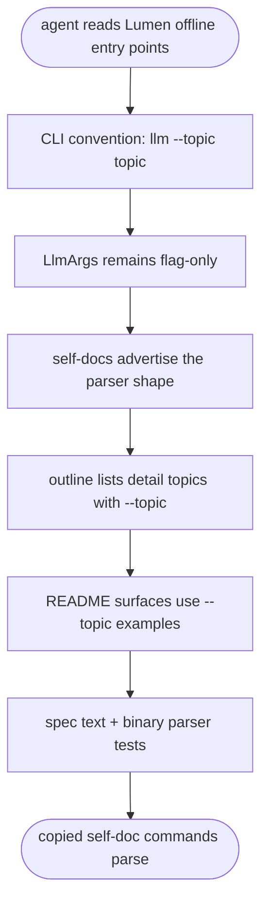
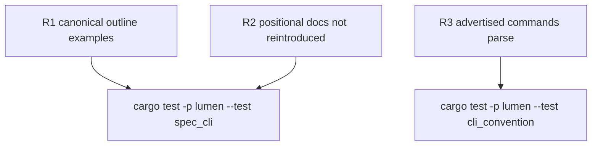

# TD: Lumen llm topic invocation docs

## Logic
<!-- type: logic lang: mermaid -->


## Unit Test
<!-- type: unit-test lang: mermaid -->


## Changes
<!-- type: changes lang: yaml -->

```yaml
changes:
  - path: projects/lumen/src/bin/lumen.rs
    action: modify
    section: logic
    impl_mode: hand-written
    description: "Change the module-level agent entry hint from `lumen llm outline` to `lumen llm --topic outline` and annotate it to this TD."
  - path: projects/lumen/src/spec.rs
    action: modify
    section: logic
    impl_mode: hand-written
    description: "Update `llm_outline_md()` topic bullets and nearby cross-topic references from positional `lumen llm <topic>` to canonical `lumen llm --topic <topic>` text."
  - path: projects/lumen/README.md
    action: modify
    section: logic
    impl_mode: hand-written
    description: "Update README brief and Agent Offline Integration surfaces to show `lumen llm --topic ...` examples."
  - path: projects/lumen/tests/spec_cli.rs
    action: modify
    section: unit-test
    impl_mode: hand-written
    description: "Add #824 `@spec` regression assertions for canonical outline topic examples and absence of rejected positional examples."
  - path: projects/lumen/tests/cli_convention.rs
    action: modify
    section: unit-test
    impl_mode: hand-written
    description: "Add #824 `@spec` binary smoke coverage that each advertised topic command parses through the built `lumen` binary."
```
