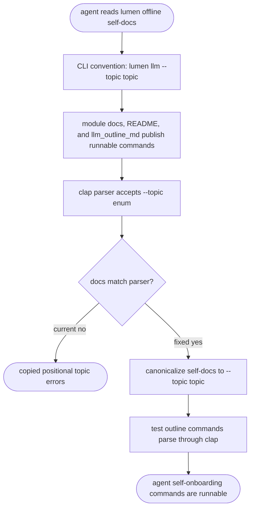
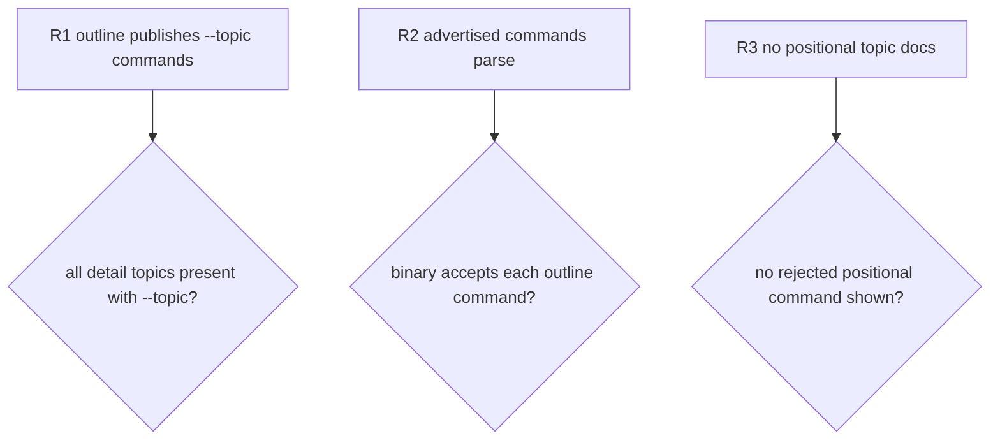

# TD: Lumen llm topic invocation docs

## Logic
<!-- type: logic lang: mermaid -->



## Unit Test
<!-- type: unit-test lang: mermaid -->



## Changes
<!-- type: changes lang: yaml -->

```yaml
changes:
  - path: projects/lumen/src/bin/lumen.rs
    action: modify
    section: logic
    impl_mode: hand-written
    description: "Update the agent-facing module documentation to point at the convention-canonical `lumen llm --topic outline` entry point."
  - path: projects/lumen/src/spec.rs
    action: modify
    section: logic
    impl_mode: hand-written
    description: "Change `llm_outline_md()` and nearby cross-topic references so every advertised detail topic uses `lumen llm --topic <topic>`."
  - path: projects/lumen/README.md
    action: modify
    section: logic
    impl_mode: hand-written
    description: "Update README capability surfaces from positional topic examples to `--topic` examples."
  - path: projects/lumen/tests/spec_cli.rs
    action: modify
    section: unit-test
    impl_mode: hand-written
    description: "Assert the outline publishes canonical `--topic` commands and does not advertise rejected positional topic commands."
  - path: projects/lumen/tests/cli_convention.rs
    action: modify
    section: unit-test
    impl_mode: hand-written
    description: "Run each topic command shape advertised by `llm_outline_md()` through the built lumen binary parser."
```
