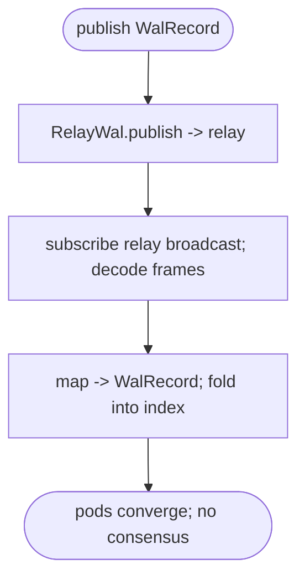
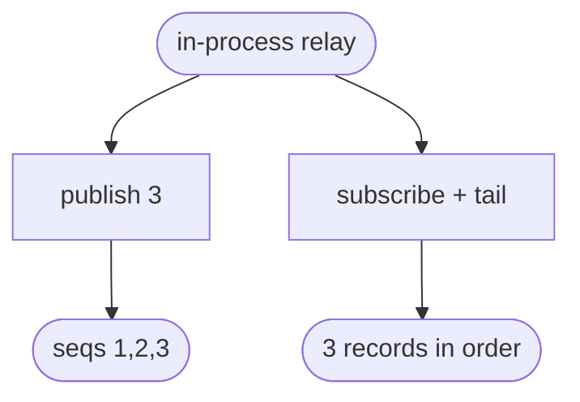

# lumen relay broadcast WAL (#124)

## Logic
<!-- type: logic lang: mermaid -->


## Unit Test
<!-- type: unit-test lang: mermaid -->


## Changes
<!-- type: changes lang: yaml -->

```yaml
changes:
  - path: projects/lumen/src/wal_relay.rs
    action: create
    section: logic
    impl_mode: hand-written
    reason: "RelayWal: a WalLog backed by relay's broadcast. publish POSTs to relay /v1/{subject}/publish (payload=json(WalRecord)); subscribe GETs /v1/{subject}/subscribe and decodes relay's length-prefixed CBOR LogEntry frames (relay::wire::decode_frames), mapping each to (seq+1, WalRecord). Plaintext h2c, no TLS."
  - path: projects/lumen/src/lib.rs
    action: modify
    section: logic
    impl_mode: hand-written
    reason: "Declare the feature-gated module: #[cfg(feature = \"relay-wal\")] pub mod wal_relay;"
  - path: projects/lumen/src/bin/lumen.rs
    action: modify
    section: logic
    impl_mode: hand-written
    reason: "Add WalBackend::Relay (feature-gated) + --relay-url/--relay-subject args + a match arm constructing RelayWal."
  - path: projects/lumen/Cargo.toml
    action: modify
    section: logic
    impl_mode: hand-written
    reason: "Optional relay (path) + reqwest deps; relay-wal feature = [dep:relay, dep:reqwest] (off by default to keep the serving binary HTTP-client-free)."
  - path: projects/lumen/tests/wal_relay.rs
    action: create
    section: unit-test
    impl_mode: hand-written
    reason: "Integration test (feature relay-wal): publish WalRecords to an in-process relay and tail them back through RelayWal, asserting in-order delivery."
```

# Reviews

### Review 1
**Verdict:** approved

- [logic] RelayWal (WalLog over relay broadcast): publish->relay /publish (seq+1), subscribe->decode_frames(LogEntry)->WalRecord; lumen folds the ordered log (derived index, no consensus). Plaintext h2c, feature-gated. Sound.
- [unit-test] in-process relay round-trip (publish 3, tail in order).
- [changes] wal_relay.rs + lib mod + bin wiring + Cargo feature + test.
