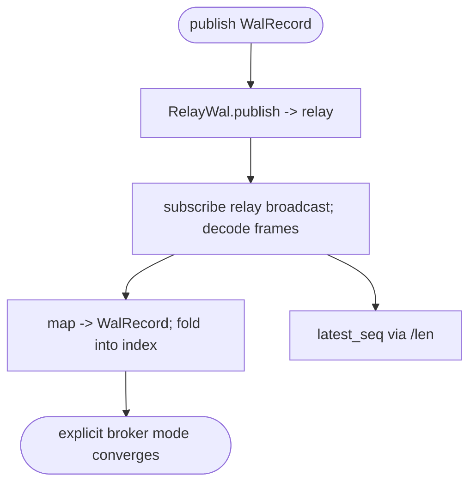
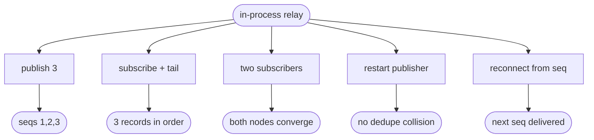

# lumen relay broadcast WAL (#124)

## Logic
<!-- type: logic lang: mermaid -->


## Unit Test
<!-- type: unit-test lang: mermaid -->


## Changes
<!-- type: changes lang: yaml -->

```yaml
changes:
  - path: projects/lumen/src/wal_relay.rs
    action: create
    section: logic
    impl_mode: hand-written
    reason: "RelayWal: a WalLog backed by relay's broadcast. publish CBOR POSTs to relay /v1/{subject}/publish (payload=versioned WalRecord::encode() envelope, publisher-unique message_id); subscribe GETs /v1/{subject}/subscribe with a per-pod subscriber_id and decodes relay's length-prefixed CBOR LogEntry frames, mapping each to (seq+1, WalRecord); latest_seq reads relay /len."
  - path: projects/lumen/src/lib.rs
    action: modify
    section: logic
    impl_mode: hand-written
    reason: "Declare the feature-gated module: #[cfg(feature = \"relay-wal\")] pub mod wal_relay;"
  - path: projects/lumen/src/bin/lumen.rs
    action: modify
    section: logic
    impl_mode: hand-written
    reason: "Add WalBackend::Relay (feature-gated) + --relay-url/--relay-subject/--relay-subscriber-id args + a match arm constructing RelayWal."
  - path: projects/lumen/Cargo.toml
    action: modify
    section: logic
    impl_mode: hand-written
    reason: "Optional relay (path) + reqwest deps; relay-wal feature = [dep:relay, dep:reqwest]."
  - path: projects/lumen/tests/wal_relay.rs
    action: create
    section: unit-test
    impl_mode: hand-written
    reason: "Integration tests (feature relay-wal): publish/tail, latest_seq, two-node fan-out, restart dedupe safety, reconnect from last seq, and invalid payload reporting against an in-process relay."
  - path: projects/relay/src/server.rs
    action: modify
    section: logic
    impl_mode: hand-written
    reason: "Expose GET /v1/{subject}/len so RelayWal.latest_seq has a concrete broker source."
```

# Reviews

### Review 1
**Verdict:** approved

- [logic] RelayWal (WalLog over relay broadcast): publish->relay /publish (seq+1), subscribe->decode_frames(LogEntry)->WalRecord with per-pod subscriber ids, latest_seq via relay /len; lumen folds the ordered broker log in explicit Relay mode. Plaintext h2c, feature-gated. Sound.
- [unit-test] in-process relay round-trip plus fan-out, restart dedupe, reconnect, and invalid payload coverage.
- [changes] wal_relay.rs + lib mod + bin wiring + Cargo feature + relay /len + test.
