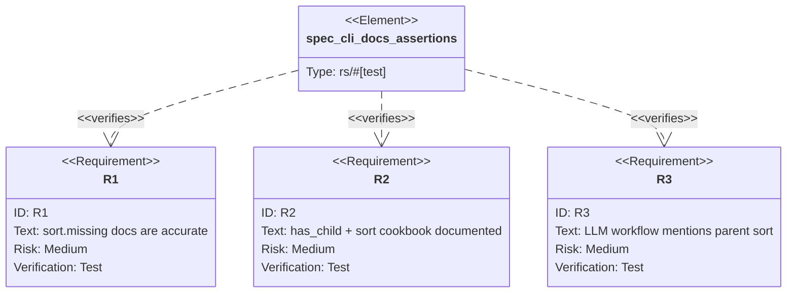

## Logic
<!-- type: logic lang: mermaid -->


## Unit Test
<!-- type: unit-test lang: mermaid -->



## E2E Test
<!-- type: e2e-test lang: yaml -->

```yaml
e2e_tests:
  - id: spec-cli-doc-surface
    name: "spec cli doc surface"
    runner: cargo
    path: projects/lumen/tests/spec_cli.rs
    command: "cargo test -p lumen --test spec_cli -- --nocapture"
    verifies:
      - "OpenAPI/schema JSON is valid."
      - "Query-shape cookbook includes the updated has_child + sort wording."
      - "LLM workflow includes the nested filter + parent sort confirmation."
  - id: has-child-sort-runtime-regression
    name: "has_child sort runtime regression"
    runner: cargo
    path: projects/lumen/src/storage.rs
    command: "cargo test -p lumen storage::tests::has_child_sort_tests -- --nocapture"
    verifies:
      - "The runtime behavior documented here remains covered by existing storage tests."
```
