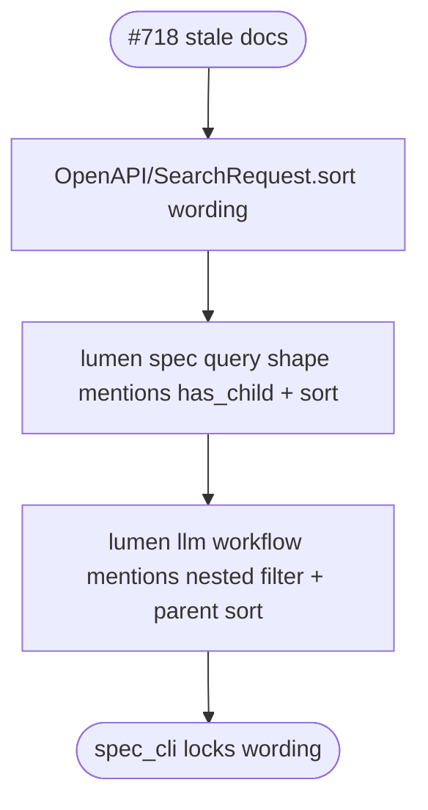

## Logic
<!-- type: logic lang: mermaid -->

```mermaid
---
id: sort-doc-refresh-applicability
entry: start
nodes:
  start:      { kind: start, label: "issue #718: docs lag runtime behavior" }
  schema:     { kind: process, label: "Update SearchRequest.sort schema wording" }
  cookbook:   { kind: process, label: "Add has_child + parent sort cookbook cue" }
  workflow:   { kind: process, label: "Add LLM workflow line for nested filter + parent sort" }
  verify:     { kind: terminal, label: "spec_cli asserts agent-facing text" }
edges:
  - { from: start, to: schema }
  - { from: schema, to: cookbook }
  - { from: cookbook, to: workflow }
  - { from: workflow, to: verify }
---
flowchart TD
    start([#718 stale docs]) --> schema[OpenAPI/SearchRequest.sort wording]
    schema --> cookbook[lumen spec query shape mentions has_child + sort]
    cookbook --> workflow[lumen llm workflow mentions nested filter + parent sort]
    workflow --> verify([spec_cli locks wording])
```
