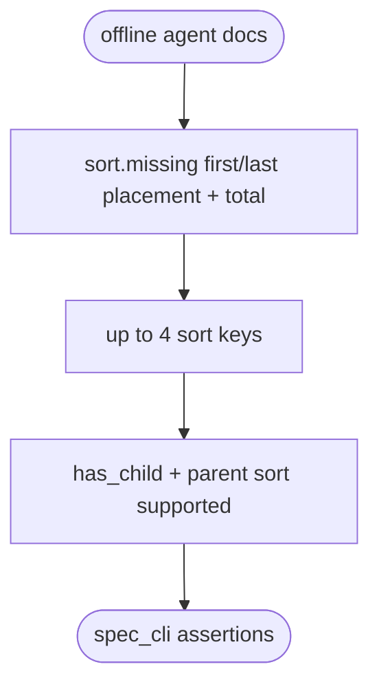
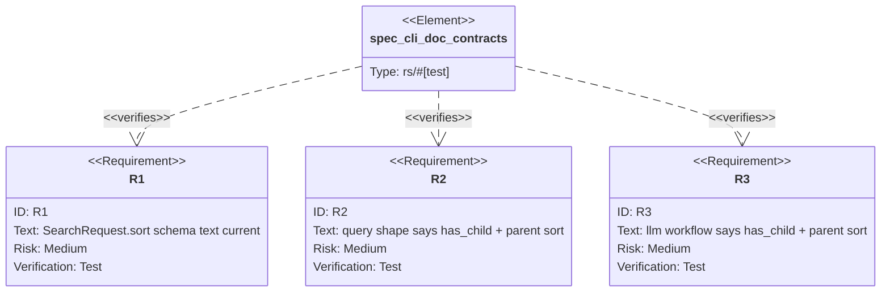

## Logic
<!-- type: logic lang: mermaid -->


## Unit Test
<!-- type: unit-test lang: mermaid -->


## E2E Test
<!-- type: e2e-test lang: yaml -->

```yaml
e2e_tests:
  - id: spec-cli-agent-doc-contract
    name: "spec cli agent doc contract"
    runner: cargo
    path: projects/lumen/tests/spec_cli.rs
    command: "cargo test -p lumen --test spec_cli -- --nocapture"
    verifies:
      - "OpenAPI JSON/YAML remain valid after doc string changes."
      - "Query shape and LLM workflow text expose current sort behavior."
  - id: storage-has-child-sort-contract
    name: "storage has_child sort contract"
    runner: cargo
    path: projects/lumen/src/storage.rs
    command: "cargo test -p lumen storage::tests::has_child_sort_tests -- --nocapture"
    verifies:
      - "Runtime support for has_child + parent sorting remains covered."
```
## Changes
<!-- type: changes lang: yaml -->

```yaml
changes:
  - path: projects/lumen/src/types.rs
    action: modify
    section: logic
    impl_mode: hand-written
    description: "Update SearchRequest.sort docs to say up to four keys, missing=first/last keep and count rows, and sorted has_child queries are supported through materialization."
  - path: projects/lumen/src/spec.rs
    action: modify
    section: logic
    impl_mode: hand-written
    description: "Update query shape and LLM workflow text for has_child + parent-field sort."
  - path: projects/lumen/tests/spec_cli.rs
    action: modify
    section: unit-test
    impl_mode: hand-written
    description: "Lock the corrected agent-facing docs with spec_cli assertions."
```
