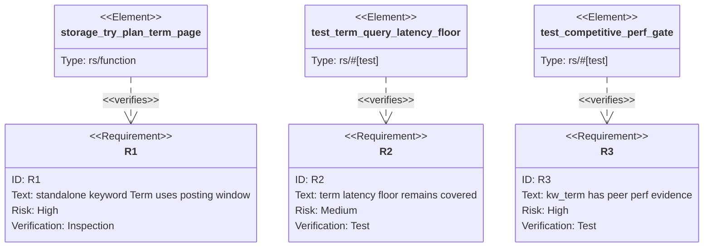

## Logic
<!-- type: logic lang: mermaid -->

```mermaid
---
id: kw-term-early-stop-applicability
entry: start
nodes:
  start:    { kind: start, label: "issue #45: kw_term must not materialize every high-selectivity hit" }
  inspect:  { kind: process, label: "Inspect storage planner for standalone Term queries" }
  planner:  { kind: process, label: "Use posting-window path: first limit docids + posting len total" }
  evidence: { kind: process, label: "Verify with perf_gate and vat ec-efficiency-meter" }
  close:    { kind: terminal, label: "Close stale perf regression with TD evidence" }
edges:
  - { from: start, to: inspect }
  - { from: inspect, to: planner }
  - { from: planner, to: evidence }
  - { from: evidence, to: close }
---
flowchart TD
    start([#45 high-selectivity kw_term regression]) --> inspect[Inspect storage::try_plan]
    inspect --> planner[Standalone Term planner returns posting.take(limit) + posting.len]
    planner --> evidence[perf_gate + vat ec-efficiency-meter evidence]
    evidence --> close([Issue closed by existing implementation claim])
```

## Unit Test
<!-- type: unit-test lang: mermaid -->



## E2E Test
<!-- type: e2e-test lang: yaml -->

```yaml
e2e_tests:
  - id: vat-ec-efficiency-meter-kw-term
    name: "vat ec-efficiency meter covers kw_term"
    runner: vat
    path: projects/lumen/vat.toml
    command: "cd projects/lumen && ../../target/debug/vat run ec-efficiency-meter"
    verifies:
      - "Postgres and OpenSearch peers are provisioned by vat, not mocked."
      - "The release `perf_gate_vs_db::competitive_perf_gate` includes the kw_term cell and native pg cheap-predicate evidence."
      - "A clean meter report proves the current kw_term planner did not regress the release competitive gate."
  - id: perf-gate-term-latency-floor
    name: "term latency floor"
    runner: cargo
    path: projects/lumen/tests/perf_gate.rs
    command: "cargo test -p lumen --test perf_gate term_query_latency_floor -- --exact --nocapture"
    verifies:
      - "The local perf gate still exercises the term lookup latency floor."
```

## Changes
<!-- type: changes lang: yaml -->

```yaml
coverage_kind: semantic
changes:
  - path: projects/lumen/src/storage.rs
    action: claim
    section: logic
    impl_mode: hand-written
    reason: "Existing `try_plan` standalone Term branch returns a posting-window page and exact bitmap-cardinality total without full-score materialization."
  - path: projects/lumen/tests/perf_gate.rs
    action: verify
    section: unit-test
    impl_mode: hand-written
    reason: "Existing term latency floor remains the local regression check for exact term lookup cost."
  - path: projects/lumen/tests/perf_gate_vs_db.rs
    action: verify
    section: e2e-test
    impl_mode: hand-written
    reason: "Existing competitive gate carries kw_term peer evidence through pg-native/OpenSearch comparison."
  - path: projects/lumen/vat.toml
    action: verify
    section: e2e-test
    impl_mode: hand-written
    reason: "Existing ec-efficiency-meter runner provisions pg/OpenSearch and runs the release competitive gate under meter."
  - path: projects/lumen/README.md
    action: claim
    section: changes
    impl_mode: hand-written
    reason: "Existing performance contract documents kw_term pg-native and OpenSearch margins as green."
```
