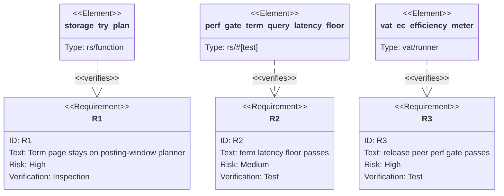

## Logic
<!-- type: logic lang: mermaid -->

```mermaid
---
id: kw-term-early-stop-contract
entry: request
nodes:
  request: { kind: start, label: "POST /search Term(city=taipei), no sort, first page" }
  plan:    { kind: process, label: "try_plan detects standalone Term" }
  page:    { kind: process, label: "Read posting iterator and take limit docids" }
  total:   { kind: process, label: "Use posting.len as exact total; do not build scored HashMap" }
  output:  { kind: terminal, label: "Return constant-score page in posting order" }
edges:
  - { from: request, to: plan }
  - { from: plan, to: page }
  - { from: page, to: total }
  - { from: total, to: output }
---
flowchart TD
    request([Term query, no sort]) --> plan[Planner standalone Term branch]
    plan --> page[posting.iter().take(limit)]
    page --> total[posting.len exact total]
    total --> output([No full materialization or ranking])
```
## Unit Test
<!-- type: unit-test lang: mermaid -->


## E2E Test
<!-- type: e2e-test lang: yaml -->

```yaml
e2e_tests:
  - id: vat-ec-efficiency-meter-kw-term
    name: "vat ec-efficiency meter covers kw_term"
    runner: vat
    path: projects/lumen/vat.toml
    command: "cd projects/lumen && ../../target/debug/vat run ec-efficiency-meter"
    verifies:
      - "Postgres and OpenSearch peers are provisioned by vat, not mocked."
      - "The release `perf_gate_vs_db::competitive_perf_gate` includes the kw_term cell and native pg cheap-predicate evidence."
      - "A clean meter report proves the current kw_term planner did not regress the release competitive gate."
  - id: perf-gate-term-latency-floor
    name: "term latency floor"
    runner: cargo
    path: projects/lumen/tests/perf_gate.rs
    command: "cargo test -p lumen --test perf_gate term_query_latency_floor -- --exact --nocapture"
    verifies:
      - "The local perf gate still exercises the term lookup latency floor."
```

## Changes
<!-- type: changes lang: yaml -->

```yaml
coverage_kind: semantic
changes:
  - path: projects/lumen/src/storage.rs
    action: claim
    section: logic
    impl_mode: hand-written
    reason: "Existing `try_plan` standalone Term branch returns a posting-window page and exact bitmap-cardinality total without full-score materialization."
  - path: projects/lumen/tests/perf_gate.rs
    action: verify
    section: unit-test
    impl_mode: hand-written
    reason: "Existing term latency floor remains the local regression check for exact term lookup cost."
  - path: projects/lumen/tests/perf_gate_vs_db.rs
    action: verify
    section: e2e-test
    impl_mode: hand-written
    reason: "Existing competitive gate carries kw_term peer evidence through pg-native/OpenSearch comparison."
  - path: projects/lumen/vat.toml
    action: verify
    section: e2e-test
    impl_mode: hand-written
    reason: "Existing ec-efficiency-meter runner provisions pg/OpenSearch and runs the release competitive gate under meter."
  - path: projects/lumen/README.md
    action: claim
    section: changes
    impl_mode: hand-written
    reason: "Existing performance contract documents kw_term pg-native and OpenSearch margins as green."
```
