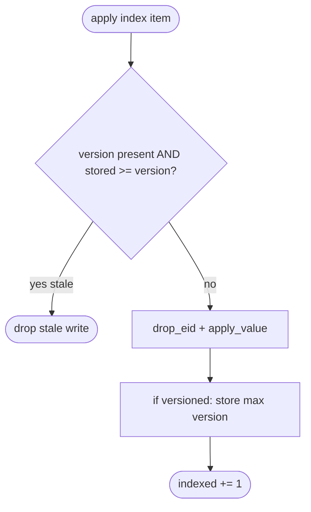
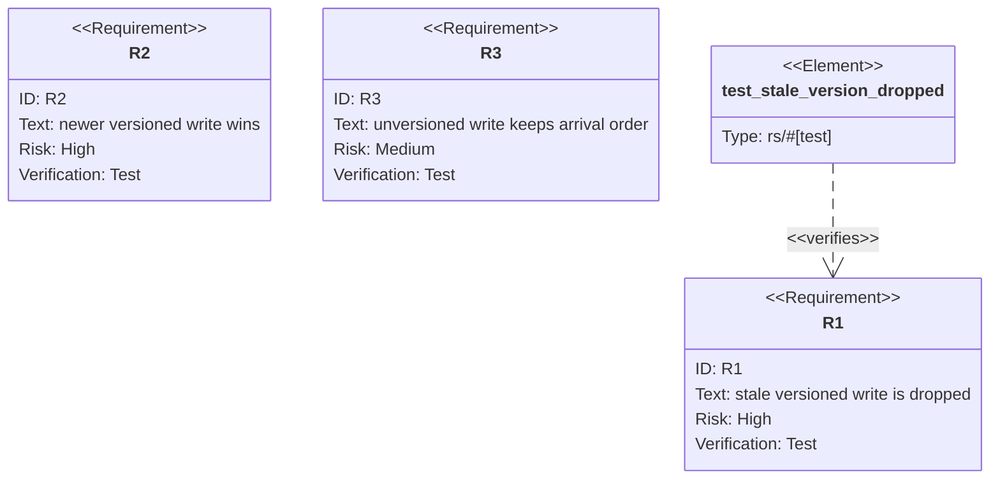

## Logic
<!-- type: logic lang: mermaid -->

## Unit Test
<!-- type: unit-test lang: mermaid -->

# Reviews

### Review 1
**Verdict:** approved

- [logic] Applicable: the change is a per-item branch in the index apply path (stale-version drop before drop_eid+apply_value); a flowchart is the right contract.
- [unit-test] Applicable: LWW behavior is verifiable by unit tests (stale dropped, newer wins, unversioned arrival order).
