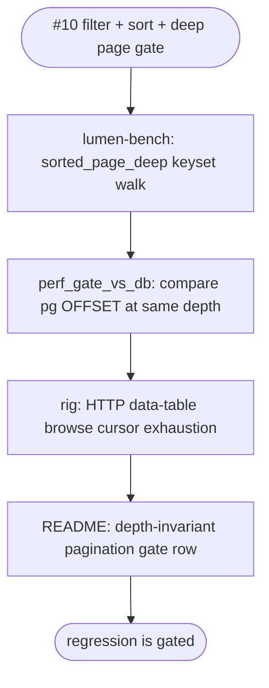
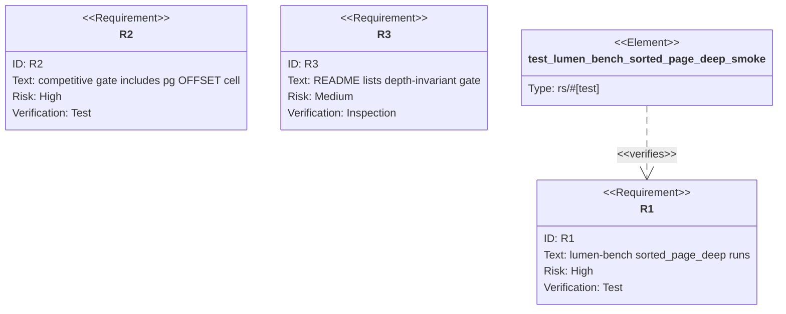

## Logic
<!-- type: logic lang: mermaid -->

```mermaid
---
id: filter-sort-deep-page-gate
entry: start
nodes:
  start:      { kind: start,    label: "issue #10: filter + sort + deep page must be gated" }
  bench:      { kind: process,  label: "lumen-bench sorted_page_deep builds corpus and walks to depth via keyset cursors" }
  gate:       { kind: process,  label: "perf_gate_vs_db measures sorted_page_deep vs pg OFFSET at same depth" }
  rig:        { kind: process,  label: "rig data_table_browse drives HTTP filter+sort cursor paging to exhaustion" }
  docs:       { kind: process,  label: "README capability inventory names depth-invariant pagination gate" }
  verify:     { kind: terminal, label: "cargo/rig/vat evidence prevents O(offset) regression" }
edges:
  - { from: start, to: bench }
  - { from: bench, to: gate }
  - { from: gate,  to: rig }
  - { from: rig,   to: docs }
  - { from: docs,  to: verify }
---
flowchart TD
    start([#10 filter + sort + deep page gate]) --> bench[lumen-bench: sorted_page_deep keyset walk]
    bench --> gate[perf_gate_vs_db: compare pg OFFSET at same depth]
    gate --> rig[rig: HTTP data-table browse cursor exhaustion]
    rig --> docs[README: depth-invariant pagination gate row]
    docs --> verify([regression is gated])
```

## Unit Test
<!-- type: unit-test lang: mermaid -->

```mermaid
---
id: filter-sort-deep-page-unit-verification
requirements:
  bench_cli_accepts_sorted_page_deep:
    id: R1
    text: "`lumen-bench run --types sorted_page_deep` executes the keyset deep-page cell and reports p50/p99"
    kind: functional
    risk: high
    verify: test
  competitive_gate_knows_sorted_page_deep:
    id: R2
    text: "perf_gate_vs_db includes sorted_page_deep with a pg OFFSET peer and ratcheted baseline entry"
    kind: design-constraint
    risk: high
    verify: test
  readme_lists_depth_invariant_gate:
    id: R3
    text: "README performance/search-core inventory names the depth-invariant pagination gate and evidence"
    kind: design-constraint
    risk: medium
    verify: inspection
elements:
  test_lumen_bench_sorted_page_deep_smoke:
    kind: test
    type: "rs/#[test]"
  test_competitive_gate_sorted_page_deep_registered:
    kind: test
    type: "rs/#[test]"
  test_readme_gate_inventory_updated:
    kind: test
    type: "inspection"
relations:
  - { from: test_lumen_bench_sorted_page_deep_smoke, verifies: bench_cli_accepts_sorted_page_deep }
  - { from: test_competitive_gate_sorted_page_deep_registered, verifies: competitive_gate_knows_sorted_page_deep }
  - { from: test_readme_gate_inventory_updated, verifies: readme_lists_depth_invariant_gate }
---
requirementDiagram
    requirement R1 {
      id: R1
      text: "lumen-bench sorted_page_deep runs"
      risk: high
      verifymethod: test
    }
    requirement R2 {
      id: R2
      text: "competitive gate includes pg OFFSET cell"
      risk: high
      verifymethod: test
    }
    requirement R3 {
      id: R3
      text: "README lists depth-invariant gate"
      risk: medium
      verifymethod: inspection
    }
    element test_lumen_bench_sorted_page_deep_smoke {
      type: "rs/#[test]"
    }
    test_lumen_bench_sorted_page_deep_smoke - verifies -> R1
```
