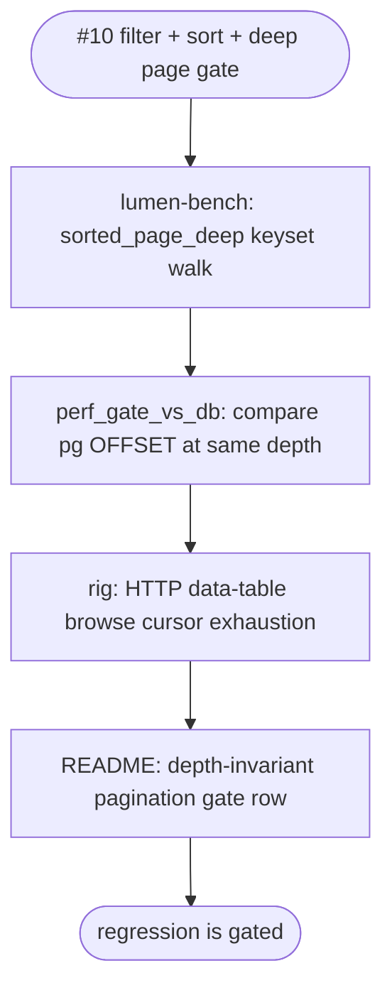
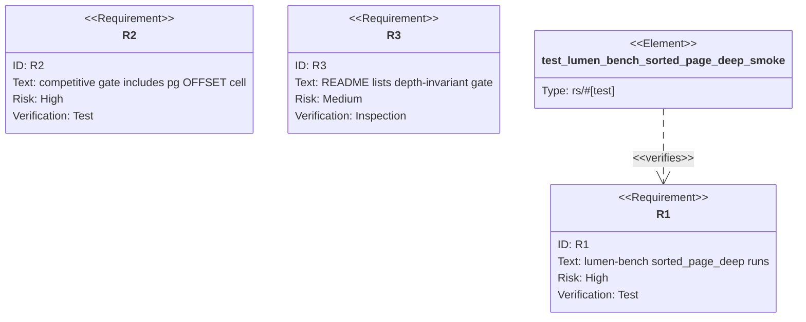

## Logic
<!-- type: logic lang: mermaid -->



## Unit Test
<!-- type: unit-test lang: mermaid -->



## E2E Test
<!-- type: e2e-test lang: yaml -->

```yaml
e2e_tests:
  - id: rig-data-table-browse
    name: "rig data-table browse"
    runner: rig
    path: projects/lumen/tests/rig/cases/load/data_table_browse.toml
    command: "cd projects/lumen && ../../target/debug/rig run --dir tests/rig/cases/load --case data_table_browse"
    verifies:
      - "Seeds a browse corpus over the HTTP API."
      - "Pages through filter+sort cursor results to exhaustion."
      - "Asserts page concatenation matches a one-shot sorted oracle."
      - "Asserts deep-page p99 stays within the shallow-page tolerance."
  - id: vat-rig-data-table-browse
    name: "vat rig data-table browse"
    runner: vat
    path: projects/lumen/vat.toml
    command: "cd projects/lumen && ../../target/debug/vat run rig-load"
    verifies:
      - "The load runner includes the data_table_browse rig case when vat provisions the lumen service."
  - id: vat-ec-efficiency-meter
    name: "vat efficiency meter"
    runner: vat
    path: projects/lumen/vat.toml
    command: "cd projects/lumen && ../../target/debug/vat run ec-efficiency-meter"
    verifies:
      - "The strict competitive gate can be run in a vat-owned pg/OpenSearch environment."
```

## Changes
<!-- type: changes lang: yaml -->

```yaml
changes:
  - path: projects/lumen/Cargo.toml
    action: modify
    section: logic
    impl_mode: hand-written
    description: "Register the lumen-bench binary used by the issue #10 bench and vat meter-profile runner."
  - path: projects/lumen/src/bin/lumen-bench.rs
    action: create
    section: logic
    impl_mode: hand-written
    description: "Implement `lumen-bench run --types sorted_page_deep` with keyset deep-page p50/p99 reporting."
  - path: projects/lumen/tests/lumen_bench_cli.rs
    action: create
    section: unit-test
    impl_mode: hand-written
    description: "Smoke-test the sorted_page_deep bench CLI and output fields."
  - path: projects/lumen/tests/perf_gate_vs_db.rs
    action: modify
    section: logic
    impl_mode: hand-written
    description: "Add the sorted_page_deep competitive cell with a Postgres OFFSET peer query at the same depth."
  - path: projects/lumen/tests/perf-baseline.json
    action: modify
    section: logic
    impl_mode: hand-written
    description: "Record the ratcheted sorted_page_deep pg baseline entry."
  - path: projects/lumen/tests/rig/cases/load/data_table_browse.toml
    action: create
    section: e2e-test
    impl_mode: hand-written
    description: "Add the HTTP browse rig scenario for filter+sort cursor exhaustion and latency flatness."
  - path: projects/lumen/vat.toml
    action: modify
    section: e2e-test
    impl_mode: hand-written
    description: "Keep vat load/meter runners aligned with the new browse and lumen-bench surfaces."
  - path: projects/lumen/README.md
    action: modify
    section: changes
    impl_mode: hand-written
    description: "Add the depth-invariant pagination promise and gate inventory row."
```
