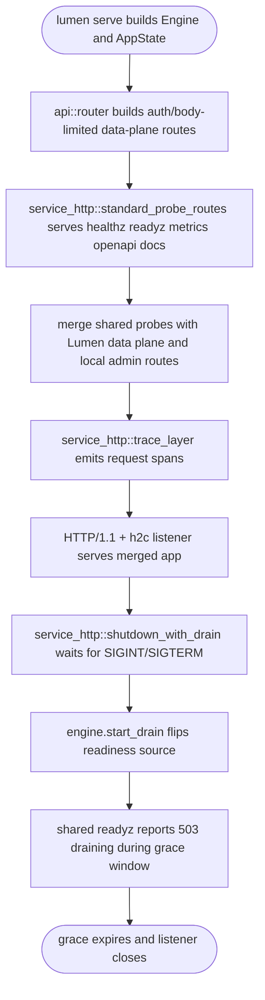
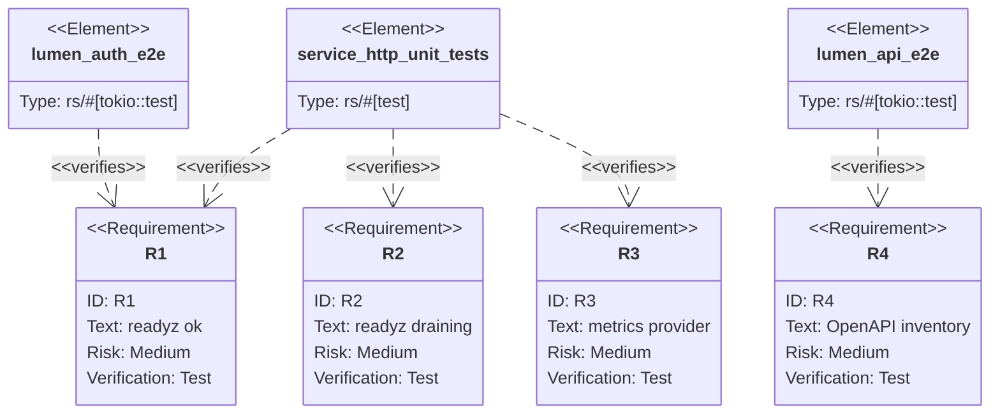

## Logic
<!-- type: logic lang: mermaid -->


## Unit Test
<!-- type: unit-test lang: mermaid -->


## E2E Test
<!-- type: e2e-test lang: yaml -->

```yaml
e2e_tests:
  - id: lumen-service-http-api-contract
    name: "lumen shared service-http probe contract"
    runner: cargo
    path: projects/lumen/tests/api_e2e.rs
    command: "cargo test -p lumen --test api_e2e -- --nocapture"
    verifies:
      - "GET /healthz and GET /readyz stay 200 without authentication."
      - "GET /metrics keeps Prometheus text from the Lumen engine."
      - "GET /openapi.json keeps standard endpoint paths and data-plane paths."
  - id: lumen-service-http-auth-exempt-contract
    name: "lumen shared probes remain auth-exempt"
    runner: cargo
    path: projects/lumen/tests/auth_e2e.rs
    command: "cargo test -p lumen --test auth_e2e -- --nocapture"
    verifies:
      - "Health, readiness, and metrics remain outside the data-plane auth layer."
  - id: lumen-package-regression
    name: "lumen package regression"
    runner: cargo
    path: projects/lumen
    command: "cargo test -p lumen"
    verifies:
      - "The package compiles and the full Lumen regression suite remains green."
```
## Changes
<!-- type: changes lang: yaml -->

```yaml
changes:
  - path: libs/service-http/src/probes.rs
    action: modify
    section: logic
    impl_mode: hand-written
    description: "Preserve Lumen's readyz body contract while serving readiness from the shared probe router."
  - path: projects/lumen/Cargo.toml
    action: modify
    section: logic
    impl_mode: hand-written
    description: "Add the service-http dependency to Lumen."
  - path: projects/lumen/src/api.rs
    action: modify
    section: logic
    impl_mode: hand-written
    description: "Implement service_http readiness/metrics adapters for Engine, build shared probe routes, keep local OpenAPI path annotations, and use service_http::trace_layer."
  - path: projects/lumen/src/bin/lumen.rs
    action: modify
    section: logic
    impl_mode: hand-written
    description: "Replace the local shutdown signal/drain future with service_http::shutdown_with_drain while keeping OTLP tracing intact."
  - path: projects/lumen/tech-design/semantic/source/projects-lumen-src-api-rs.md
    action: modify
    section: logic
    impl_mode: hand-written
    description: "Synchronize the spec-managed source capture for api.rs service-http adoption."
  - path: projects/lumen/tech-design/semantic/source/projects-lumen-src-bin-lumen-rs.md
    action: modify
    section: logic
    impl_mode: hand-written
    description: "Synchronize the spec-managed source capture for bin/lumen.rs drain wiring."
```
