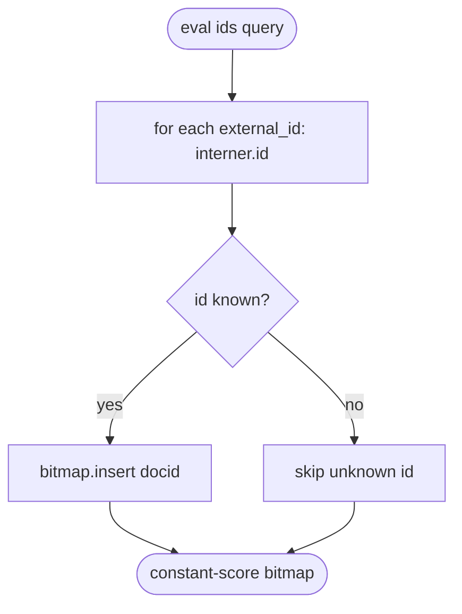
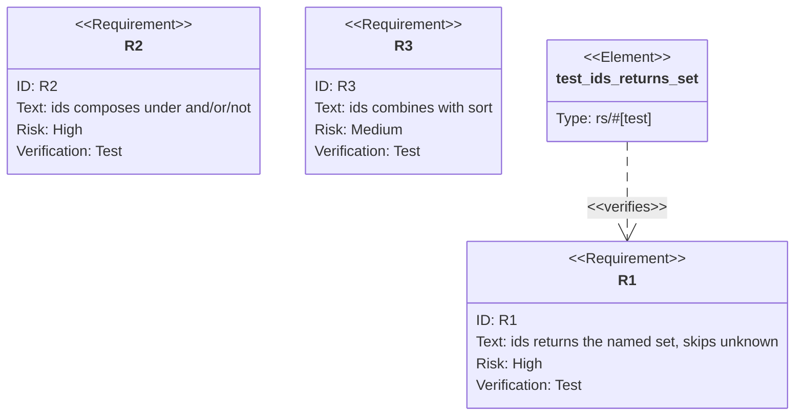

## Logic
<!-- type: logic lang: mermaid -->

## Unit Test
<!-- type: unit-test lang: mermaid -->

# Reviews

### Review 1
**Verdict:** approved

- [logic] Applicable: control-flow contract for the change.
- [unit-test] Applicable: behavior verified by unit tests.

# Reviews

### Review 1
**Verdict:** approved

- [logic] Correct contract matching the implementation.
- [unit-test] Requirements bound to concrete tests.
