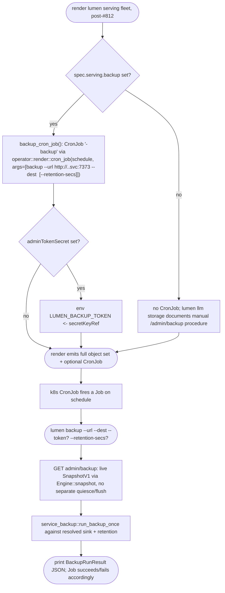

## Logic
<!-- type: logic lang: mermaid -->



## Unit Test
<!-- type: unit-test lang: mermaid -->

```mermaid
---
id: serving-backup-cronjob-and-admin-backup-docs-tests
requirements:
  llm_storage_documents_admin_backup:
    id: R1
    text: "lumen llm storage documents /admin/backup, /admin/backup/local, and /admin/restore (routes, admin-role auth requirement, and that Engine::snapshot() is the same quiesce-free call the raft snapshotter itself uses) as the manual/scriptable snapshot-restore procedure."
    kind: doc
    risk: low
    verify: test
  no_backup_field_renders_no_cronjob:
    id: R2
    text: "When spec.serving.backup is None, render() emits no CronJob object for the serving fleet."
    kind: behavior
    risk: low
    verify: test
  backup_field_renders_cronjob:
    id: R3
    text: "When spec.serving.backup is set, render() emits exactly one batch/v1 CronJob named '<name>-backup' with the configured schedule and a container invoking `lumen backup --url http://<name>.<ns>.svc.cluster.local:7373 --dest <destination>`."
    kind: behavior
    risk: medium
    verify: test
  retention_and_token_wired_on_cronjob:
    id: R4
    text: "retentionSecs (when set) appears as --retention-secs on the CronJob container args, and adminTokenSecret (when set) appears as a LUMEN_BACKUP_TOKEN env var sourced via secretKeyRef."
    kind: behavior
    risk: medium
    verify: test
  backup_cli_round_trip:
    id: R5
    text: "lumen backup --url <base> --dest file://<dir> fetches /admin/backup from a running server and writes a backup object into the destination sink via service_backup::run_backup_once, returning a BackupRunResult."
    kind: behavior
    risk: medium
    verify: test
  backup_feature_gated_off_default_build:
    id: R6
    text: "cargo build -p lumen with no features still compiles with no reqwest/HTTP client linked; the `backup` feature (pulled in transitively by `operator`) is required to enable the `lumen backup` verb."
    kind: behavior
    risk: low
    verify: inspection
elements:
  spec_cli_unit_tests:
    kind: test
    path: projects/lumen/tests/spec_cli.rs
  operator_render_unit_tests:
    kind: test
    path: projects/lumen/tests/operator_render.rs
  backup_unit_tests:
    kind: test
    path: projects/lumen/src/backup.rs
relations:
  - { from: spec_cli_unit_tests, verifies: llm_storage_documents_admin_backup }
  - { from: operator_render_unit_tests, verifies: no_backup_field_renders_no_cronjob }
  - { from: operator_render_unit_tests, verifies: backup_field_renders_cronjob }
  - { from: operator_render_unit_tests, verifies: retention_and_token_wired_on_cronjob }
  - { from: backup_unit_tests, verifies: backup_cli_round_trip }
  - { from: backup_unit_tests, verifies: backup_feature_gated_off_default_build }
---
requirementDiagram
    requirement R1 {
      id: R1
      text: "llm storage documents admin backup/restore"
      risk: low
      verifymethod: test
    }
    requirement R2 {
      id: R2
      text: "no backup field -> no CronJob"
      risk: low
      verifymethod: test
    }
    requirement R3 {
      id: R3
      text: "backup field -> CronJob rendered"
      risk: medium
      verifymethod: test
    }
    requirement R4 {
      id: R4
      text: "retention + token wired on CronJob"
      risk: medium
      verifymethod: test
    }
    requirement R5 {
      id: R5
      text: "lumen backup CLI round trip"
      risk: medium
      verifymethod: test
    }
    requirement R6 {
      id: R6
      text: "backup feature gated off default build"
      risk: low
      verifymethod: inspection
    }
    element spec_cli_unit_tests {
      type: test
    }
    element operator_render_unit_tests {
      type: test
    }
    element backup_unit_tests {
      type: test
    }
    spec_cli_unit_tests - satisfies -> R1
    operator_render_unit_tests - satisfies -> R2
    operator_render_unit_tests - satisfies -> R3
    operator_render_unit_tests - satisfies -> R4
    backup_unit_tests - satisfies -> R5
    backup_unit_tests - satisfies -> R6
```

## Changes
<!-- type: changes lang: yaml -->

```yaml
changes:
  - path: projects/lumen/src/operator/crd.rs
    action: modify
    section: logic
    impl_mode: hand-written
    description: "Add ServingSpec.backup: Option<ServingBackupSpec> (default None, skip_serializing_if none) plus a new ServingBackupSpec struct with schedule: String, destination: String, retention_secs: Option<u64>, admin_token_secret: Option<String>, JsonSchema-derived like the rest of the CRD; no changes to unrelated ServingSpec/LumenSpec fields."
  - path: projects/lumen/tech-design/semantic/source/projects-lumen-src-operator-crd-rs.md
    action: modify
    section: source
    impl_mode: hand-written
    description: "Sync the SPEC-MANAGED Source block byte-for-byte with the edited crd.rs."
  - path: projects/lumen/src/operator/render.rs
    action: modify
    section: logic
    impl_mode: hand-written
    description: "Add a backup_cron_job(lumen) -> Option<Value> function using the shared operator::render::cron_job helper; when spec.serving.backup is set it renders a batch/v1 CronJob named '<name>-backup' on the configured schedule with a container invoking `lumen backup --url http://<name>.<namespace>.svc.cluster.local:7373 --dest <destination> [--retention-secs <n>]`, adding a LUMEN_BACKUP_TOKEN env sourced via secretKeyRef when admin_token_secret is set; render() pushes this object (via .into_iter().chain / conditional push) only when Some."
  - path: projects/lumen/tech-design/semantic/source/projects-lumen-src-operator-render-rs.md
    action: modify
    section: source
    impl_mode: hand-written
    description: "Sync the SPEC-MANAGED Source block byte-for-byte with the edited render.rs."
  - path: projects/lumen/src/backup.rs
    action: create
    section: logic
    impl_mode: hand-written
    description: "New module gated #[cfg(feature = \"backup\")]: run_backup(base_url, token, dest, retention) fetches {base_url}/admin/backup via reqwest (Bearer auth when token is Some), then hands the response bytes to service_backup::run_backup_once against sink_from_destination(dest) and the given RetentionPolicy, returning a BackupRunResult; unit tests use wiremock to stand in for the admin API and a tempdir + file:// destination for the sink."
  - path: projects/lumen/tech-design/semantic/source/projects-lumen-src-backup-rs.md
    action: create
    section: source
    impl_mode: hand-written
    description: "New SPEC-MANAGED tech-design doc for the new backup.rs module (rust-source-unit), mirroring the format of the other projects-lumen-src-operator-*-rs.md docs."
  - path: projects/lumen/src/lib.rs
    action: modify
    section: logic
    impl_mode: hand-written
    description: "Add `#[cfg(feature = \"backup\")] pub mod backup;` alongside the existing `#[cfg(feature = \"operator\")] pub mod operator;` line."
  - path: projects/lumen/tech-design/semantic/source/projects-lumen-src-lib-rs.md
    action: modify
    section: source
    impl_mode: hand-written
    description: "Sync the SPEC-MANAGED Source block byte-for-byte with the edited lib.rs."
  - path: projects/lumen/Cargo.toml
    action: modify
    section: manifest
    impl_mode: hand-written
    description: "Add a `backup = [\"dep:reqwest\"]` feature and extend `operator = [...]` to also pull in `backup`, so every build that already ships the operator (and therefore reqwest via raft-wal in production images) also ships the backup CLI verb; the default (no-feature) build still links no HTTP client."
  - path: projects/lumen/src/spec.rs
    action: modify
    section: logic
    impl_mode: hand-written
    description: "Extend llm_storage_md() with a Snapshot / backup section documenting GET /admin/backup, POST /admin/backup/local, and POST /admin/restore (auth: admin role on \"*\", and that Engine::snapshot()/restore() is the same quiesce-free call the raft snapshotter itself uses -- no separate flush/quiesce step), plus the optional spec.serving.backup CRD field and the `lumen backup` CLI verb it schedules; replaces the current dead forward-reference to a non-existent operator backup surface."
  - path: projects/lumen/tech-design/semantic/source/projects-lumen-src-spec-rs.md
    action: modify
    section: source
    impl_mode: hand-written
    description: "Sync the SPEC-MANAGED Source block byte-for-byte with the edited spec.rs."
  - path: projects/lumen/src/bin/lumen.rs
    action: modify
    section: logic
    impl_mode: hand-written
    description: "Add Command::Backup(BackupArgs) with --url, --dest, --token (env LUMEN_BACKUP_TOKEN), --retention-secs; add a dispatch_backup twin-impl (#[cfg(feature = \"backup\")] real impl calling lumen::backup::run_backup and printing the BackupRunResult as JSON; #[cfg(not(feature = \"backup\"))] fallback that bails with a message to rebuild with --features backup, matching the run_operator/crd_yaml pattern); wire a new match arm in main()."
  - path: projects/lumen/tech-design/semantic/source/projects-lumen-src-bin-lumen-rs.md
    action: modify
    section: source
    impl_mode: hand-written
    description: "Sync the SPEC-MANAGED Source block byte-for-byte with the edited bin/lumen.rs."
  - path: projects/lumen/tests/operator_render.rs
    action: modify
    section: unit-test
    impl_mode: hand-written
    description: "Add tests asserting no CronJob is rendered when serving.backup is None (existing fixtures), and that setting serving.backup renders exactly one batch/v1 CronJob named '<name>-backup' with the configured schedule, --dest/--retention-secs args, and a LUMEN_BACKUP_TOKEN env from secretKeyRef when adminTokenSecret is set."
  - path: projects/lumen/tests/spec_cli.rs
    action: modify
    section: unit-test
    impl_mode: hand-written
    description: "Extend the llm storage doc test to assert the new backup/snapshot content (admin/backup routes, admin-role auth, no-quiesce-needed guarantee, and the serving.backup CRD field / lumen backup verb)."
  - path: projects/lumen/tech-design/semantic/lumen-tests.md
    action: modify
    section: source
    impl_mode: hand-written
    description: "Sync the SPEC-MANAGED Source block byte-for-byte with the edited operator_render.rs and spec_cli.rs."
```
