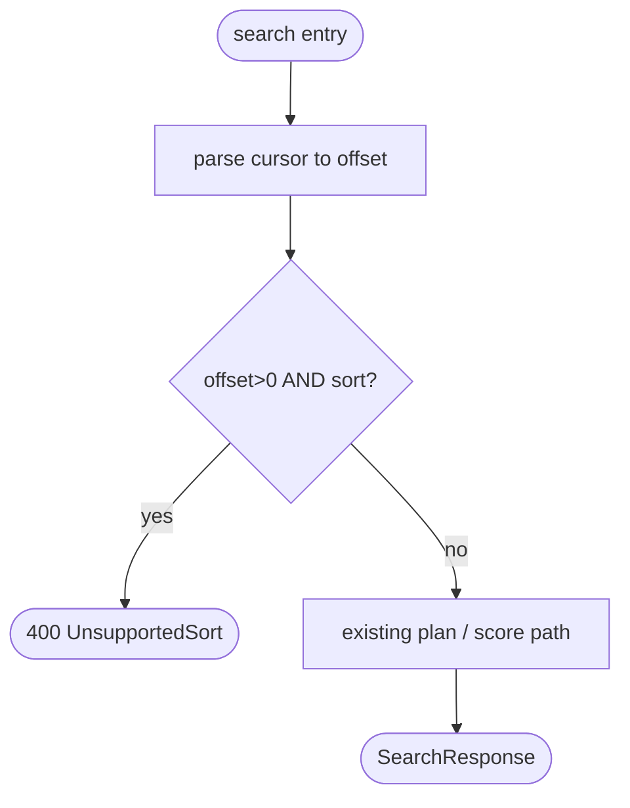
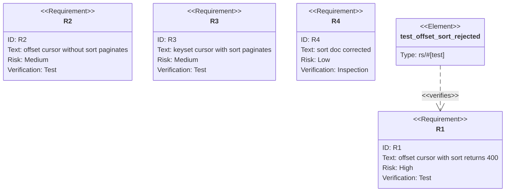

## Logic
<!-- type: logic lang: mermaid -->

## Unit Test
<!-- type: unit-test lang: mermaid -->

# Reviews

### Review 1
**Verdict:** approved

- [logic] Correct contract: guard sits after cursor→offset parse; offset>0 AND sort present → 400 UnsupportedSort, else the existing plan/score path is unchanged. Matches the silent-ignore site at storage.rs:7558 / 3390-3397.
- [unit-test] Requirements R1–R4 cover the reject path, the offset-without-sort regression, the keyset+sort happy path, and the doc-correctness inspection, each bound to a concrete test element.
