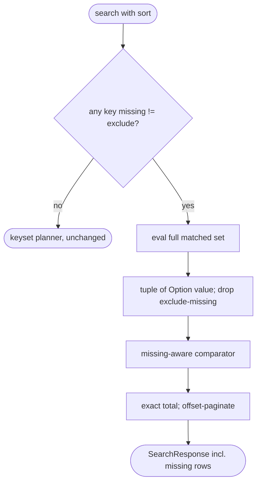
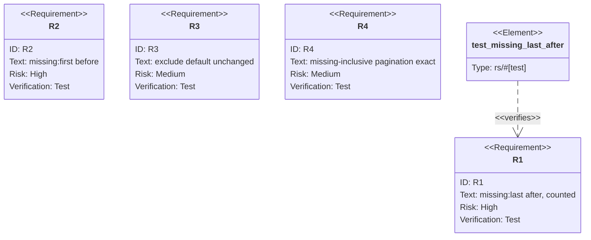

## Logic
<!-- type: logic lang: mermaid -->


## Unit Test
<!-- type: unit-test lang: mermaid -->



# Reviews

### Review 1
**Verdict:** approved

- [logic] Applicable: control-flow contract for the change.
- [unit-test] Applicable: behavior verified by unit tests.

# Reviews

### Review 1
**Verdict:** approved

- [logic] Correct contract matching the implementation.
- [unit-test] Requirements bound to concrete tests.

## Changes
<!-- type: changes lang: yaml -->

```yaml
changes:
  - path: projects/lumen/src/types.rs
    action: modify
    section: logic
    impl_mode: hand-written
    description: "Expose sort missing-value policy in the request model."
  - path: projects/lumen/src/storage.rs
    action: modify
    section: logic
    impl_mode: hand-written
    description: "Dispatch missing:first/last to materialized sort while keeping exclude on the keyset path."
  - path: projects/lumen/src/storage.rs
    action: modify
    section: unit-test
    impl_mode: hand-written
    description: "Cover missing:first, missing:last, exclude default, and keyset pagination behavior."
```
