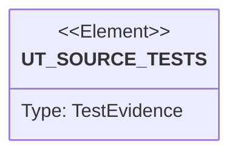

# Semantic TD: lumen/benches

## Schema
<!-- type: schema lang: yaml -->

```yaml
semantic_domain:
  key: "lumen/benches"
  source_group: "projects/lumen/benches"
  coverage_kind: semantic
  evidence:
    source_units:
      - path: "projects/lumen/benches/bench_duplicates.rs"
        language: "rust"
        ownership_state: "codegen"
        generator_primitives: ["config_surface", "data_model", "service_method"]
        symbols:
          - name: "N"
            kind: "constant"
            public: false
          - name: "HOT_KEYS"
            kind: "constant"
            public: false
          - name: "Lcg"
            kind: "struct"
            public: false
          - name: "new"
            kind: "function"
            public: false
          - name: "next_u32"
            kind: "function"
            public: false
          - name: "build_corpus"
            kind: "function"
            public: false
          - name: "bench_duplicates"
            kind: "function"
            public: false
        source_evidence_node:
          layer: "backend"
          ecosystem: "rust"
          role: "source"
          section_type: "schema"
          domain: "projects/lumen/benches"
      - path: "projects/lumen/benches/bench_search.rs"
        language: "rust"
        ownership_state: "codegen"
        generator_primitives: ["config_surface", "data_model", "service_method"]
        symbols:
          - name: "N"
            kind: "constant"
            public: false
          - name: "Lcg"
            kind: "struct"
            public: false
          - name: "new"
            kind: "function"
            public: false
          - name: "next_u32"
            kind: "function"
            public: false
          - name: "VOCAB"
            kind: "constant"
            public: false
          - name: "KEYWORDS"
            kind: "constant"
            public: false
          - name: "sentence"
            kind: "function"
            public: false
          - name: "build_corpus"
            kind: "function"
            public: false
          - name: "bench_search"
            kind: "function"
            public: false
        source_evidence_node:
          layer: "backend"
          ecosystem: "rust"
          role: "source"
          section_type: "schema"
          domain: "projects/lumen/benches"
      - path: "projects/lumen/benches/bench_index.rs"
        language: "rust"
        ownership_state: "codegen"
        generator_primitives: ["config_surface", "data_model", "service_method"]
        symbols:
          - name: "N"
            kind: "constant"
            public: false
          - name: "Lcg"
            kind: "struct"
            public: false
          - name: "new"
            kind: "function"
            public: false
          - name: "next_u32"
            kind: "function"
            public: false
          - name: "TEXT_WORDS"
            kind: "constant"
            public: false
          - name: "sentence"
            kind: "function"
            public: false
          - name: "keyword_items"
            kind: "function"
            public: false
          - name: "text_items"
            kind: "function"
            public: false
          - name: "number_items"
            kind: "function"
            public: false
          - name: "fresh_engine"
            kind: "function"
            public: false
          - name: "bench_index"
            kind: "function"
            public: false
        source_evidence_node:
          layer: "backend"
          ecosystem: "rust"
          role: "source"
          section_type: "schema"
          domain: "projects/lumen/benches"
```

## Unit Test
<!-- type: unit-test lang: mermaid -->



## Changes
<!-- type: changes lang: yaml -->

```yaml
coverage_kind: semantic
changes:
  - path: "projects/lumen/benches/bench_duplicates.rs"
    action: modify
    section: schema
    description: |
      Existing source behavior is covered by this feature/domain semantic TD.
    impl_mode: hand-written
  - path: "projects/lumen/benches/bench_search.rs"
    action: modify
    section: schema
    description: |
      Existing source behavior is covered by this feature/domain semantic TD.
    impl_mode: hand-written
  - path: "projects/lumen/benches/bench_index.rs"
    action: modify
    section: schema
    description: |
      Existing source behavior is covered by this feature/domain semantic TD.
    impl_mode: hand-written
  - action: annotate
    section: unit-test
    impl_mode: hand-written
    description: "Traceability metadata edge for the unit-test section."
```
