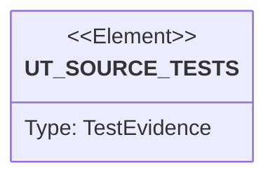

# Semantic TD: lumen/bin

## Schema
<!-- type: schema lang: yaml -->

```yaml
semantic_domain:
  key: "lumen/bin"
  source_group: "projects/lumen/src/bin"
  coverage_kind: semantic
  evidence:
    source_units:
      - path: "projects/lumen/src/bin/lumen.rs"
        language: "rust"
        ownership_state: "handwrite"
        generator_primitives: ["data_model", "enum_model", "service_method"]
        symbols:
          - name: "Cli"
            kind: "struct"
            public: false
          - name: "Command"
            kind: "enum"
            public: false
          - name: "LlmTopic"
            kind: "enum"
            public: false
          - name: "LlmFormat"
            kind: "enum"
            public: false
          - name: "LlmArgs"
            kind: "struct"
            public: false
          - name: "WalBackend"
            kind: "enum"
            public: false
          - name: "LogFormat"
            kind: "enum"
            public: false
          - name: "Persistence"
            kind: "enum"
            public: false
          - name: "SpecFormat"
            kind: "enum"
            public: false
          - name: "SpecArgs"
            kind: "struct"
            public: false
          - name: "ServeArgs"
            kind: "struct"
            public: false
          - name: "main"
            kind: "function"
            public: false
          - name: "serve"
            kind: "function"
            public: false
          - name: "use_segment_persistence"
            kind: "function"
            public: false
          - name: "load_search_shard_segment_roots"
            kind: "function"
            public: false
          - name: "cbor_cold_start"
            kind: "function"
            public: false
          - name: "connect_nats_with_retry"
            kind: "function"
            public: false
          - name: "shutdown_signal"
            kind: "function"
            public: false
          - name: "init_tracing"
            kind: "function"
            public: false
          - name: "build_otel_tracer"
            kind: "function"
            public: false
          - name: "init_otel_meter"
            kind: "function"
            public: false
        source_evidence_node:
          layer: "backend"
          ecosystem: "rust"
          role: "source"
          section_type: "schema"
          domain: "projects/lumen/src/bin"
      - path: "projects/lumen/src/bin/lumen-operator.rs"
        language: "rust"
        ownership_state: "handwrite"
        generator_primitives: ["data_model", "enum_model", "service_method"]
        symbols:
          - name: "Cli"
            kind: "struct"
            public: false
          - name: "Command"
            kind: "enum"
            public: false
          - name: "main"
            kind: "function"
            public: false
        source_evidence_node:
          layer: "backend"
          ecosystem: "rust"
          role: "source"
          section_type: "schema"
          domain: "projects/lumen/src/bin"
      - path: "projects/lumen/src/bin/lumen-consumer.rs"
        language: "rust"
        ownership_state: "handwrite"
        generator_primitives: ["service_method"]
        symbols:
          - name: "main"
            kind: "function"
            public: false
        source_evidence_node:
          layer: "backend"
          ecosystem: "rust"
          role: "source"
          section_type: "schema"
          domain: "projects/lumen/src/bin"
      - path: "projects/lumen/src/bin/lumen-bench.rs"
        language: "rust"
        ownership_state: "handwrite"
        generator_primitives: ["config_surface", "data_model", "enum_model", "service_method"]
        symbols:
          - name: "mix"
            kind: "function"
            public: false
          - name: "VOCAB"
            kind: "constant"
            public: false
          - name: "VEC_DIM"
            kind: "constant"
            public: false
          - name: "VEC_CLUSTERS"
            kind: "constant"
            public: false
          - name: "TARGET_MATCHES"
            kind: "constant"
            public: false
          - name: "cardinality_for"
            kind: "function"
            public: false
          - name: "is_hit"
            kind: "function"
            public: false
          - name: "doc_tokens"
            kind: "function"
            public: false
          - name: "doc_bio"
            kind: "function"
            public: false
          - name: "doc_keyword"
            kind: "function"
            public: false
          - name: "doc_number"
            kind: "function"
            public: false
          - name: "doc_vector"
            kind: "function"
            public: false
          - name: "centroid"
            kind: "function"
            public: false
          - name: "l2"
            kind: "function"
            public: false
          - name: "Corpus"
            kind: "struct"
            public: false
          - name: "COLL"
            kind: "constant"
            public: false
          - name: "build_corpus"
            kind: "function"
            public: false
          - name: "index_field"
            kind: "function"
            public: false
          - name: "keyword_spec"
            kind: "function"
            public: false
          - name: "number_spec"
            kind: "function"
            public: false
          - name: "vector_spec"
            kind: "function"
            public: false
          - name: "Class"
            kind: "enum"
            public: false
          - name: "budget_ns"
            kind: "function"
            public: false
          - name: "SLO_CEILING_NS"
            kind: "constant"
            public: false
          - name: "SearchType"
            kind: "struct"
            public: false
          - name: "TYPES"
            kind: "constant"
            public: false
          - name: "wide_terms"
            kind: "function"
            public: false
          - name: "wide_terms_set"
            kind: "function"
            public: false
          - name: "make_query"
            kind: "function"
            public: false
          - name: "verify"
            kind: "function"
            public: false
          - name: "eid"
            kind: "function"
            public: false
          - name: "pct"
            kind: "function"
            public: false
          - name: "Cell"
            kind: "struct"
            public: false
          - name: "run_cell"
            kind: "function"
            public: false
          - name: "Cli"
            kind: "struct"
            public: false
          - name: "Cmd"
            kind: "enum"
            public: false
          - name: "tier_docs"
            kind: "function"
            public: false
          - name: "main"
            kind: "function"
            public: false
          - name: "check_scaling"
            kind: "function"
            public: false
          - name: "run"
            kind: "function"
            public: false
        source_evidence_node:
          layer: "backend"
          ecosystem: "rust"
          role: "source"
          section_type: "schema"
          domain: "projects/lumen/src/bin"
      - path: "projects/lumen/src/bin/lumen-openapi-dump.rs"
        language: "rust"
        ownership_state: "handwrite"
        generator_primitives: ["service_method"]
        symbols:
          - name: "main"
            kind: "function"
            public: false
        source_evidence_node:
          layer: "backend"
          ecosystem: "rust"
          role: "source"
          section_type: "schema"
          domain: "projects/lumen/src/bin"
```

## Unit Test
<!-- type: unit-test lang: mermaid -->



## Changes
<!-- type: changes lang: yaml -->

```yaml
coverage_kind: semantic
changes:
  - path: "projects/lumen/src/bin/lumen.rs"
    action: modify
    section: schema
    description: |
      Existing source behavior is covered by this feature/domain semantic TD.
    impl_mode: hand-written
    replaces:
      - "<handwrite-tracker:projects-lumen-src-bin-lumen-rs>"
  - path: "projects/lumen/src/bin/lumen-operator.rs"
    action: modify
    section: schema
    description: |
      Existing source behavior is covered by this feature/domain semantic TD.
    impl_mode: hand-written
    replaces:
      - "<handwrite-tracker:projects-lumen-src-bin-lumen-operator-rs>"
  - path: "projects/lumen/src/bin/lumen-consumer.rs"
    action: modify
    section: schema
    description: |
      Existing source behavior is covered by this feature/domain semantic TD.
    impl_mode: hand-written
    replaces:
      - "<handwrite-tracker:projects-lumen-src-bin-lumen-consumer-rs>"
  - path: "projects/lumen/src/bin/lumen-bench.rs"
    action: modify
    section: schema
    description: |
      Existing source behavior is covered by this feature/domain semantic TD.
    impl_mode: hand-written
    replaces:
      - "<handwrite-tracker:projects-lumen-src-bin-lumen-bench-rs>"
  - path: "projects/lumen/src/bin/lumen-openapi-dump.rs"
    action: modify
    section: schema
    description: |
      Existing source behavior is covered by this feature/domain semantic TD.
    impl_mode: hand-written
    replaces:
      - "<handwrite-tracker:projects-lumen-src-bin-lumen-openapi-dump-rs>"
```
