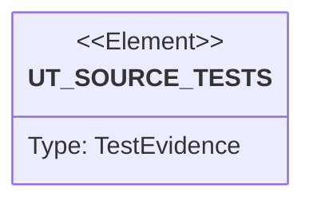

# Semantic TD: lumen/bin

## Schema
<!-- type: schema lang: yaml -->

```yaml
semantic_domain:
  key: "lumen/bin"
  source_group: "projects/lumen/src/bin"
  coverage_kind: semantic
  evidence:
    source_units:
      - path: "projects/lumen/src/bin/lumen.rs"
        language: "rust"
        ownership_state: "codegen"
        generator_primitives: ["data_model", "enum_model", "service_method"]
        symbols:
          - name: "Cli"
            kind: "struct"
            public: false
          - name: "Command"
            kind: "enum"
            public: false
          - name: "LlmTopic"
            kind: "enum"
            public: false
          - name: "LlmFormat"
            kind: "enum"
            public: false
          - name: "LlmArgs"
            kind: "struct"
            public: false
          - name: "WalBackend"
            kind: "enum"
            public: false
          - name: "LogFormat"
            kind: "enum"
            public: false
          - name: "Persistence"
            kind: "enum"
            public: false
          - name: "SpecFormat"
            kind: "enum"
            public: false
          - name: "SpecArgs"
            kind: "struct"
            public: false
          - name: "ServeArgs"
            kind: "struct"
            public: false
          - name: "main"
            kind: "function"
            public: false
          - name: "serve"
            kind: "function"
            public: false
          - name: "use_segment_persistence"
            kind: "function"
            public: false
          - name: "load_search_shard_segment_roots"
            kind: "function"
            public: false
          - name: "cbor_cold_start"
            kind: "function"
            public: false
          - name: "connect_nats_with_retry"
            kind: "function"
            public: false
          - name: "shutdown_signal"
            kind: "function"
            public: false
          - name: "init_tracing"
            kind: "function"
            public: false
          - name: "build_otel_tracer"
            kind: "function"
            public: false
          - name: "init_otel_meter"
            kind: "function"
            public: false
        source_evidence_node:
          layer: "backend"
          ecosystem: "rust"
          role: "source"
          section_type: "schema"
          domain: "projects/lumen/src/bin"
```

## Unit Test
<!-- type: unit-test lang: mermaid -->



## Changes
<!-- type: changes lang: yaml -->

```yaml
coverage_kind: semantic
changes:
  - path: "projects/lumen/src/bin/lumen.rs"
    action: modify
    section: schema
    description: |
      Existing source behavior is covered by this feature/domain semantic TD.
    impl_mode: codegen
  - action: annotate
    section: unit-test
    impl_mode: hand-written
    description: "Traceability metadata edge for the unit-test section."
```
