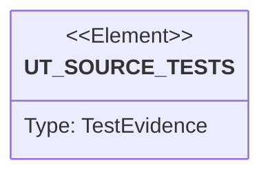

# Semantic TD: lumen/examples

## Schema
<!-- type: schema lang: yaml -->

```yaml
semantic_domain:
  key: "lumen/examples"
  source_group: "projects/lumen/examples"
  coverage_kind: semantic
  evidence:
    source_units:
      - path: "projects/lumen/examples/consumer_pg_logical.py"
        language: "python"
        ownership_state: "codegen"
        generator_primitives: ["service_method"]
        symbols:
          - name: "shard_of"
            kind: "function"
            public: true
          - name: "index_url"
            kind: "function"
            public: true
          - name: "to_index_items"
            kind: "function"
            public: true
          - name: "post_index"
            kind: "function"
            public: true
          - name: "stream_changes"
            kind: "function"
            public: true
          - name: "main"
            kind: "function"
            public: true
        source_evidence_node:
          layer: "backend"
          ecosystem: "python"
          role: "service"
          section_type: "logic"
          domain: "projects/lumen/examples"
python_modules:
  - path: projects/lumen/examples/consumer_pg_logical.py
    body:
    - kind: raw
      lines:
      - '#!/usr/bin/env python3'
      - '# SPEC-MANAGED: projects/lumen/tech-design/semantic/lumen-examples.md#schema'
      - '# CODEGEN-BEGIN'
      - '"""Illustrative DIY ingestion recipe: Postgres logical replication -> lumen.'
      - ''
      - lumen bundles no connector. Getting data in is the caller's own pub/sub into
      - '`POST /collections/{id}/index`. This script is the reference shape for that'
      - 'pub/sub when the source of truth is Postgres (or AlloyDB): tail a logical'
      - replication slot decoded as JSON (the `wal2json` output plugin), translate each
      - row change into lumen index items, and POST them to the shard that owns the
      - collection.
      - ''
      - It is **illustrative, not a shipped/maintained connector** — copy it, don't
      - depend on it. The Postgres read is abstracted behind `stream_changes()` so the
      - file needs no live database to read or syntax-check (`python -m py_compile`).
      - ''
      - 'Shard routing mirrors lumen exactly: `crc32(collection_id) % shard_count`,'
      - POSTed to any replica of that shard (a write is published to the log, so there
      - is no leader to target).
      - '"""'
      - ''
      - from __future__ import annotations
      - ''
      - import json
      - import zlib
      - from typing import Iterable
      - from urllib import request
      - ''
      - '# --- config (env/flags in a real deployment) --------------------------------'
      - ''
      - SHARD_COUNT = 3
      - '# Client service base; `{shard}` is filled from the crc32 route. In-cluster this'
      - '# is the per-shard pod DNS, e.g. "http://lumen-{shard}.lumen.svc.cluster.local:7373".'
      - LUMEN_BASE = "http://lumen-{shard}.lumen.svc.cluster.local:7373"
      - ''
      - '# Map a Postgres table -> the lumen collection + the fields lumen should index.'
      - '# lumen is a *derived* index: only index what you search on, never the whole row.'
      - TABLE_MAP = {
      - '    "public.users": {'
      - '        "collection": "users",'
      - '        "pk": "id",                 # becomes lumen''s external_id'
      - '        "fields": ["bio", "email", "tags"],'
      - '    },'
      - '}'
      - ''
      - ''
      - 'def shard_of(collection_id: str) -> int:'
      - '    """crc32(collection_id) % shard_count — identical to lumen''s client routing."""'
      - '    return zlib.crc32(collection_id.encode("utf-8")) % SHARD_COUNT'
      - ''
      - ''
      - 'def index_url(collection_id: str) -> str:'
      - '    shard = shard_of(collection_id)'
      - '    return f"{LUMEN_BASE.format(shard=shard)}/collections/{collection_id}/index"'
      - ''
      - ''
      - 'def to_index_items(change: dict) -> tuple[str, list[dict]] | None:'
      - '    """Translate one wal2json change into (collection_id, lumen index items).'
      - ''
      - '    A re-write of `(external_id, field)` fully re-indexes that field; a delete'
      - '    maps to `DELETE /index/{external_id}` (left to the caller for brevity).'
      - '    """'
      - '    table = f"{change[''schema'']}.{change[''table'']}"'
      - '    spec = TABLE_MAP.get(table)'
      - '    if spec is None or change["kind"] not in ("insert", "update"):'
      - '        return None'
      - '    row = dict(zip(change["columnnames"], change["columnvalues"]))'
      - '    external_id = str(row[spec["pk"]])'
      - '    items = ['
      - '        {"external_id": external_id, "field": f, "value": row[f]}'
      - '        for f in spec["fields"]'
      - '        if row.get(f) is not None'
      - '    ]'
      - '    return (spec["collection"], items)'
      - ''
      - ''
      - 'def post_index(collection_id: str, items: list[dict]) -> None:'
      - '    body = json.dumps({"items": items}).encode("utf-8")'
      - '    req = request.Request('
      - '        index_url(collection_id),'
      - '        data=body,'
      - '        headers={"Content-Type": "application/json"},  # + Authorization when LUMEN_AUTH=required'
      - '        method="POST",'
      - '    )'
      - '    with request.urlopen(req) as resp:  # noqa: S310 (illustrative)'
      - '        resp.read()'
      - ''
      - ''
      - 'def stream_changes() -> Iterable[dict]:'
      - '    """Yield wal2json change records from a logical replication slot.'
      - ''
      - '    Real implementation (needs `psycopg` and a configured slot):'
      - ''
      - '        import psycopg'
      - '        with psycopg.connect(DSN, autocommit=True) as conn:'
      - '            conn.execute("SELECT pg_create_logical_replication_slot(''lumen'', ''wal2json'')")'
      - '            while True:'
      - '                for row in conn.execute('
      - '                    "SELECT data FROM pg_logical_slot_get_changes(''lumen'', NULL, NULL)"'
      - '                ):'
      - '                    for change in json.loads(row[0])["change"]:'
      - '                        yield change'
      - ''
      - '    Stubbed here so the recipe syntax-checks without a database.'
      - '    """'
      - '    return iter(())'
      - ''
      - ''
      - 'def main() -> None:'
      - '    for change in stream_changes():'
      - '        mapped = to_index_items(change)'
      - '        if mapped is None:'
      - '            continue'
      - '        collection_id, items = mapped'
      - '        if items:'
      - '            post_index(collection_id, items)'
      - ''
      - ''
      - 'if __name__ == "__main__":'
      - '    main()'
      - '# CODEGEN-END'
```

## Unit Test
<!-- type: unit-test lang: mermaid -->



## Changes
<!-- type: changes lang: yaml -->

```yaml
coverage_kind: semantic
changes:
  - path: "projects/lumen/examples/consumer_pg_logical.py"
    action: modify
    section: schema
    description: |
      Existing source behavior is covered by this feature/domain semantic TD.
    impl_mode: codegen
  - action: annotate
    section: unit-test
    impl_mode: hand-written
    description: "Traceability metadata edge for the unit-test section."
```
