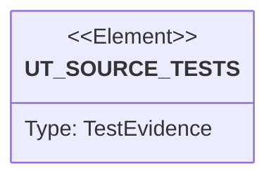

# Semantic TD: lumen/operator

## Schema
<!-- type: schema lang: yaml -->

```yaml
semantic_domain:
  key: "lumen/operator"
  source_group: "projects/lumen/src/operator"
  coverage_kind: semantic
  evidence:
    source_units:
      - path: "projects/lumen/src/operator/render.rs"
        language: "rust"
        ownership_state: "codegen"
        generator_primitives: ["config_surface", "service_method"]
        symbols:
          - name: "APP"
            kind: "constant"
            public: false
          - name: "API_VERSION"
            kind: "constant"
            public: false
          - name: "KIND"
            kind: "constant"
            public: false
          - name: "CLIENT_PORT"
            kind: "constant"
            public: false
          - name: "instance"
            kind: "function"
            public: false
          - name: "namespace"
            kind: "function"
            public: false
          - name: "nats_url"
            kind: "function"
            public: true
          - name: "labels"
            kind: "function"
            public: false
          - name: "selector"
            kind: "function"
            public: false
          - name: "owner_ref"
            kind: "function"
            public: false
          - name: "meta"
            kind: "function"
            public: false
          - name: "render"
            kind: "function"
            public: true
          - name: "service_account"
            kind: "function"
            public: false
          - name: "serving_configmap"
            kind: "function"
            public: false
          - name: "serving_env"
            kind: "function"
            public: false
          - name: "serving_deployment"
            kind: "function"
            public: false
          - name: "serving_service"
            kind: "function"
            public: false
          - name: "serving_hpa"
            kind: "function"
            public: false
          - name: "serving_pdb"
            kind: "function"
            public: false
          - name: "nats_configmap"
            kind: "function"
            public: false
          - name: "nats_args"
            kind: "function"
            public: false
          - name: "nats_statefulset"
            kind: "function"
            public: false
          - name: "nats_service"
            kind: "function"
            public: false
          - name: "nats_headless_service"
            kind: "function"
            public: false
          - name: "nats_pdb"
            kind: "function"
            public: false
          - name: "service_monitor"
            kind: "function"
            public: false
          - name: "prometheus_rule"
            kind: "function"
            public: false
        source_evidence_node:
          layer: "backend"
          ecosystem: "rust"
          role: "source"
          section_type: "schema"
          domain: "projects/lumen/src/operator"
      - path: "projects/lumen/src/operator/crd.rs"
        language: "rust"
        ownership_state: "codegen"
        generator_primitives: ["data_model", "enum_model", "service_method"]
        symbols:
          - name: "LumenSpec"
            kind: "struct"
            public: true
          - name: "LogFormat"
            kind: "enum"
            public: true
          - name: "as_env"
            kind: "function"
            public: true
          - name: "AuthMode"
            kind: "enum"
            public: true
          - name: "as_env"
            kind: "function"
            public: true
          - name: "ServingSpec"
            kind: "struct"
            public: true
          - name: "default"
            kind: "function"
            public: false
          - name: "Autoscaling"
            kind: "struct"
            public: true
          - name: "default"
            kind: "function"
            public: false
          - name: "NatsSpec"
            kind: "struct"
            public: true
          - name: "is_managed"
            kind: "function"
            public: true
          - name: "default"
            kind: "function"
            public: false
          - name: "LumenStatus"
            kind: "struct"
            public: true
          - name: "default_shard_count"
            kind: "function"
            public: false
          - name: "default_serving_cpu"
            kind: "function"
            public: false
          - name: "default_serving_memory"
            kind: "function"
            public: false
          - name: "default_grace_secs"
            kind: "function"
            public: false
          - name: "default_nats_replicas"
            kind: "function"
            public: false
          - name: "default_nats_storage"
            kind: "function"
            public: false
          - name: "default_nats_cpu"
            kind: "function"
            public: false
          - name: "default_nats_memory"
            kind: "function"
            public: false
        source_evidence_node:
          layer: "backend"
          ecosystem: "rust"
          role: "source"
          section_type: "schema"
          domain: "projects/lumen/src/operator"
      - path: "projects/lumen/src/operator/mod.rs"
        language: "rust"
        ownership_state: "codegen"
        generator_primitives: ["service_method"]
        symbols:
          - name: "crd"
            kind: "module"
            public: true
          - name: "lease"
            kind: "module"
            public: true
          - name: "reconcile"
            kind: "module"
            public: true
          - name: "render"
            kind: "module"
            public: true
          - name: "crd_yaml"
            kind: "function"
            public: true
        source_evidence_node:
          layer: "backend"
          ecosystem: "rust"
          role: "source"
          section_type: "schema"
          domain: "projects/lumen/src/operator"
      - path: "projects/lumen/src/operator/reconcile.rs"
        language: "rust"
        ownership_state: "codegen"
        generator_primitives: ["config_surface", "data_model", "enum_model", "service_method"]
        symbols:
          - name: "MANAGER"
            kind: "constant"
            public: false
          - name: "Error"
            kind: "enum"
            public: true
          - name: "Ctx"
            kind: "struct"
            public: false
          - name: "identity"
            kind: "function"
            public: false
          - name: "lease_namespace"
            kind: "function"
            public: false
          - name: "run"
            kind: "function"
            public: true
          - name: "plural_for"
            kind: "function"
            public: false
          - name: "api_resource"
            kind: "function"
            public: false
          - name: "apply_object"
            kind: "function"
            public: false
          - name: "ready_replicas"
            kind: "function"
            public: false
          - name: "reconcile"
            kind: "function"
            public: false
          - name: "error_policy"
            kind: "function"
            public: false
        source_evidence_node:
          layer: "backend"
          ecosystem: "rust"
          role: "source"
          section_type: "schema"
          domain: "projects/lumen/src/operator"
      - path: "projects/lumen/src/operator/lease.rs"
        language: "rust"
        ownership_state: "codegen"
        generator_primitives: ["config_surface", "data_model", "service_method"]
        symbols:
          - name: "LEASE_NAME"
            kind: "constant"
            public: false
          - name: "LEASE_DURATION_SECS"
            kind: "constant"
            public: false
          - name: "RENEW_INTERVAL"
            kind: "constant"
            public: false
          - name: "Election"
            kind: "struct"
            public: true
          - name: "new"
            kind: "function"
            public: true
          - name: "may_acquire"
            kind: "function"
            public: false
          - name: "acquire_or_renew"
            kind: "function"
            public: false
          - name: "spawn"
            kind: "function"
            public: true
          - name: "tests"
            kind: "module"
            public: false
        source_evidence_node:
          layer: "backend"
          ecosystem: "rust"
          role: "source"
          section_type: "schema"
          domain: "projects/lumen/src/operator"
```

## Unit Test
<!-- type: unit-test lang: mermaid -->



## Changes
<!-- type: changes lang: yaml -->

```yaml
coverage_kind: semantic
changes:
  - path: "projects/lumen/src/operator/render.rs"
    action: modify
    section: schema
    description: |
      Existing source behavior is covered by this feature/domain semantic TD.
    impl_mode: hand-written
  - path: "projects/lumen/src/operator/crd.rs"
    action: modify
    section: schema
    description: |
      Existing source behavior is covered by this feature/domain semantic TD.
    impl_mode: hand-written
  - path: "projects/lumen/src/operator/mod.rs"
    action: modify
    section: schema
    description: |
      Existing source behavior is covered by this feature/domain semantic TD.
    impl_mode: hand-written
  - path: "projects/lumen/src/operator/reconcile.rs"
    action: modify
    section: schema
    description: |
      Existing source behavior is covered by this feature/domain semantic TD.
    impl_mode: hand-written
  - path: "projects/lumen/src/operator/lease.rs"
    action: modify
    section: schema
    description: |
      Existing source behavior is covered by this feature/domain semantic TD.
    impl_mode: hand-written
  - action: annotate
    section: unit-test
    impl_mode: hand-written
    description: "Traceability metadata edge for the unit-test section."
```
