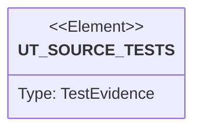

# Semantic TD: lumen/scripts

## Schema
<!-- type: schema lang: yaml -->

```yaml
semantic_domain:
  key: "lumen/scripts"
  source_group: "projects/lumen/scripts"
  coverage_kind: semantic
  evidence:
    source_units:
      - path: "projects/lumen/scripts/load-fixture.py"
        language: "python"
        ownership_state: "handwrite"
        generator_primitives: ["service_method"]
        symbols:
          - name: "gen_bio"
            kind: "function"
            public: true
          - name: "gen_email"
            kind: "function"
            public: true
          - name: "main"
            kind: "function"
            public: true
        source_evidence_node:
          layer: "backend"
          ecosystem: "python"
          role: "service"
          section_type: "logic"
          domain: "projects/lumen/scripts"
      - path: "projects/lumen/scripts/bench_vs_db.py"
        language: "python"
        ownership_state: "handwrite"
        generator_primitives: ["python_data_model", "service_method"]
        symbols:
          - name: "Doc"
            kind: "class"
            public: true
          - name: "gen_corpus"
            kind: "function"
            public: true
          - name: "knn_query_vec"
            kind: "function"
            public: true
          - name: "measure"
            kind: "function"
            public: true
          - name: "Engine"
            kind: "class"
            public: true
          - name: "Engine.setup"
            kind: "function"
            public: true
          - name: "Engine.query"
            kind: "function"
            public: true
          - name: "Engine.close"
            kind: "function"
            public: true
          - name: "Lumen"
            kind: "class"
            public: true
          - name: "Lumen.__init__"
            kind: "function"
            public: false
          - name: "Lumen._wait_health"
            kind: "function"
            public: false
          - name: "Lumen.start_server"
            kind: "function"
            public: true
          - name: "Lumen.setup"
            kind: "function"
            public: true
          - name: "Lumen.query"
            kind: "function"
            public: true
          - name: "Lumen.close"
            kind: "function"
            public: true
          - name: "Postgres"
            kind: "class"
            public: true
          - name: "Postgres.__init__"
            kind: "function"
            public: false
          - name: "Postgres.setup"
            kind: "function"
            public: true
          - name: "Postgres.query"
            kind: "function"
            public: true
          - name: "Postgres.close"
            kind: "function"
            public: true
          - name: "Mongo"
            kind: "class"
            public: true
          - name: "Mongo.__init__"
            kind: "function"
            public: false
          - name: "Mongo.setup"
            kind: "function"
            public: true
          - name: "Mongo.query"
            kind: "function"
            public: true
          - name: "Mongo.close"
            kind: "function"
            public: true
          - name: "OpenSearch"
            kind: "class"
            public: true
          - name: "OpenSearch.__init__"
            kind: "function"
            public: false
          - name: "OpenSearch.setup"
            kind: "function"
            public: true
          - name: "OpenSearch.query"
            kind: "function"
            public: true
          - name: "OpenSearch.close"
            kind: "function"
            public: true
          - name: "main"
            kind: "function"
            public: true
        source_evidence_node:
          layer: "backend"
          ecosystem: "python"
          role: "schema"
          section_type: "schema"
          domain: "projects/lumen/scripts"
python_modules:
  - path: projects/lumen/scripts/load-fixture.py
    body:
    - kind: raw
      lines:
      - '#!/usr/bin/env python3'
      - '"""Generate a synthetic lumen index fixture.'
      - ''
      - 'Emits two files:'
      - ''
      - '* `<output>`         — one JSON document per line (NDJSON). Useful for ad-hoc'
      - '                       diffing / re-indexing.'
      - '* `<output>.req.json` (where the `.json` suffix on `<output>` is replaced) —'
      - '                       a single batched `IndexRequest` body the e2e script'
      - '                       feeds straight to `POST /collections/users/index`.'
      - ''
      - The fixture mixes unique bios (to drive non-trivial search results) with a
      - small pool of repeated emails (to drive duplicates).
      - '"""'
      - ''
      - from __future__ import annotations
      - ''
      - import argparse
      - import json
      - import os
      - import random
      - import sys
      - from pathlib import Path
      - ''
      - ADJECTIVES = [
      - '    "fast", "quiet", "fierce", "kind", "bold", "calm", "eager", "proud",'
      - '    "happy", "curious", "brave", "gentle", "lucky", "wise", "young", "old",'
      - ']'
      - NOUNS = [
      - '    "engineer", "designer", "writer", "doctor", "teacher", "musician",'
      - '    "scientist", "explorer", "chef", "pilot", "farmer", "architect",'
      - ']'
      - LANGS = [
      - '    "rust", "python", "go", "typescript", "kotlin", "swift", "java",'
      - '    "c++", "haskell", "ocaml", "elixir", "ruby",'
      - ']'
      - HOBBIES = [
      - '    "hiking", "cycling", "running", "reading", "gaming", "cooking",'
      - '    "painting", "writing", "climbing", "skiing", "surfing",'
      - ']'
      - ''
      - ''
      - 'def gen_bio(rng: random.Random) -> str:'
      - '    adj = rng.choice(ADJECTIVES)'
      - '    noun = rng.choice(NOUNS)'
      - '    lang = rng.choice(LANGS)'
      - '    hobby = rng.choice(HOBBIES)'
      - '    return f"a {adj} {noun} who codes in {lang} and loves {hobby}"'
      - ''
      - ''
      - 'def gen_email(rng: random.Random, dup_pool_size: int) -> str:'
      - '    # ~5% of records share an email — guarantees the duplicates endpoint'
      - '    # has something to return.'
      - '    if rng.random() < 0.05:'
      - '        idx = rng.randrange(dup_pool_size)'
      - '        return f"shared{idx}@example.com"'
      - '    return f"user{rng.randrange(10**9)}@example.com"'
      - ''
      - ''
      - 'def main() -> int:'
      - '    ap = argparse.ArgumentParser(description=__doc__)'
      - '    ap.add_argument("--count", type=int, default=10_000,'
      - '                    help="number of synthetic documents to emit")'
      - '    ap.add_argument("--output", required=True,'
      - '                    help="path to NDJSON output; the IndexRequest body is "'
      - '                         "written to <output>.req.json (or sibling)")'
      - '    ap.add_argument("--seed", type=int, default=42,'
      - '                    help="RNG seed for reproducibility")'
      - '    ap.add_argument("--dup-pool", type=int, default=50,'
      - '                    help="size of the shared-email pool (controls how many "'
      - '                         "duplicate groups appear)")'
      - '    ap.add_argument("--items-per-batch", type=int, default=0,'
      - '                    help="if >0, split the IndexItems across multiple request "'
      - '                         "bodies of at most this many items each, written as "'
      - '                         "<output>.req.000.json, .001.json, … (respects the "'
      - '                         "server''s bulk-index cap). 0 = one combined body.")'
      - '    args = ap.parse_args()'
      - ''
      - '    rng = random.Random(args.seed)'
      - ''
      - '    out_ndjson = Path(args.output)'
      - '    # `<output>.req.json` if output ends with .json, else `<output>.req.json`.'
      - '    if out_ndjson.suffix == ".json":'
      - '        out_req = out_ndjson.with_suffix("").with_suffix(".req.json")'
      - '    else:'
      - '        out_req = out_ndjson.with_name(out_ndjson.name + ".req.json")'
      - ''
      - '    items: list[dict] = []'
      - '    with out_ndjson.open("w", encoding="utf-8") as nd:'
      - '        for i in range(args.count):'
      - '            external_id = f"u{i:07d}"'
      - '            bio = gen_bio(rng)'
      - '            email = gen_email(rng, args.dup_pool)'
      - '            # Two IndexItems per logical doc: one for `bio`, one for `email`.'
      - '            bio_item = {'
      - '                "external_id": external_id,'
      - '                "field": "bio",'
      - '                "value": bio,'
      - '            }'
      - '            email_item = {'
      - '                "external_id": external_id,'
      - '                "field": "email",'
      - '                "value": email,'
      - '            }'
      - '            items.append(bio_item)'
      - '            items.append(email_item)'
      - '            nd.write(json.dumps({"external_id": external_id,'
      - '                                 "bio": bio,'
      - '                                 "email": email}) + "\n")'
      - ''
      - '    # Split into batches of at most --items-per-batch items (0 = single body).'
      - '    # request_id must be unique per batch, else the server dedups later batches'
      - '    # as idempotent retries of the first.'
      - '    per = args.items_per_batch if args.items_per_batch > 0 else len(items)'
      - '    per = max(per, 1)'
      - '    batches = [items[i:i + per] for i in range(0, len(items), per)] or [[]]'
      - ''
      - '    written = []'
      - '    if args.items_per_batch > 0:'
      - '        stem = out_req.with_suffix("")  # drop trailing .json'
      - '        for n, chunk in enumerate(batches):'
      - '            path = stem.with_name(f"{stem.name}.{n:03d}.json")'
      - '            req = {"items": chunk, "request_id": f"e2e-{args.seed}-{args.count}-{n}"}'
      - '            with path.open("w", encoding="utf-8") as f:'
      - '                json.dump(req, f)'
      - '            written.append(path)'
      - '    else:'
      - '        req = {"items": items, "request_id": f"e2e-{args.seed}-{args.count}"}'
      - '        with out_req.open("w", encoding="utf-8") as f:'
      - '            json.dump(req, f)'
      - '        written.append(out_req)'
      - ''
      - '    total_bytes = sum(os.path.getsize(p) for p in written)'
      - '    print('
      - '        f"wrote {args.count} docs ({len(items)} IndexItems) to "'
      - '        f"{out_ndjson} + {len(written)} request body file(s) "'
      - '        f"({total_bytes} bytes total)",'
      - '        file=sys.stderr,'
      - '    )'
      - '    return 0'
      - ''
      - ''
      - 'if __name__ == "__main__":'
      - '    raise SystemExit(main())'
  - path: projects/lumen/scripts/bench_vs_db.py
    body:
    - kind: raw
      lines:
      - '#!/usr/bin/env python3'
      - '"""Cross-engine search latency benchmark: lumen vs PostgreSQL vs MongoDB vs OpenSearch.'
      - ''
      - 'Goal (per the user''s two criteria):'
      - '  1. lumen should beat general-purpose engines (pg / mongo) on search.'
      - '  2. ideally lumen beats an ES-class engine (OpenSearch, same Lucene core) too,'
      - '     because lumen does far less.'
      - ''
      - 'Fairness contract (why these numbers mean something):'
      - '  * ONE deterministic corpus (seeded), loaded byte-for-byte identically into'
      - '    every engine. Same docs, same field values, same query set.'
      - '  * Every engine gets its proper index (pg GIN+btree+hnsw, mongo text+btree,'
      - '    OpenSearch inverted+doc_values, lumen native). No engine runs a seq-scan it'
      - '    could have indexed away.'
      - '  * Warm: each cell is run WARMUP times (discarded) before measuring, so buffer'
      - '    pools / segments / in-memory structures are hot for everyone.'
      - '  * Primary metric = client-observed wall latency over a warm persistent'
      - '    connection, min / p50 / p99 over REPS reps. min = the best the server can do'
      - '    with noise removed; p99 = tail.'
      - '  * Cross-check: server-reported time where the engine gives it (lumen took_ms,'
      - '    OpenSearch `took`) is printed alongside — coarse (integer ms) but confirms'
      - '    client/driver overhead is small.'
      - ''
      - 'Honest asymmetry (stated, not hidden):'
      - '  lumen and OpenSearch are queried over HTTP+JSON; pg and mongo over their binary'
      - '  wire protocols (lower per-request overhead). So lumen is at a protocol'
      - '  DISADVANTAGE vs pg/mongo — a lumen win is therefore conservative. For the'
      - '  text/BM25 cells the query work dominates and protocol overhead is negligible.'
      - ''
      - 'Run:'
      - '  python3 bench_vs_db.py [N_DOCS]      # default 100_000'
      - '  LUMEN_BIN=target/release/lumen python3 bench_vs_db.py 100000'
      - '"""'
      - from __future__ import annotations
      - ''
      - import os
      - import random
      - import statistics
      - import subprocess
      - import sys
      - import time
      - from dataclasses import dataclass, field
      - ''
      - import numpy as np
      - import requests
      - ''
      - '# ---------------------------------------------------------------------------'
      - '# Config'
      - '# ---------------------------------------------------------------------------'
      - N_DOCS = int(sys.argv[1]) if len(sys.argv) > 1 else 100_000
      - DIM = 128
      - SEED = 1234
      - WARMUP = 5
      - REPS = 50
      - KNN_K = 10
      - '# BENCH_NO_VECTOR=1 drops the embedding field everywhere (skips the expensive'
      - '# HNSW build → fast reload) and the knn cell. Use it to iterate on the'
      - '# text/filter cells without paying the ~15 min vector load at 100k.'
      - NO_VECTOR = bool(os.environ.get("BENCH_NO_VECTOR"))
      - ''
      - REPO_ROOT = os.path.abspath(os.path.join(os.path.dirname(__file__), "..", "..", ".."))
      - LUMEN_BIN = os.environ.get("LUMEN_BIN", os.path.join(REPO_ROOT, "target", "release", "lumen"))
      - LUMEN_URL = "http://127.0.0.1:7373"
      - PG_DSN = "dbname=lumenbench"
      - MONGO_URI = "mongodb://localhost:27017"
      - OS_HOST, OS_PORT = "localhost", 9200
      - ''
      - CITIES = [
      - '    "taipei", "tokyo", "osaka", "seoul", "shanghai", "beijing", "shenzhen",'
      - '    "singapore", "bangkok", "jakarta", "manila", "hanoi", "kualalumpur",'
      - '    "delhi", "mumbai", "dubai", "london", "paris", "berlin", "madrid",'
      - '    "rome", "amsterdam", "zurich", "vienna", "stockholm", "oslo", "helsinki",'
      - '    "dublin", "lisbon", "prague", "warsaw", "athens", "istanbul", "moscow",'
      - '    "newyork", "boston", "chicago", "seattle", "austin", "denver",'
      - '    "sanfrancisco", "losangeles", "toronto", "vancouver", "mexico", "saopaulo",'
      - '    "buenosaires", "sydney", "melbourne", "auckland",'
      - ']  # 50 cities → keyword cardinality 50'
      - assert len(CITIES) == 50
      - ''
      - VOCAB = (
      - '    "system data query index search engine scale latency throughput memory "'
      - '    "vector cluster shard replica stream record schema field value token "'
      - '    "service network protocol request response cache buffer thread async "'
      - '    "design build deploy test verify monitor profile optimize refactor commit "'
      - '    "model train infer embed rank score filter match range boolean nested "'
      - '    "alpha beta gamma delta omega sigma theta kappa lambda phi rho tau zeta "'
      - '    "north south east west prime core edge node leaf root path graph tree "'
      - '    "fast slow warm cold hot dense sparse exact approximate dynamic static"'
      - ).split()
      - ''
      - ''
      - 'GROUP_LEN = 3  # elements per `items` group (nested array-of-objects)'
      - ''
      - '@dataclass'
      - 'class Doc:'
      - '    eid: str'
      - '    bio: str'
      - '    city: str'
      - '    age: int'
      - '    vec: list  # length DIM'
      - '    items: list  # GROUP_LEN tuples (sku, qty) — the nested `group` field'
      - ''
      - ''
      - 'def gen_corpus(n: int):'
      - '    """Deterministic corpus. Probe tokens at known selectivity:'
      - '      ''engineer'' in i%40==0  (~2.5%),  ''rust'' in i%80==0  (~1.25%, ⊂ engineer).'
      - '      city = CITIES[i%50]    → ''taipei'' = i%50==0 (~2%).'
      - '      age in [30,40)         → ~16%.'
      - '    """'
      - '    rng = random.Random(SEED)'
      - '    nrng = np.random.default_rng(SEED)'
      - '    vecs = nrng.standard_normal((n, DIM)).astype(np.float32)'
      - '    vecs /= np.linalg.norm(vecs, axis=1, keepdims=True)  # unit vectors (cosine)'
      - '    docs = []'
      - '    for i in range(n):'
      - '        words = [rng.choice(VOCAB) for _ in range(10)]'
      - '        if i % 40 == 0:'
      - '            words.append("engineer")'
      - '        if i % 80 == 0:'
      - '            words.append("rust")'
      - '        rng.shuffle(words)'
      - '        # nested `group`: GROUP_LEN elements of (sku, qty). Probe (group_nested):'
      - '        # an element with sku=''sku0'' AND qty>=80. sku0=1/10, qty>=80=20% → per'
      - '        # element ~2%, per doc (3 elems) ~6% match — a selective nested filter.'
      - '        items = [(f"sku{rng.randint(0, 9)}", rng.randint(0, 99)) for _ in range(GROUP_LEN)]'
      - '        docs.append(Doc('
      - '            eid=f"d{i}",'
      - '            bio=" ".join(words),'
      - '            city=CITIES[i % 50],'
      - '            age=18 + (i * 7919 % 63),  # 18..80, well mixed'
      - '            vec=vecs[i].tolist(),'
      - '            items=items,'
      - '        ))'
      - '    return docs, vecs'
      - ''
      - ''
      - '# Fixed query vector for kNN (deterministic, unit-norm).'
      - 'def knn_query_vec():'
      - '    v = np.random.default_rng(SEED + 1).standard_normal(DIM).astype(np.float32)'
      - '    v /= np.linalg.norm(v)'
      - '    return v.tolist()'
      - ''
      - ''
      - QVEC = knn_query_vec()
      - ''
      - '# Abstract query cells. Each adapter translates these to its dialect.'
      - '# (name, kind, params, applies_to_vector_only)'
      - CELLS = [
      - '    ("text_bm25", "match one token ''engineer'' (~2.5% selectivity), top 10"),'
      - '    ("text_and", "match ''engineer'' AND ''rust'' (~1.25%), top 10"),'
      - '    ("filtered_search", "RANKED search ''engineer'' + filter city=''taipei'' + age[30,40) — THE search workload"),'
      - '    ("kw_term", "keyword city=''taipei'' (~2%), top 10"),'
      - '    ("range", "age in [30,40) (~16%), top 10"),'
      - '    ("bool_filter", "city=''taipei'' AND age in [30,40), top 10 (no ranking — DB territory)"),'
      - '    ("filter_sort", "filter city=''taipei'' ORDER BY age ASC, top 10 (filter + field sort)"),'
      - '    ("pure_sort", "ORDER BY age ASC, top 10 (sort by field, no filter)"),'
      - '    ("group_nested", "NESTED: rows with a group element sku=''sku0'' AND qty>=80 (lumen child+collapse vs pg jsonb-EXISTS = AlloyDB baseline)"),'
      - '    ("group_nested_count", "NESTED COUNT: how many rows have a matching element (pg can''t early-stop → must scan all)"),'
      - ']'
      - 'if not NO_VECTOR:'
      - '    CELLS.append(("knn", f"vector kNN k={KNN_K} (cosine)"))'
      - ''
      - ''
      - '# ---------------------------------------------------------------------------'
      - '# timing helper'
      - '# ---------------------------------------------------------------------------'
      - 'def measure(fn):'
      - '    """Warm then time fn() REPS times. Returns (min,p50,p99 in ms, hits, server_ms|None)."""'
      - '    hits = 0'
      - '    server_ms = None'
      - '    for _ in range(WARMUP):'
      - '        hits, server_ms = fn()'
      - '    samples = []'
      - '    for _ in range(REPS):'
      - '        t0 = time.perf_counter()'
      - '        hits, server_ms = fn()'
      - '        samples.append((time.perf_counter() - t0) * 1000.0)'
      - '    samples.sort()'
      - '    p50 = statistics.median(samples)'
      - '    p99 = samples[min(len(samples) - 1, int(len(samples) * 0.99))]'
      - '    return min(samples), p50, p99, hits, server_ms'
      - ''
      - ''
      - '# ---------------------------------------------------------------------------'
      - '# Adapters'
      - '# ---------------------------------------------------------------------------'
      - 'class Engine:'
      - '    name = "?"'
      - '    supports = set(c[0] for c in CELLS)'
      - ''
      - '    def setup(self, docs):'
      - '        ...'
      - ''
      - '    def query(self, cell):'
      - '        """Return (hits:int, server_ms:float|None)."""'
      - '        ...'
      - ''
      - '    def close(self):'
      - '        ...'
      - ''
      - ''
      - 'class Lumen(Engine):'
      - '    name = "lumen"'
      - ''
      - '    def __init__(self):'
      - '        self.s = requests.Session()'
      - '        self.proc = None'
      - ''
      - '    def _wait_health(self, timeout=60):'
      - '        t0 = time.time()'
      - '        while time.time() - t0 < timeout:'
      - '            try:'
      - '                if self.s.get(f"{LUMEN_URL}/healthz", timeout=2).status_code == 200:'
      - '                    return'
      - '            except Exception:'
      - '                pass'
      - '            time.sleep(0.3)'
      - '        raise RuntimeError("lumen /healthz never came up")'
      - ''
      - '    def start_server(self):'
      - '        # Always spawn a FRESH server: embedded MemWal → clean state, and a'
      - '        # dropped collection id is tombstoned (410 Gone) so a reused server'
      - '        # can''t recreate "docs". Kill any stale server on :7373 first.'
      - '        subprocess.run(["pkill", "-9", "-f", "lumen serve"], capture_output=True)'
      - '        time.sleep(1.0)'
      - '        if not os.path.exists(LUMEN_BIN):'
      - '            raise RuntimeError(f"lumen binary not found: {LUMEN_BIN} (build it first)")'
      - '        env = dict(os.environ, LUMEN_PORT="7373", LUMEN_LOG_LEVEL="warn", LUMEN_WAL="embedded")'
      - '        self.proc = subprocess.Popen([LUMEN_BIN, "serve"], env=env,'
      - '                                     stdout=open("/tmp/lumen-serve.log", "w"), stderr=subprocess.STDOUT)'
      - '        self._wait_health()'
      - '        print("  lumen: server up (fresh)")'
      - ''
      - '    def setup(self, docs):'
      - '        self.start_server()'
      - '        # fresh collection'
      - '        self.s.delete(f"{LUMEN_URL}/collections/docs")'
      - '        fields = {'
      - '            "bio": {"type": "text"},'
      - '            "city": {"type": "keyword"},'
      - '            "age": {"type": "number"},'
      - '        }'
      - '        if not NO_VECTOR:'
      - '            fields["embedding"] = {"type": "vector", "dim": DIM, "metric": "cosine"}'
      - '        r = self.s.put(f"{LUMEN_URL}/collections/docs", json={"fields": fields}, timeout=30)'
      - '        r.raise_for_status()'
      - '        # bulk index — item = (eid, field, value); batch by items (<=10000 cap)'
      - '        items, BATCH = [], 8000'
      - '        def flush():'
      - '            if not items:'
      - '                return'
      - '            rr = self.s.post(f"{LUMEN_URL}/collections/docs/index", json={"items": items}, timeout=120)'
      - '            rr.raise_for_status()'
      - '            items.clear()'
      - '        for d in docs:'
      - '            items.append({"external_id": d.eid, "field": "bio", "value": d.bio})'
      - '            items.append({"external_id": d.eid, "field": "city", "value": d.city})'
      - '            items.append({"external_id": d.eid, "field": "age", "value": d.age})'
      - '            if not NO_VECTOR:'
      - '                items.append({"external_id": d.eid, "field": "embedding", "value": d.vec})'
      - '            if len(items) >= BATCH:'
      - '                flush()'
      - '        flush()'
      - ''
      - '        # Child collection for the nested `group` field: ONE doc per element,'
      - '        # carrying parent_row_id + the sub-fields. Nested filter = filter this'
      - '        # collection + collapse(parent). (field_definitions→lumen mapping:'
      - '        # group → child collection; sub_fields → typed child fields.)'
      - '        self.s.delete(f"{LUMEN_URL}/collections/items")'
      - '        self.s.put(f"{LUMEN_URL}/collections/items", json={"fields": {'
      - '            "parent": {"type": "keyword"},'
      - '            "sku": {"type": "keyword"},'
      - '            "qty": {"type": "number"},'
      - '        }}, timeout=30).raise_for_status()'
      - '        citems = []'
      - '        def cflush():'
      - '            if not citems:'
      - '                return'
      - '            rr = self.s.post(f"{LUMEN_URL}/collections/items/index", json={"items": citems}, timeout=120)'
      - '            rr.raise_for_status()'
      - '            citems.clear()'
      - '        for d in docs:'
      - '            for j, (sku, qty) in enumerate(d.items):'
      - '                cid = f"{d.eid}#{j}"'
      - '                citems.append({"external_id": cid, "field": "parent", "value": d.eid})'
      - '                citems.append({"external_id": cid, "field": "sku", "value": sku})'
      - '                citems.append({"external_id": cid, "field": "qty", "value": qty})'
      - '                if len(citems) >= BATCH:'
      - '                    cflush()'
      - '        cflush()'
      - ''
      - '    def query(self, cell):'
      - '        q = {'
      - '            "text_bm25": {"query": {"match": {"field": "bio", "text": "engineer"}}, "limit": 10},'
      - '            "text_and": {"query": {"match": {"field": "bio", "text": "engineer rust", "op": "and"}}, "limit": 10},'
      - '            "kw_term": {"query": {"term": {"field": "city", "value": "taipei"}}, "limit": 10},'
      - '            "range": {"query": {"range": {"field": "age", "gte": 30, "lt": 40}}, "limit": 10},'
      - '            "bool_filter": {"query": {"and": ['
      - '                {"term": {"field": "city", "value": "taipei"}},'
      - '                {"range": {"field": "age", "gte": 30, "lt": 40}}]}, "limit": 10},'
      - '            "filtered_search": {"query": {"and": ['
      - '                {"match": {"field": "bio", "text": "engineer"}},'
      - '                {"term": {"field": "city", "value": "taipei"}},'
      - '                {"range": {"field": "age", "gte": 30, "lt": 40}}]}, "limit": 10},'
      - '            # sort-by-field: track_total=false lets the planner early-terminate.'
      - '            "filter_sort": {"query": {"term": {"field": "city", "value": "taipei"}},'
      - '                            "sort": [{"field": "age", "order": "asc"}],'
      - '                            "limit": 10, "track_total": False},'
      - '            "pure_sort": {"query": {"range": {"field": "age"}},'
      - '                          "sort": [{"field": "age", "order": "asc"}],'
      - '                          "limit": 10, "track_total": False},'
      - '            "knn": {"query": {"knn": {"field": "embedding", "vector": QVEC, "k": KNN_K}}, "limit": KNN_K},'
      - '            # nested group: filter the child collection, collapse to distinct'
      - '            # parent. track_total=false → early-terminate at `limit` distinct'
      - '            # parents (like pg''s EXISTS+LIMIT), not a full collapse.'
      - '            "group_nested": {"query": {"and": ['
      - '                {"term": {"field": "sku", "value": "sku0"}},'
      - '                {"range": {"field": "qty", "gte": 80}}]},'
      - '                "collapse": "parent", "limit": 10, "track_total": False},'
      - '            # count: track_total=true → full collapse computes the distinct count.'
      - '            "group_nested_count": {"query": {"and": ['
      - '                {"term": {"field": "sku", "value": "sku0"}},'
      - '                {"range": {"field": "qty", "gte": 80}}]},'
      - '                "collapse": "parent", "limit": 10, "track_total": True},'
      - '        }[cell]'
      - '        coll = "items" if cell.startswith("group_nested") else "docs"'
      - '        r = self.s.post(f"{LUMEN_URL}/collections/{coll}/search", json=q, timeout=30)'
      - '        r.raise_for_status()'
      - '        j = r.json()'
      - '        n = int(j.get("total", 0)) if cell.endswith("_count") else len(j["hits"])'
      - '        return n, float(j.get("took_ms", 0))'
      - ''
      - '    def close(self):'
      - '        if self.proc:'
      - '            self.proc.terminate()'
      - '            try:'
      - '                self.proc.wait(timeout=10)'
      - '            except Exception:'
      - '                self.proc.kill()'
      - ''
      - ''
      - 'class Postgres(Engine):'
      - '    name = "pg"'
      - ''
      - '    def __init__(self):'
      - '        import psycopg2'
      - '        self.conn = psycopg2.connect(PG_DSN)'
      - '        self.conn.autocommit = True'
      - '        self.cur = self.conn.cursor()'
      - ''
      - '    def setup(self, docs):'
      - '        c = self.cur'
      - '        c.execute("DROP TABLE IF EXISTS docs")'
      - '        emb_col = f", embedding vector({DIM})" if not NO_VECTOR else ""'
      - '        c.execute(f"""'
      - '            CREATE TABLE docs ('
      - '                eid text PRIMARY KEY,'
      - '                bio text,'
      - '                bio_tsv tsvector GENERATED ALWAYS AS (to_tsvector(''simple'', bio)) STORED,'
      - '                city text,'
      - '                age int,'
      - '                items jsonb{emb_col}'
      - '            )""")'
      - '        from psycopg2.extras import execute_values, Json'
      - '        # items = the nested `group` array, stored as JSONB (intentionally NOT'
      - '        # indexed — mirrors AlloyDB''s current group sub-field path).'
      - '        def jitems(d):'
      - '            return Json([{"sku": s, "qty": q} for (s, q) in d.items])'
      - '        if NO_VECTOR:'
      - '            rows = [(d.eid, d.bio, d.city, d.age, jitems(d)) for d in docs]'
      - '            execute_values(c, "INSERT INTO docs (eid,bio,city,age,items) VALUES %s", rows, page_size=2000)'
      - '        else:'
      - '            rows = [(d.eid, d.bio, d.city, d.age, jitems(d), "[" + ",".join(f"{x:.6f}" for x in d.vec) + "]") for d in docs]'
      - '            execute_values(c, "INSERT INTO docs (eid,bio,city,age,items,embedding) VALUES %s", rows, page_size=2000)'
      - '        # indexes (note: NO index on items — the unindexed jsonb-EXISTS baseline)'
      - '        c.execute("CREATE INDEX docs_bio_gin ON docs USING gin (bio_tsv)")'
      - '        c.execute("CREATE INDEX docs_city ON docs (city)")'
      - '        c.execute("CREATE INDEX docs_age ON docs (age)")'
      - '        if not NO_VECTOR:'
      - '            c.execute("CREATE INDEX docs_vec ON docs USING hnsw (embedding vector_cosine_ops) WITH (m=16, ef_construction=64)")'
      - '            c.execute("SET hnsw.ef_search = 100")'
      - '        c.execute("ANALYZE docs")'
      - ''
      - '    def query(self, cell):'
      - '        c = self.cur'
      - '        qv = "[" + ",".join(f"{x:.6f}" for x in QVEC) + "]"'
      - '        sql = {'
      - '            "text_bm25": "SELECT eid FROM docs WHERE bio_tsv @@ websearch_to_tsquery(''simple'',''engineer'') ORDER BY ts_rank(bio_tsv, websearch_to_tsquery(''simple'',''engineer'')) DESC LIMIT 10",'
      - '            "text_and": "SELECT eid FROM docs WHERE bio_tsv @@ websearch_to_tsquery(''simple'',''engineer rust'') ORDER BY ts_rank(bio_tsv, websearch_to_tsquery(''simple'',''engineer rust'')) DESC LIMIT 10",'
      - '            "filtered_search": "SELECT eid FROM docs WHERE bio_tsv @@ websearch_to_tsquery(''simple'',''engineer'') AND city=''taipei'' AND age>=30 AND age<40 ORDER BY ts_rank(bio_tsv, websearch_to_tsquery(''simple'',''engineer'')) DESC LIMIT 10",'
      - '            "filter_sort": "SELECT eid FROM docs WHERE city=''taipei'' ORDER BY age ASC, eid ASC LIMIT 10",'
      - '            "pure_sort": "SELECT eid FROM docs ORDER BY age ASC, eid ASC LIMIT 10",'
      - '            "kw_term": "SELECT eid FROM docs WHERE city=''taipei'' LIMIT 10",'
      - '            "range": "SELECT eid FROM docs WHERE age>=30 AND age<40 LIMIT 10",'
      - '            "bool_filter": "SELECT eid FROM docs WHERE city=''taipei'' AND age>=30 AND age<40 LIMIT 10",'
      - '            "knn": f"SELECT eid FROM docs ORDER BY embedding <=> ''{qv}'' LIMIT {KNN_K}",'
      - '            # AlloyDB baseline: correlated EXISTS over an unindexed jsonb array.'
      - '            "group_nested": "SELECT eid FROM docs WHERE EXISTS (SELECT 1 FROM jsonb_array_elements(items) e WHERE e->>''sku''=''sku0'' AND (e->>''qty'')::int >= 80) LIMIT 10",'
      - '            # count → no LIMIT early-stop; must evaluate EXISTS for every row.'
      - '            "group_nested_count": "SELECT count(*) FROM docs WHERE EXISTS (SELECT 1 FROM jsonb_array_elements(items) e WHERE e->>''sku''=''sku0'' AND (e->>''qty'')::int >= 80)",'
      - '        }[cell]'
      - '        c.execute(sql)'
      - '        rows = c.fetchall()'
      - '        return (int(rows[0][0]) if cell.endswith("_count") else len(rows)), None'
      - ''
      - '    def close(self):'
      - '        self.cur.close(); self.conn.close()'
      - ''
      - ''
      - 'class Mongo(Engine):'
      - '    name = "mongo"'
      - '    supports = {"text_bm25", "text_and", "filtered_search", "kw_term", "range",'
      - '                "bool_filter", "filter_sort", "pure_sort", "group_nested",'
      - '                "group_nested_count"}  # no local vector'
      - ''
      - '    def __init__(self):'
      - '        import pymongo'
      - '        # Fail fast if mongo is down so the engine is skipped at construction'
      - '        # (pymongo connects lazily, so without an explicit ping a dead mongo'
      - '        # only surfaces as a 30s timeout mid-load that aborts the whole run).'
      - '        self.cli = pymongo.MongoClient(MONGO_URI, serverSelectionTimeoutMS=800)'
      - '        self.cli.admin.command("ping")'
      - '        self.db = self.cli["lumenbench"]'
      - '        self.col = self.db["docs"]'
      - ''
      - '    def setup(self, docs):'
      - '        import pymongo'
      - '        self.col.drop()'
      - '        BATCH = 5000'
      - '        buf = []'
      - '        for d in docs:'
      - '            buf.append({"_id": d.eid, "bio": d.bio, "city": d.city, "age": d.age,'
      - '                        "items": [{"sku": s, "qty": q} for (s, q) in d.items]})'
      - '            if len(buf) >= BATCH:'
      - '                self.col.insert_many(buf, ordered=False); buf = []'
      - '        if buf:'
      - '            self.col.insert_many(buf, ordered=False)'
      - '        # default_language="none" → no stemming / no stopwords, so $text matches'
      - '        # the exact token "engineer" (2.5k docs), same as lumen/OpenSearch — not'
      - '        # the stemmed "engin" that also catches "engine" (~13k, unfair).'
      - '        self.col.create_index([("bio", pymongo.TEXT)], default_language="none")'
      - '        self.col.create_index([("city", pymongo.ASCENDING)])'
      - '        self.col.create_index([("age", pymongo.ASCENDING)])'
      - ''
      - '    def query(self, cell):'
      - '        import pymongo'
      - '        if cell == "text_bm25":'
      - '            cur = self.col.find({"$text": {"$search": "engineer"}},'
      - '                                {"score": {"$meta": "textScore"}}).sort('
      - '                                [("score", {"$meta": "textScore"})]).limit(10)'
      - '        elif cell == "text_and":'
      - '            # mongo $text is OR-semantics for bare terms (engine limitation; annotated).'
      - '            cur = self.col.find({"$text": {"$search": "engineer rust"}}).limit(10)'
      - '        elif cell == "kw_term":'
      - '            cur = self.col.find({"city": "taipei"}).limit(10)'
      - '        elif cell == "range":'
      - '            cur = self.col.find({"age": {"$gte": 30, "$lt": 40}}).limit(10)'
      - '        elif cell == "bool_filter":'
      - '            cur = self.col.find({"city": "taipei", "age": {"$gte": 30, "$lt": 40}}).limit(10)'
      - '        elif cell == "filtered_search":'
      - '            cur = self.col.find('
      - '                {"$text": {"$search": "engineer"}, "city": "taipei", "age": {"$gte": 30, "$lt": 40}},'
      - '                {"score": {"$meta": "textScore"}}).sort([("score", {"$meta": "textScore"})]).limit(10)'
      - '        elif cell == "filter_sort":'
      - '            cur = self.col.find({"city": "taipei"}).sort('
      - '                [("age", pymongo.ASCENDING), ("_id", pymongo.ASCENDING)]).limit(10)'
      - '        elif cell == "pure_sort":'
      - '            cur = self.col.find().sort('
      - '                [("age", pymongo.ASCENDING), ("_id", pymongo.ASCENDING)]).limit(10)'
      - '        elif cell == "group_nested":'
      - '            # $elemMatch = correlated within one array element (true nested).'
      - '            cur = self.col.find('
      - '                {"items": {"$elemMatch": {"sku": "sku0", "qty": {"$gte": 80}}}}).limit(10)'
      - '        elif cell == "group_nested_count":'
      - '            return self.col.count_documents('
      - '                {"items": {"$elemMatch": {"sku": "sku0", "qty": {"$gte": 80}}}}), None'
      - '        else:'
      - '            return 0, None'
      - '        return len(list(cur)), None'
      - ''
      - '    def close(self):'
      - '        self.cli.close()'
      - ''
      - ''
      - 'class OpenSearch(Engine):'
      - '    name = "opensearch"'
      - '    supports = {"text_bm25", "text_and", "filtered_search", "kw_term", "range",'
      - '                "bool_filter", "filter_sort", "pure_sort"}  # no knn plugin'
      - ''
      - '    def __init__(self):'
      - '        from opensearchpy import OpenSearch as OS'
      - '        self.os = OS(hosts=[{"host": OS_HOST, "port": OS_PORT}], use_ssl=False,'
      - '                     timeout=60, max_retries=3, retry_on_timeout=True)'
      - '        if not self.os.ping():  # fail fast if OpenSearch is down → skipped at construction'
      - '            raise RuntimeError("opensearch not reachable")'
      - ''
      - '    def setup(self, docs):'
      - '        from opensearchpy import helpers'
      - '        if self.os.indices.exists(index="docs"):'
      - '            self.os.indices.delete(index="docs")'
      - '        self.os.indices.create(index="docs", body={'
      - '            "settings": {"number_of_shards": 1, "number_of_replicas": 0, "refresh_interval": "-1"},'
      - '            "mappings": {"properties": {'
      - '                "bio": {"type": "text"},'
      - '                "city": {"type": "keyword"},'
      - '                "age": {"type": "integer"},'
      - '            }},'
      - '        })'
      - '        def gen():'
      - '            for d in docs:'
      - '                yield {"_index": "docs", "_id": d.eid,'
      - '                       "_source": {"bio": d.bio, "city": d.city, "age": d.age}}'
      - '        helpers.bulk(self.os, gen(), chunk_size=5000, request_timeout=120)'
      - '        self.os.indices.refresh(index="docs")'
      - '        # force-merge to 1 segment → OpenSearch''s best-case read path (generous/fair)'
      - '        self.os.indices.forcemerge(index="docs", max_num_segments=1, request_timeout=300)'
      - ''
      - '    def query(self, cell):'
      - '        body = {'
      - '            "text_bm25": {"query": {"match": {"bio": "engineer"}}, "size": 10},'
      - '            "text_and": {"query": {"match": {"bio": {"query": "engineer rust", "operator": "and"}}}, "size": 10},'
      - '            "kw_term": {"query": {"term": {"city": "taipei"}}, "size": 10},'
      - '            "range": {"query": {"range": {"age": {"gte": 30, "lt": 40}}}, "size": 10},'
      - '            "bool_filter": {"query": {"bool": {"filter": ['
      - '                {"term": {"city": "taipei"}}, {"range": {"age": {"gte": 30, "lt": 40}}}]}}, "size": 10},'
      - '            "filtered_search": {"query": {"bool": {'
      - '                "must": [{"match": {"bio": "engineer"}}],'
      - '                "filter": [{"term": {"city": "taipei"}}, {"range": {"age": {"gte": 30, "lt": 40}}}]}}, "size": 10},'
      - '            "filter_sort": {"query": {"bool": {"filter": [{"term": {"city": "taipei"}}]}},'
      - '                            "sort": [{"age": "asc"}], "track_total_hits": False, "size": 10},'
      - '            "pure_sort": {"query": {"match_all": {}},'
      - '                          "sort": [{"age": "asc"}], "track_total_hits": False, "size": 10},'
      - '        }[cell]'
      - '        r = self.os.search(index="docs", body=body)'
      - '        return len(r["hits"]["hits"]), float(r.get("took", 0))'
      - ''
      - '    def close(self):'
      - '        pass'
      - ''
      - ''
      - '# ---------------------------------------------------------------------------'
      - '# main'
      - '# ---------------------------------------------------------------------------'
      - 'def main():'
      - '    print(f"# lumen vs pg/mongo/OpenSearch — {N_DOCS:,} docs, dim={DIM}, "'
      - '          f"warmup={WARMUP}, reps={REPS}\n")'
      - '    print("generating corpus…", flush=True)'
      - '    docs, _ = gen_corpus(N_DOCS)'
      - ''
      - '    engines = []'
      - '    for cls in (Lumen, Postgres, Mongo, OpenSearch):'
      - '        try:'
      - '            engines.append(cls())'
      - '        except Exception as e:'
      - '            print(f"  ! {cls.name} unavailable: {e}")'
      - ''
      - '    # load (skip an engine whose load fails rather than aborting the whole run)'
      - '    loaded = []'
      - '    for e in engines:'
      - '        t0 = time.time()'
      - '        print(f"loading {e.name}…", flush=True)'
      - '        try:'
      - '            e.setup(docs)'
      - '        except Exception as ex:'
      - '            print(f"  ! {e.name} load failed, skipping: {str(ex)[:80]}", flush=True)'
      - '            continue'
      - '        loaded.append(e)'
      - '        print(f"  {e.name} loaded in {time.time()-t0:.1f}s", flush=True)'
      - '    engines = loaded'
      - ''
      - '    # bench'
      - '    results = {}  # cell -> {engine: (min,p50,p99,hits,server_ms) | ''N/A''}'
      - '    for cell, desc in CELLS:'
      - '        results[cell] = {}'
      - '        for e in engines:'
      - '            if cell not in e.supports:'
      - '                results[cell][e.name] = None'
      - '                continue'
      - '            try:'
      - '                results[cell][e.name] = measure(lambda e=e, c=cell: e.query(c))'
      - '            except Exception as ex:'
      - '                results[cell][e.name] = ("ERR", str(ex)[:60])'
      - ''
      - '    for e in engines:'
      - '        e.close()'
      - ''
      - '    # report'
      - '    names = [e.name for e in engines]'
      - '    print("\n## Results — client-observed latency, ms (min / p50 / p99), hits, [server ms]\n")'
      - '    for cell, desc in CELLS:'
      - '        print(f"### {cell} — {desc}")'
      - '        header = f"{''engine'':<12} {''min'':>8} {''p50'':>8} {''p99'':>8} {''hits'':>7}  server"'
      - '        print(header); print("-" * len(header))'
      - '        base_min = None'
      - '        row = results[cell]'
      - '        for nm in names:'
      - '            v = row.get(nm)'
      - '            if v is None:'
      - '                print(f"{nm:<12} {''N/A'':>8}   (unsupported on this engine)")'
      - '                continue'
      - '            if isinstance(v, tuple) and v and v[0] == "ERR":'
      - '                print(f"{nm:<12} {''ERR'':>8}   {v[1]}")'
      - '                continue'
      - '            mn, p50, p99, hits, sms = v'
      - '            sms_s = f"{sms:.0f}ms" if sms is not None else "—"'
      - '            print(f"{nm:<12} {mn:8.3f} {p50:8.3f} {p99:8.3f} {hits:7d}  {sms_s}")'
      - '            if nm == "lumen":'
      - '                base_min = mn'
      - '        # speedups vs lumen'
      - '        if base_min:'
      - '            ups = []'
      - '            for nm in names:'
      - '                if nm == "lumen":'
      - '                    continue'
      - '                v = row.get(nm)'
      - '                if isinstance(v, tuple) and len(v) == 5:'
      - '                    ups.append(f"{nm} {v[0]/base_min:.2f}x")'
      - '            if ups:'
      - '                print(f"  → lumen vs others (min ratio, >1 = lumen faster): " + ", ".join(ups))'
      - '        print()'
      - ''
      - ''
      - 'if __name__ == "__main__":'
      - '    main()'
```

## Unit Test
<!-- type: unit-test lang: mermaid -->



## Changes
<!-- type: changes lang: yaml -->

```yaml
coverage_kind: semantic
changes:
  - path: "projects/lumen/scripts/load-fixture.py"
    action: modify
    section: schema
    description: |
      Existing source behavior is covered by this feature/domain semantic TD.
    impl_mode: hand-written
    replaces:
      - "<handwrite-tracker:projects-lumen-scripts-load-fixture-py>"
  - path: "projects/lumen/scripts/bench_vs_db.py"
    action: modify
    section: schema
    description: |
      Existing source behavior is covered by this feature/domain semantic TD.
    impl_mode: hand-written
    replaces:
      - "<handwrite-tracker:projects-lumen-scripts-bench-vs-db-py>"
```
