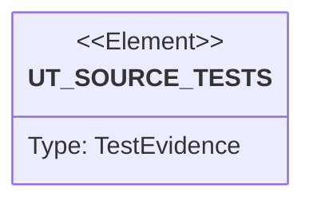

# Semantic TD: lumen/src

## Schema
<!-- type: schema lang: yaml -->

```yaml
semantic_domain:
  key: "lumen/src"
  source_group: "projects/lumen/src"
  coverage_kind: semantic
  evidence:
    source_units:
      - path: "projects/lumen/src/spec.rs"
        language: "rust"
        ownership_state: "codegen"
        generator_primitives: ["service_method"]
        symbols:
          - name: "openapi_json"
            kind: "function"
            public: true
          - name: "json_schema_json"
            kind: "function"
            public: true
          - name: "query_shapes"
            kind: "function"
            public: true
          - name: "field_catalog"
            kind: "function"
            public: true
          - name: "llm_guide_md"
            kind: "function"
            public: true
          - name: "llm_quickstart_md"
            kind: "function"
            public: true
          - name: "llm_recipes_md"
            kind: "function"
            public: true
        source_evidence_node:
          layer: "backend"
          ecosystem: "rust"
          role: "source"
          section_type: "schema"
          domain: "projects/lumen/src"
      - path: "projects/lumen/src/segment_rdb.rs"
        language: "rust"
        ownership_state: "codegen"
        generator_primitives: ["data_model", "service_method"]
        symbols:
          - name: "SegmentRdbStore"
            kind: "struct"
            public: true
          - name: "new"
            kind: "function"
            public: true
          - name: "gen_path"
            kind: "function"
            public: false
          - name: "staging_path"
            kind: "function"
            public: false
          - name: "seq_of"
            kind: "function"
            public: false
          - name: "generations"
            kind: "function"
            public: false
          - name: "sweep_staging"
            kind: "function"
            public: false
          - name: "save"
            kind: "function"
            public: true
          - name: "load_latest"
            kind: "function"
            public: true
          - name: "reopen_into"
            kind: "function"
            public: true
          - name: "prune"
            kind: "function"
            public: true
          - name: "generation_seqs"
            kind: "function"
            public: true
          - name: "tests"
            kind: "module"
            public: false
        source_evidence_node:
          layer: "backend"
          ecosystem: "rust"
          role: "source"
          section_type: "schema"
          domain: "projects/lumen/src"
      - path: "projects/lumen/src/wal.rs"
        language: "rust"
        ownership_state: "codegen"
        generator_primitives: ["config_surface", "data_model", "service_method", "ts_type_surface"]
        symbols:
          - name: "WAL_FORMAT_VERSION"
            kind: "constant"
            public: true
          - name: "WAL_FAST_MAGIC"
            kind: "constant"
            public: false
          - name: "WAL_FAST_INDEX"
            kind: "constant"
            public: false
          - name: "WAL_VALUE_STRING"
            kind: "constant"
            public: false
          - name: "WAL_VALUE_NUMBER"
            kind: "constant"
            public: false
          - name: "WAL_VALUE_VECTOR"
            kind: "constant"
            public: false
          - name: "WAL_VALUE_STRING_LIST"
            kind: "constant"
            public: false
          - name: "WalRecord"
            kind: "struct"
            public: true
          - name: "new"
            kind: "function"
            public: true
          - name: "encode"
            kind: "function"
            public: true
          - name: "decode"
            kind: "function"
            public: true
          - name: "encode_fast_index"
            kind: "function"
            public: false
          - name: "estimate_fast_index_len"
            kind: "function"
            public: false
          - name: "put_u32"
            kind: "function"
            public: false
          - name: "put_str"
            kind: "function"
            public: false
          - name: "decode_fast_record"
            kind: "function"
            public: false
          - name: "FastCursor"
            kind: "struct"
            public: false
          - name: "new"
            kind: "function"
            public: false
          - name: "expect_magic"
            kind: "function"
            public: false
          - name: "expect_eof"
            kind: "function"
            public: false
          - name: "read_exact"
            kind: "function"
            public: false
          - name: "read_u8"
            kind: "function"
            public: false
          - name: "read_u32"
            kind: "function"
            public: false
          - name: "read_f32"
            kind: "function"
            public: false
          - name: "read_f64"
            kind: "function"
            public: false
          - name: "read_string"
            kind: "function"
            public: false
          - name: "WalStream"
            kind: "type"
            public: true
          - name: "SharedWal"
            kind: "type"
            public: true
          - name: "MemWal"
            kind: "struct"
            public: true
          - name: "MemWalInner"
            kind: "struct"
            public: false
          - name: "latest"
            kind: "function"
            public: false
          - name: "maybe_truncate"
            kind: "function"
            public: false
          - name: "SubGuard"
            kind: "struct"
            public: false
          - name: "drop"
            kind: "function"
            public: false
          - name: "default"
            kind: "function"
            public: false
          - name: "new"
            kind: "function"
            public: true
          - name: "publish"
            kind: "function"
            public: false
          - name: "subscribe"
            kind: "function"
            public: false
          - name: "latest_seq"
            kind: "function"
            public: false
          - name: "tests"
            kind: "module"
            public: false
        source_evidence_node:
          layer: "backend"
          ecosystem: "rust"
          role: "source"
          section_type: "schema"
          domain: "projects/lumen/src"
      - path: "projects/lumen/src/log_entry.rs"
        language: "rust"
        ownership_state: "codegen"
        generator_primitives: ["data_model", "enum_model"]
        symbols:
          - name: "RaftLogEntry"
            kind: "enum"
            public: true
          - name: "RaftLogResponse"
            kind: "struct"
            public: true
        source_evidence_node:
          layer: "backend"
          ecosystem: "rust"
          role: "source"
          section_type: "schema"
          domain: "projects/lumen/src"
      - path: "projects/lumen/src/types.rs"
        language: "rust"
        ownership_state: "codegen"
        generator_primitives: ["data_model", "enum_model", "service_method"]
        symbols:
          - name: "CreateCollectionRequest"
            kind: "struct"
            public: true
          - name: "CreateCollectionResponse"
            kind: "struct"
            public: true
          - name: "FieldSpec"
            kind: "struct"
            public: true
          - name: "FieldType"
            kind: "enum"
            public: true
          - name: "VectorMetric"
            kind: "enum"
            public: true
          - name: "VectorBackend"
            kind: "enum"
            public: true
          - name: "default"
            kind: "function"
            public: false
          - name: "VectorQuantize"
            kind: "enum"
            public: true
          - name: "VectorSpec"
            kind: "struct"
            public: true
          - name: "Analyzer"
            kind: "enum"
            public: true
          - name: "IndexRequest"
            kind: "struct"
            public: true
          - name: "IndexItem"
            kind: "struct"
            public: true
          - name: "FieldValue"
            kind: "enum"
            public: true
          - name: "IndexResponse"
            kind: "struct"
            public: true
          - name: "SearchRequest"
            kind: "struct"
            public: true
          - name: "default_limit"
            kind: "function"
            public: false
          - name: "default_track_total"
            kind: "function"
            public: false
          - name: "SortSpec"
            kind: "struct"
            public: true
          - name: "SortOrder"
            kind: "enum"
            public: true
          - name: "QueryNode"
            kind: "enum"
            public: true
          - name: "ExistsQuery"
            kind: "struct"
            public: true
          - name: "DuplicatedQuery"
            kind: "struct"
            public: true
          - name: "RrfQuery"
            kind: "struct"
            public: true
          - name: "default_rrf_k"
            kind: "function"
            public: false
          - name: "HammingQuery"
            kind: "struct"
            public: true
          - name: "HasChildQuery"
            kind: "struct"
            public: true
          - name: "MatchQuery"
            kind: "struct"
            public: true
          - name: "MatchOp"
            kind: "enum"
            public: true
          - name: "default_match_op"
            kind: "function"
            public: false
          - name: "TermQuery"
            kind: "struct"
            public: true
          - name: "TermsQuery"
            kind: "struct"
            public: true
          - name: "KnnQuery"
            kind: "struct"
            public: true
          - name: "RangeQuery"
            kind: "struct"
            public: true
          - name: "SearchHit"
            kind: "struct"
            public: true
          - name: "SearchResponse"
            kind: "struct"
            public: true
          - name: "DuplicatesRequest"
            kind: "struct"
            public: true
          - name: "default_min_group_size"
            kind: "function"
            public: false
          - name: "default_dup_limit"
            kind: "function"
            public: false
          - name: "DuplicateGroup"
            kind: "struct"
            public: true
          - name: "DuplicatesResponse"
            kind: "struct"
            public: true
        source_evidence_node:
          layer: "backend"
          ecosystem: "rust"
          role: "source"
          section_type: "schema"
          domain: "projects/lumen/src"
      - path: "projects/lumen/src/config.rs"
        language: "rust"
        ownership_state: "codegen"
        generator_primitives: ["data_model", "service_method"]
        symbols:
          - name: "ClusterConfig"
            kind: "struct"
            public: true
          - name: "from_env"
            kind: "function"
            public: true
          - name: "pod_ordinal"
            kind: "function"
            public: true
          - name: "shard_index"
            kind: "function"
            public: true
          - name: "replica_index"
            kind: "function"
            public: true
          - name: "is_voter"
            kind: "function"
            public: true
          - name: "parse_env"
            kind: "function"
            public: false
          - name: "tests"
            kind: "module"
            public: false
        source_evidence_node:
          layer: "backend"
          ecosystem: "rust"
          role: "source"
          section_type: "schema"
          domain: "projects/lumen/src"
      - path: "projects/lumen/src/aof.rs"
        language: "rust"
        ownership_state: "codegen"
        generator_primitives: ["config_surface", "data_model", "enum_model", "service_method"]
        symbols:
          - name: "HEADER_LEN"
            kind: "constant"
            public: false
          - name: "encode_payload"
            kind: "function"
            public: false
          - name: "decode_payload"
            kind: "function"
            public: false
          - name: "FsyncPolicy"
            kind: "enum"
            public: true
          - name: "default"
            kind: "function"
            public: false
          - name: "AofWriter"
            kind: "struct"
            public: true
          - name: "open"
            kind: "function"
            public: true
          - name: "open_with_policy"
            kind: "function"
            public: true
          - name: "scan_good_end"
            kind: "function"
            public: false
          - name: "append"
            kind: "function"
            public: true
          - name: "flush"
            kind: "function"
            public: true
          - name: "sync"
            kind: "function"
            public: true
          - name: "maybe_sync"
            kind: "function"
            public: true
          - name: "truncate_through"
            kind: "function"
            public: true
          - name: "tmp_path"
            kind: "function"
            public: false
          - name: "AofReader"
            kind: "struct"
            public: true
          - name: "replay"
            kind: "function"
            public: true
          - name: "replay_aof_into"
            kind: "function"
            public: true
          - name: "tests"
            kind: "module"
            public: false
          - name: "crux_recovery_tests"
            kind: "module"
            public: false
        source_evidence_node:
          layer: "backend"
          ecosystem: "rust"
          role: "source"
          section_type: "schema"
          domain: "projects/lumen/src"
      - path: "projects/lumen/src/lib.rs"
        language: "rust"
        ownership_state: "codegen"
        generator_primitives: ["source_unit"]
        symbols:
          - name: "aof"
            kind: "module"
            public: true
          - name: "api"
            kind: "module"
            public: true
          - name: "auth"
            kind: "module"
            public: true
          - name: "backup_sink"
            kind: "module"
            public: true
          - name: "config"
            kind: "module"
            public: true
          - name: "consumer"
            kind: "module"
            public: true
          - name: "coordinator"
            kind: "module"
            public: true
          - name: "log_entry"
            kind: "module"
            public: true
          - name: "metrics"
            kind: "module"
            public: true
          - name: "native_wire"
            kind: "module"
            public: true
          - name: "operator"
            kind: "module"
            public: true
          - name: "raft"
            kind: "module"
            public: true
          - name: "rdb"
            kind: "module"
            public: true
          - name: "routing"
            kind: "module"
            public: true
          - name: "segment"
            kind: "module"
            public: false
          - name: "segment_rdb"
            kind: "module"
            public: true
          - name: "spec"
            kind: "module"
            public: true
          - name: "storage"
            kind: "module"
            public: true
          - name: "tls"
            kind: "module"
            public: true
          - name: "tokenize"
            kind: "module"
            public: true
          - name: "types"
            kind: "module"
            public: true
          - name: "vector_index"
            kind: "module"
            public: true
          - name: "wal"
            kind: "module"
            public: true
          - name: "wal_nats"
            kind: "module"
            public: true
        source_evidence_node:
          layer: "backend"
          ecosystem: "rust"
          role: "source"
          section_type: "schema"
          domain: "projects/lumen/src"
      - path: "projects/lumen/src/auth.rs"
        language: "rust"
        ownership_state: "codegen"
        generator_primitives: ["config_surface", "data_model", "enum_model", "service_method"]
        symbols:
          - name: "WILDCARD_COLLECTION"
            kind: "constant"
            public: false
          - name: "Role"
            kind: "enum"
            public: true
          - name: "covers"
            kind: "function"
            public: true
          - name: "TokenClaims"
            kind: "struct"
            public: true
          - name: "AuthConfig"
            kind: "struct"
            public: true
          - name: "open"
            kind: "function"
            public: true
          - name: "from_env"
            kind: "function"
            public: true
          - name: "lookup"
            kind: "function"
            public: false
          - name: "AuthContext"
            kind: "enum"
            public: true
          - name: "ensure"
            kind: "function"
            public: true
          - name: "subject"
            kind: "function"
            public: true
          - name: "auth_middleware"
            kind: "function"
            public: true
          - name: "AuthErr"
            kind: "enum"
            public: true
          - name: "into_response"
            kind: "function"
            public: false
          - name: "tests"
            kind: "module"
            public: false
        source_evidence_node:
          layer: "backend"
          ecosystem: "rust"
          role: "source"
          section_type: "schema"
          domain: "projects/lumen/src"
      - path: "projects/lumen/src/wal_nats.rs"
        language: "rust"
        ownership_state: "codegen"
        generator_primitives: ["config_surface", "data_model", "service_method"]
        symbols:
          - name: "DEFAULT_STREAM_NAME"
            kind: "constant"
            public: false
          - name: "DEFAULT_SUBJECT"
            kind: "constant"
            public: false
          - name: "APPLY_PULL_BATCH"
            kind: "constant"
            public: false
          - name: "APPLY_PULL_EXPIRES"
            kind: "constant"
            public: false
          - name: "LOCAL_PUBLISH_WINDOW"
            kind: "constant"
            public: false
          - name: "LOCAL_PUBLISH_RETAIN_AFTER"
            kind: "constant"
            public: false
          - name: "NatsWal"
            kind: "struct"
            public: true
          - name: "NatsWalConfig"
            kind: "struct"
            public: true
          - name: "default"
            kind: "function"
            public: false
          - name: "new"
            kind: "function"
            public: true
          - name: "shard"
            kind: "function"
            public: true
          - name: "connect"
            kind: "function"
            public: true
          - name: "connect_with_config"
            kind: "function"
            public: true
          - name: "publish"
            kind: "function"
            public: false
          - name: "subscribe"
            kind: "function"
            public: false
          - name: "latest_seq"
            kind: "function"
            public: false
          - name: "tests"
            kind: "module"
            public: false
        source_evidence_node:
          layer: "backend"
          ecosystem: "rust"
          role: "source"
          section_type: "schema"
          domain: "projects/lumen/src"
      - path: "projects/lumen/src/vector_index.rs"
        language: "rust"
        ownership_state: "codegen"
        generator_primitives: ["config_surface", "data_model", "enum_model", "service_method"]
        symbols:
          - name: "ScalarCodebook"
            kind: "struct"
            public: true
          - name: "empty"
            kind: "function"
            public: true
          - name: "widen"
            kind: "function"
            public: true
          - name: "range"
            kind: "function"
            public: false
          - name: "encode_sq"
            kind: "function"
            public: true
          - name: "decode_sq"
            kind: "function"
            public: true
          - name: "distance"
            kind: "function"
            public: false
          - name: "l2_squared"
            kind: "function"
            public: false
          - name: "dot"
            kind: "function"
            public: false
          - name: "normalize_unit_safe"
            kind: "function"
            public: false
          - name: "cosine_similarity"
            kind: "function"
            public: false
          - name: "VectorStore"
            kind: "struct"
            public: false
          - name: "new"
            kind: "function"
            public: false
          - name: "put"
            kind: "function"
            public: false
          - name: "drop"
            kind: "function"
            public: false
          - name: "len"
            kind: "function"
            public: false
          - name: "iter_decoded"
            kind: "function"
            public: false
          - name: "get_decoded"
            kind: "function"
            public: false
          - name: "HnswCpuIndex"
            kind: "struct"
            public: true
          - name: "HnswCpuInner"
            kind: "struct"
            public: false
          - name: "HnswBackend"
            kind: "enum"
            public: false
          - name: "HNSW_MAX_NB_CONNECTION"
            kind: "constant"
            public: false
          - name: "HNSW_EF_CONSTRUCTION"
            kind: "constant"
            public: false
          - name: "HNSW_MAX_LAYER"
            kind: "constant"
            public: false
          - name: "HNSW_DEFAULT_MAX_ELEMENTS"
            kind: "constant"
            public: false
          - name: "HNSW_SEARCH_EF_DEFAULT"
            kind: "constant"
            public: false
          - name: "hnsw_search_ef"
            kind: "function"
            public: false
          - name: "new"
            kind: "function"
            public: false
          - name: "insert"
            kind: "function"
            public: false
          - name: "search"
            kind: "function"
            public: false
          - name: "new"
            kind: "function"
            public: true
          - name: "restore"
            kind: "function"
            public: true
          - name: "set_ef_search"
            kind: "function"
            public: true
          - name: "add"
            kind: "function"
            public: false
          - name: "remove"
            kind: "function"
            public: false
          - name: "search_knn_filtered"
            kind: "function"
            public: false
          - name: "len"
            kind: "function"
            public: false
          - name: "dump_for_snapshot"
            kind: "function"
            public: false
          - name: "fmt"
            kind: "function"
            public: false
          - name: "FlatCpuIndex"
            kind: "struct"
            public: true
        source_evidence_node:
          layer: "backend"
          ecosystem: "rust"
          role: "source"
          section_type: "schema"
          domain: "projects/lumen/src"
      - path: "projects/lumen/src/coordinator.rs"
        language: "rust"
        ownership_state: "codegen"
        generator_primitives: ["config_surface", "data_model", "service_method", "ts_type_surface"]
        symbols:
          - name: "OUTCOME_WINDOW"
            kind: "constant"
            public: false
          - name: "APPLY_LOOP_BATCH"
            kind: "constant"
            public: false
          - name: "PendingApply"
            kind: "struct"
            public: false
          - name: "CompletionState"
            kind: "struct"
            public: false
          - name: "SharedAof"
            kind: "type"
            public: true
          - name: "WriteCoordinator"
            kind: "struct"
            public: true
          - name: "start"
            kind: "function"
            public: true
          - name: "start_from"
            kind: "function"
            public: true
          - name: "start_from_with_aof"
            kind: "function"
            public: true
          - name: "start_from_inner"
            kind: "function"
            public: false
          - name: "complete"
            kind: "function"
            public: false
          - name: "register_waiter"
            kind: "function"
            public: false
          - name: "submit"
            kind: "function"
            public: true
          - name: "applied_seq"
            kind: "function"
            public: true
          - name: "tests"
            kind: "module"
            public: false
        source_evidence_node:
          layer: "backend"
          ecosystem: "rust"
          role: "source"
          section_type: "schema"
          domain: "projects/lumen/src"
      - path: "projects/lumen/src/metrics.rs"
        language: "rust"
        ownership_state: "codegen"
        generator_primitives: ["data_model", "service_method"]
        symbols:
          - name: "Metrics"
            kind: "struct"
            public: true
          - name: "new"
            kind: "function"
            public: true
          - name: "incr_index"
            kind: "function"
            public: true
          - name: "observe_search"
            kind: "function"
            public: true
          - name: "incr_duplicates"
            kind: "function"
            public: true
          - name: "incr_collection_created"
            kind: "function"
            public: true
          - name: "set_storage_bytes"
            kind: "function"
            public: true
          - name: "render"
            kind: "function"
            public: true
          - name: "tests"
            kind: "module"
            public: false
        source_evidence_node:
          layer: "backend"
          ecosystem: "rust"
          role: "source"
          section_type: "schema"
          domain: "projects/lumen/src"
      - path: "projects/lumen/src/tokenize.rs"
        language: "rust"
        ownership_state: "codegen"
        generator_primitives: ["config_surface", "service_method"]
        symbols:
          - name: "DEFAULT_NGRAM_MIN"
            kind: "constant"
            public: true
          - name: "DEFAULT_NGRAM_MAX"
            kind: "constant"
            public: true
          - name: "tokenize"
            kind: "function"
            public: true
          - name: "for_whitespace_lower"
            kind: "function"
            public: true
          - name: "for_whitespace_lower_cow"
            kind: "function"
            public: true
          - name: "jieba"
            kind: "function"
            public: false
          - name: "jieba"
            kind: "function"
            public: false
          - name: "ngram"
            kind: "function"
            public: false
          - name: "tests"
            kind: "module"
            public: false
        source_evidence_node:
          layer: "backend"
          ecosystem: "rust"
          role: "source"
          section_type: "schema"
          domain: "projects/lumen/src"
      - path: "projects/lumen/src/segment.rs"
        language: "rust"
        ownership_state: "codegen"
        generator_primitives: ["config_surface", "data_model", "service_method", "ts_type_surface"]
        symbols:
          - name: "MAGIC1"
            kind: "constant"
            public: false
          - name: "MAGIC2"
            kind: "constant"
            public: false
          - name: "FORMAT_VER"
            kind: "constant"
            public: false
          - name: "HOST_ENDIAN_MARKER"
            kind: "constant"
            public: false
          - name: "PAGE"
            kind: "constant"
            public: false
          - name: "HEADER_LEN"
            kind: "constant"
            public: false
          - name: "FOOTER_LEN"
            kind: "constant"
            public: false
          - name: "ROLE_NUMBER"
            kind: "constant"
            public: false
          - name: "ROLE_PRESENT"
            kind: "constant"
            public: false
          - name: "ROLE_HASH"
            kind: "constant"
            public: false
          - name: "ROLE_VECTOR"
            kind: "constant"
            public: false
          - name: "ROLE_DICT"
            kind: "constant"
            public: false
          - name: "ROLE_KEYWORD_DICTID"
            kind: "constant"
            public: false
          - name: "ROLE_SET_OFFSETS"
            kind: "constant"
            public: false
          - name: "ROLE_SET_PACKED"
            kind: "constant"
            public: false
          - name: "ROLE_TEXT_POSTINGS"
            kind: "constant"
            public: false
          - name: "ROLE_TEXT_DOCLEN"
            kind: "constant"
            public: false
          - name: "ROLE_EID"
            kind: "constant"
            public: false
          - name: "ROLE_KEYWORD_POSTINGS"
            kind: "constant"
            public: false
          - name: "ROLE_SET_POSTINGS"
            kind: "constant"
            public: false
          - name: "ROLE_NUMBER_SORTED"
            kind: "constant"
            public: false
          - name: "ROLE_NUMBER_POSTINGS"
            kind: "constant"
            public: false
          - name: "CODEC_FIXED"
            kind: "constant"
            public: false
          - name: "CODEC_LZ4_VAR"
            kind: "constant"
            public: false
          - name: "DICT_ABSENT"
            kind: "constant"
            public: false
          - name: "VAR_BLOCK_BYTES"
            kind: "constant"
            public: false
          - name: "page_align"
            kind: "function"
            public: false
          - name: "ColumnRef"
            kind: "struct"
            public: true
          - name: "Header"
            kind: "struct"
            public: false
          - name: "to_prefix_bytes"
            kind: "function"
            public: false
          - name: "from_bytes"
            kind: "function"
            public: false
          - name: "Footer"
            kind: "struct"
            public: false
          - name: "to_bytes"
            kind: "function"
            public: false
          - name: "from_bytes"
            kind: "function"
            public: false
          - name: "header_block"
            kind: "function"
            public: false
          - name: "append_present_bitset"
            kind: "function"
            public: false
          - name: "present_column_ref"
            kind: "function"
            public: false
          - name: "finalize_and_write"
            kind: "function"
            public: false
          - name: "sortable_bits"
            kind: "function"
            public: false
          - name: "write_number_segment"
            kind: "function"
            public: true
        source_evidence_node:
          layer: "backend"
          ecosystem: "rust"
          role: "source"
          section_type: "schema"
          domain: "projects/lumen/src"
      - path: "projects/lumen/src/native_wire.rs"
        language: "rust"
        ownership_state: "codegen"
        generator_primitives: ["config_surface", "data_model", "enum_model", "service_method"]
        symbols:
          - name: "MAX_FRAME_BYTES"
            kind: "constant"
            public: false
          - name: "FAST_MAGIC"
            kind: "constant"
            public: false
          - name: "FAST_VER"
            kind: "constant"
            public: false
          - name: "FAST_TERM"
            kind: "constant"
            public: false
          - name: "FAST_RANGE"
            kind: "constant"
            public: false
          - name: "FAST_TERM_RANGE"
            kind: "constant"
            public: false
          - name: "FAST_RESPONSE"
            kind: "constant"
            public: false
          - name: "FAST_OK"
            kind: "constant"
            public: false
          - name: "NativeSearchRequest"
            kind: "struct"
            public: true
          - name: "NativeSearchResponse"
            kind: "enum"
            public: true
          - name: "serve_search"
            kind: "function"
            public: true
          - name: "serve_unix_search"
            kind: "function"
            public: true
          - name: "encode_search_frame"
            kind: "function"
            public: true
          - name: "encode_term_frame"
            kind: "function"
            public: true
          - name: "encode_range_frame"
            kind: "function"
            public: true
          - name: "encode_term_range_frame"
            kind: "function"
            public: true
          - name: "search_prepared"
            kind: "function"
            public: true
          - name: "handle_conn"
            kind: "function"
            public: false
          - name: "encode_frame"
            kind: "function"
            public: false
          - name: "frame_payload"
            kind: "function"
            public: false
          - name: "fast_header"
            kind: "function"
            public: false
          - name: "put_str"
            kind: "function"
            public: false
          - name: "put_bound"
            kind: "function"
            public: false
          - name: "is_fast_request"
            kind: "function"
            public: false
          - name: "is_fast_response"
            kind: "function"
            public: false
          - name: "handle_fast_frame"
            kind: "function"
            public: false
          - name: "encode_fast_response"
            kind: "function"
            public: false
          - name: "decode_fast_response"
            kind: "function"
            public: false
          - name: "take"
            kind: "function"
            public: false
          - name: "take_u32"
            kind: "function"
            public: false
          - name: "take_u64"
            kind: "function"
            public: false
          - name: "take_bound"
            kind: "function"
            public: false
          - name: "take_str"
            kind: "function"
            public: false
          - name: "take_str_ref"
            kind: "function"
            public: false
          - name: "decode_response"
            kind: "function"
            public: false
          - name: "read_frame"
            kind: "function"
            public: false
          - name: "tests"
            kind: "module"
            public: false
        source_evidence_node:
          layer: "backend"
          ecosystem: "rust"
          role: "source"
          section_type: "schema"
          domain: "projects/lumen/src"
      - path: "projects/lumen/src/raft.rs"
        language: "rust"
        ownership_state: "codegen"
        generator_primitives: ["data_model", "enum_model", "service_method"]
        symbols:
          - name: "RaftRole"
            kind: "enum"
            public: true
          - name: "ReadConsistency"
            kind: "enum"
            public: true
          - name: "from_header"
            kind: "function"
            public: true
          - name: "RaftGroup"
            kind: "struct"
            public: true
          - name: "PeerAddr"
            kind: "struct"
            public: true
          - name: "from_config"
            kind: "function"
            public: true
          - name: "leader"
            kind: "function"
            public: true
          - name: "ClusterState"
            kind: "struct"
            public: true
          - name: "new"
            kind: "function"
            public: true
          - name: "snapshot"
            kind: "function"
            public: true
          - name: "ClusterStateView"
            kind: "struct"
            public: true
          - name: "tests"
            kind: "module"
            public: false
        source_evidence_node:
          layer: "backend"
          ecosystem: "rust"
          role: "source"
          section_type: "schema"
          domain: "projects/lumen/src"
      - path: "projects/lumen/src/storage.rs"
        language: "rust"
        ownership_state: "codegen"
        generator_primitives: ["config_surface", "data_model", "enum_model", "service_method", "ts_type_surface"]
        symbols:
          - name: "IDEMPOTENCY_TTL"
            kind: "constant"
            public: false
          - name: "SEARCH_RESULT_CACHE_MAX"
            kind: "constant"
            public: false
          - name: "FastHashMap"
            kind: "type"
            public: false
          - name: "MAX_INDEX_ITEMS"
            kind: "constant"
            public: true
          - name: "DropOutcome"
            kind: "enum"
            public: true
          - name: "StorageError"
            kind: "enum"
            public: true
          - name: "SortableF64"
            kind: "struct"
            public: true
          - name: "MISSING_SORTABLE_F64_BITS"
            kind: "constant"
            public: false
          - name: "new"
            kind: "function"
            public: true
          - name: "to_f64"
            kind: "function"
            public: true
          - name: "bits"
            kind: "function"
            public: true
          - name: "from_bits"
            kind: "function"
            public: true
          - name: "range_is_empty"
            kind: "function"
            public: false
          - name: "bound_to_bits"
            kind: "function"
            public: false
          - name: "range_cache_key"
            kind: "function"
            public: false
          - name: "Interner"
            kind: "struct"
            public: false
          - name: "InternerBucket"
            kind: "enum"
            public: false
          - name: "intern"
            kind: "function"
            public: false
          - name: "intern_with_status"
            kind: "function"
            public: false
          - name: "intern_owned_with_status"
            kind: "function"
            public: false
          - name: "insert_hash"
            kind: "function"
            public: false
          - name: "id"
            kind: "function"
            public: false
          - name: "id_with_hash"
            kind: "function"
            public: false
          - name: "resolve"
            kind: "function"
            public: false
          - name: "hash_external_id"
            kind: "function"
            public: false
          - name: "Postings"
            kind: "struct"
            public: true
          - name: "from_sorted"
            kind: "function"
            public: true
          - name: "docids"
            kind: "function"
            public: true
          - name: "tfs"
            kind: "function"
            public: true
          - name: "upsert"
            kind: "function"
            public: false
          - name: "upsert_add"
            kind: "function"
            public: false
          - name: "remove"
            kind: "function"
            public: false
          - name: "tf"
            kind: "function"
            public: false
          - name: "df"
            kind: "function"
            public: false
          - name: "TokPostings"
            kind: "enum"
            public: false
          - name: "docids"
            kind: "function"
            public: false
          - name: "tfs"
            kind: "function"
            public: false
          - name: "df"
            kind: "function"
            public: false
          - name: "tf"
            kind: "function"
            public: false
          - name: "TextIndex"
            kind: "struct"
            public: false
        source_evidence_node:
          layer: "backend"
          ecosystem: "rust"
          role: "source"
          section_type: "schema"
          domain: "projects/lumen/src"
      - path: "projects/lumen/src/routing.rs"
        language: "rust"
        ownership_state: "codegen"
        generator_primitives: ["data_model", "service_method"]
        symbols:
          - name: "shard_index"
            kind: "function"
            public: true
          - name: "document_shard_index"
            kind: "function"
            public: true
          - name: "shard_host"
            kind: "function"
            public: true
          - name: "EngineShardSearch"
            kind: "struct"
            public: true
          - name: "new"
            kind: "function"
            public: true
          - name: "len"
            kind: "function"
            public: true
          - name: "is_empty"
            kind: "function"
            public: true
          - name: "search"
            kind: "function"
            public: false
          - name: "EngineShardWrite"
            kind: "struct"
            public: true
          - name: "new"
            kind: "function"
            public: true
          - name: "len"
            kind: "function"
            public: true
          - name: "is_empty"
            kind: "function"
            public: true
          - name: "require_shards"
            kind: "function"
            public: false
          - name: "create_collection"
            kind: "function"
            public: false
          - name: "drop_collection"
            kind: "function"
            public: false
          - name: "index"
            kind: "function"
            public: false
          - name: "delete"
            kind: "function"
            public: false
          - name: "drop_field"
            kind: "function"
            public: false
          - name: "search_shards_parallel"
            kind: "function"
            public: true
          - name: "merge_shard_search_responses"
            kind: "function"
            public: true
          - name: "make_cursor"
            kind: "function"
            public: false
          - name: "parse_cursor"
            kind: "function"
            public: false
          - name: "tests"
            kind: "module"
            public: false
        source_evidence_node:
          layer: "backend"
          ecosystem: "rust"
          role: "source"
          section_type: "schema"
          domain: "projects/lumen/src"
      - path: "projects/lumen/src/rdb.rs"
        language: "rust"
        ownership_state: "codegen"
        generator_primitives: ["data_model", "service_method"]
        symbols:
          - name: "RdbSnapshot"
            kind: "struct"
            public: true
          - name: "capture"
            kind: "function"
            public: true
          - name: "restore_into"
            kind: "function"
            public: true
          - name: "encode"
            kind: "function"
            public: true
          - name: "decode"
            kind: "function"
            public: true
          - name: "LocalFsRdbStore"
            kind: "struct"
            public: true
          - name: "new"
            kind: "function"
            public: true
          - name: "seq_of"
            kind: "function"
            public: false
          - name: "snapshots"
            kind: "function"
            public: false
          - name: "save"
            kind: "function"
            public: false
          - name: "load_latest"
            kind: "function"
            public: false
          - name: "prune"
            kind: "function"
            public: false
          - name: "tests"
            kind: "module"
            public: false
        source_evidence_node:
          layer: "backend"
          ecosystem: "rust"
          role: "source"
          section_type: "schema"
          domain: "projects/lumen/src"
      - path: "projects/lumen/src/api.rs"
        language: "rust"
        ownership_state: "codegen"
        generator_primitives: ["data_model", "service_method"]
        symbols:
          - name: "AppState"
            kind: "struct"
            public: true
          - name: "LocalEngineSearch"
            kind: "struct"
            public: false
          - name: "search"
            kind: "function"
            public: false
          - name: "LocalWriteBackend"
            kind: "struct"
            public: false
          - name: "unexpected"
            kind: "function"
            public: false
          - name: "create_collection"
            kind: "function"
            public: false
          - name: "drop_collection"
            kind: "function"
            public: false
          - name: "index"
            kind: "function"
            public: false
          - name: "delete"
            kind: "function"
            public: false
          - name: "drop_field"
            kind: "function"
            public: false
          - name: "with_wal"
            kind: "function"
            public: true
          - name: "with_components"
            kind: "function"
            public: true
          - name: "new"
            kind: "function"
            public: true
          - name: "with_cluster"
            kind: "function"
            public: true
          - name: "with_search_backend"
            kind: "function"
            public: true
          - name: "with_write_backend"
            kind: "function"
            public: true
          - name: "open"
            kind: "function"
            public: true
          - name: "ApiDoc"
            kind: "struct"
            public: true
          - name: "router"
            kind: "function"
            public: true
          - name: "metrics"
            kind: "function"
            public: false
          - name: "debug_cluster"
            kind: "function"
            public: false
          - name: "read_consistency_from"
            kind: "function"
            public: false
          - name: "healthz"
            kind: "function"
            public: false
          - name: "readyz"
            kind: "function"
            public: false
          - name: "list_collections"
            kind: "function"
            public: false
          - name: "create_collection"
            kind: "function"
            public: false
          - name: "DropQuery"
            kind: "struct"
            public: false
          - name: "drop_collection"
            kind: "function"
            public: false
          - name: "index"
            kind: "function"
            public: false
          - name: "DeleteQuery"
            kind: "struct"
            public: false
          - name: "delete_external_id"
            kind: "function"
            public: false
          - name: "search"
            kind: "function"
            public: false
          - name: "duplicates"
            kind: "function"
            public: false
          - name: "stats"
            kind: "function"
            public: false
          - name: "reindex_stream"
            kind: "function"
            public: false
          - name: "drop_field"
            kind: "function"
            public: false
          - name: "backup"
            kind: "function"
            public: false
          - name: "LocalBackupRequest"
            kind: "struct"
            public: false
          - name: "default_backup_prefix"
            kind: "function"
            public: false
          - name: "backup_to_local"
            kind: "function"
            public: false
        source_evidence_node:
          layer: "backend"
          ecosystem: "rust"
          role: "source"
          section_type: "schema"
          domain: "projects/lumen/src"
      - path: "projects/lumen/src/tls.rs"
        language: "rust"
        ownership_state: "codegen"
        generator_primitives: ["data_model", "service_method"]
        symbols:
          - name: "PeerTlsConfig"
            kind: "struct"
            public: true
          - name: "from_env"
            kind: "function"
            public: true
          - name: "verify_paths"
            kind: "function"
            public: false
          - name: "tests"
            kind: "module"
            public: false
        source_evidence_node:
          layer: "backend"
          ecosystem: "rust"
          role: "source"
          section_type: "schema"
          domain: "projects/lumen/src"
      - path: "projects/lumen/src/backup_sink.rs"
        language: "rust"
        ownership_state: "codegen"
        generator_primitives: ["data_model", "service_method"]
        symbols:
          - name: "LocalFsSink"
            kind: "struct"
            public: true
          - name: "new"
            kind: "function"
            public: true
          - name: "put"
            kind: "function"
            public: false
          - name: "prune"
            kind: "function"
            public: false
          - name: "identity"
            kind: "function"
            public: false
          - name: "tests"
            kind: "module"
            public: false
        source_evidence_node:
          layer: "backend"
          ecosystem: "rust"
          role: "source"
          section_type: "schema"
          domain: "projects/lumen/src"
      - path: "projects/lumen/src/consumer.rs"
        language: "rust"
        ownership_state: "codegen"
        generator_primitives: ["data_model", "service_method"]
        symbols:
          - name: "ShardRouter"
            kind: "struct"
            public: true
          - name: "index_url"
            kind: "function"
            public: true
          - name: "tests"
            kind: "module"
            public: false
        source_evidence_node:
          layer: "backend"
          ecosystem: "rust"
          role: "source"
          section_type: "schema"
          domain: "projects/lumen/src"
```

## Unit Test
<!-- type: unit-test lang: mermaid -->



## Changes
<!-- type: changes lang: yaml -->

```yaml
coverage_kind: semantic
changes:
  - path: "projects/lumen/src/spec.rs"
    action: modify
    section: schema
    description: |
      Existing source behavior is covered by this feature/domain semantic TD.
    impl_mode: codegen
  - path: "projects/lumen/src/segment_rdb.rs"
    action: modify
    section: schema
    description: |
      Existing source behavior is covered by this feature/domain semantic TD.
    impl_mode: codegen
  - path: "projects/lumen/src/wal.rs"
    action: modify
    section: schema
    description: |
      Existing source behavior is covered by this feature/domain semantic TD.
    impl_mode: codegen
  - path: "projects/lumen/src/log_entry.rs"
    action: modify
    section: schema
    description: |
      Existing source behavior is covered by this feature/domain semantic TD.
    impl_mode: codegen
  - path: "projects/lumen/src/types.rs"
    action: modify
    section: schema
    description: |
      Existing source behavior is covered by this feature/domain semantic TD.
    impl_mode: codegen
  - path: "projects/lumen/src/config.rs"
    action: modify
    section: schema
    description: |
      Existing source behavior is covered by this feature/domain semantic TD.
    impl_mode: codegen
  - path: "projects/lumen/src/aof.rs"
    action: modify
    section: schema
    description: |
      Existing source behavior is covered by this feature/domain semantic TD.
    impl_mode: codegen
  - path: "projects/lumen/src/lib.rs"
    action: modify
    section: schema
    description: |
      Existing source behavior is covered by this feature/domain semantic TD.
    impl_mode: codegen
  - path: "projects/lumen/src/auth.rs"
    action: modify
    section: schema
    description: |
      Existing source behavior is covered by this feature/domain semantic TD.
    impl_mode: codegen
  - path: "projects/lumen/src/wal_nats.rs"
    action: modify
    section: schema
    description: |
      Existing source behavior is covered by this feature/domain semantic TD.
    impl_mode: codegen
  - path: "projects/lumen/src/vector_index.rs"
    action: modify
    section: schema
    description: |
      Existing source behavior is covered by this feature/domain semantic TD.
    impl_mode: codegen
  - path: "projects/lumen/src/coordinator.rs"
    action: modify
    section: schema
    description: |
      Existing source behavior is covered by this feature/domain semantic TD.
    impl_mode: codegen
  - path: "projects/lumen/src/metrics.rs"
    action: modify
    section: schema
    description: |
      Existing source behavior is covered by this feature/domain semantic TD.
    impl_mode: codegen
  - path: "projects/lumen/src/tokenize.rs"
    action: modify
    section: schema
    description: |
      Existing source behavior is covered by this feature/domain semantic TD.
    impl_mode: codegen
  - path: "projects/lumen/src/segment.rs"
    action: modify
    section: schema
    description: |
      Existing source behavior is covered by this feature/domain semantic TD.
    impl_mode: codegen
  - path: "projects/lumen/src/native_wire.rs"
    action: modify
    section: schema
    description: |
      Existing source behavior is covered by this feature/domain semantic TD.
    impl_mode: codegen
  - path: "projects/lumen/src/raft.rs"
    action: modify
    section: schema
    description: |
      Existing source behavior is covered by this feature/domain semantic TD.
    impl_mode: codegen
  - path: "projects/lumen/src/storage.rs"
    action: modify
    section: schema
    description: |
      Existing source behavior is covered by this feature/domain semantic TD.
    impl_mode: codegen
  - path: "projects/lumen/src/routing.rs"
    action: modify
    section: schema
    description: |
      Existing source behavior is covered by this feature/domain semantic TD.
    impl_mode: codegen
  - path: "projects/lumen/src/rdb.rs"
    action: modify
    section: schema
    description: |
      Existing source behavior is covered by this feature/domain semantic TD.
    impl_mode: codegen
  - path: "projects/lumen/src/api.rs"
    action: modify
    section: schema
    description: |
      Existing source behavior is covered by this feature/domain semantic TD.
    impl_mode: codegen
  - path: "projects/lumen/src/tls.rs"
    action: modify
    section: schema
    description: |
      Existing source behavior is covered by this feature/domain semantic TD.
    impl_mode: codegen
  - path: "projects/lumen/src/backup_sink.rs"
    action: modify
    section: schema
    description: |
      Existing source behavior is covered by this feature/domain semantic TD.
    impl_mode: codegen
  - path: "projects/lumen/src/consumer.rs"
    action: modify
    section: schema
    description: |
      Existing source behavior is covered by this feature/domain semantic TD.
    impl_mode: codegen
  - action: annotate
    section: unit-test
    impl_mode: hand-written
    description: "Traceability metadata edge for the unit-test section."
```
