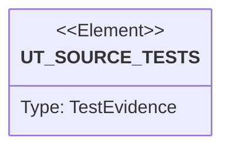

# Semantic TD: lumen/src

## Schema
<!-- type: schema lang: yaml -->

```yaml
semantic_domain:
  key: "lumen/src"
  source_group: "projects/lumen/src"
  coverage_kind: semantic
  evidence:
    source_units:
```

## Unit Test
<!-- type: unit-test lang: mermaid -->



## Changes
<!-- type: changes lang: yaml -->

```yaml
coverage_kind: semantic
changes:
  - action: annotate
    section: unit-test
    impl_mode: hand-written
    description: "Traceability metadata edge for the unit-test section."
```
