# Semantic TD: lumen/tests

## Schema
<!-- type: schema lang: yaml -->

```yaml
semantic_domain:
  key: "lumen/tests"
  source_group: "projects/lumen/tests"
  coverage_kind: semantic
  evidence:
    source_units:
      - path: "projects/lumen/tests/perf_gate_vs_db.rs"
        language: "rust"
        ownership_state: "codegen"
        generator_primitives: ["config_surface", "data_model", "enum_model", "service_method", "test_case"]
        symbols:
          - name: "SEED"
            kind: "constant"
            public: false
          - name: "WARMUP"
            kind: "constant"
            public: false
          - name: "REPS"
            kind: "constant"
            public: false
          - name: "PG_DSN"
            kind: "constant"
            public: false
          - name: "OS_URL"
            kind: "constant"
            public: false
          - name: "CELLS"
            kind: "constant"
            public: false
          - name: "PG_CHEAP_CELLS"
            kind: "constant"
            public: false
          - name: "CITIES"
            kind: "constant"
            public: false
          - name: "VOCAB"
            kind: "constant"
            public: false
          - name: "LCG_A"
            kind: "constant"
            public: false
          - name: "LCG_C"
            kind: "constant"
            public: false
          - name: "Lcg"
            kind: "struct"
            public: false
          - name: "new"
            kind: "function"
            public: false
          - name: "for_doc"
            kind: "function"
            public: false
          - name: "advance"
            kind: "function"
            public: false
          - name: "next"
            kind: "function"
            public: false
          - name: "pick"
            kind: "function"
            public: false
          - name: "Doc"
            kind: "struct"
            public: false
          - name: "gen_doc"
            kind: "function"
            public: false
          - name: "VEC_DIM"
            kind: "constant"
            public: false
          - name: "KNN_K"
            kind: "constant"
            public: false
          - name: "VEC_SEED"
            kind: "constant"
            public: false
          - name: "vector_enabled"
            kind: "function"
            public: false
          - name: "unit_vec"
            kind: "function"
            public: false
          - name: "gen_embedding"
            kind: "function"
            public: false
          - name: "query_vec"
            kind: "function"
            public: false
          - name: "gen_corpus"
            kind: "function"
            public: false
          - name: "lcg_skip_ahead_matches_sequential_doc_stream"
            kind: "function"
            public: false
          - name: "lumen_query"
            kind: "function"
            public: false
          - name: "pg_vec_literal"
            kind: "function"
            public: false
          - name: "pg_sql"
            kind: "function"
            public: false
          - name: "os_query"
            kind: "function"
            public: false
          - name: "Stat"
            kind: "struct"
            public: false
          - name: "summarize"
            kind: "function"
            public: false
          - name: "lumen_serve"
            kind: "function"
            public: false
          - name: "lumen_serve_engine"
            kind: "function"
            public: false
          - name: "NativeEndpoint"
            kind: "struct"
            public: false
          - name: "lumen_serve_native"
            kind: "function"
            public: false
          - name: "post_index"
            kind: "function"
            public: false
          - name: "measure_lumen"
            kind: "function"
            public: false
        source_evidence_node:
          layer: "backend"
          ecosystem: "rust"
          role: "test"
          section_type: "unit-test"
          domain: "projects/lumen/tests"
      - path: "projects/lumen/tests/spec_cli.rs"
        language: "rust"
        ownership_state: "codegen"
        generator_primitives: ["service_method", "test_case"]
        symbols:
          - name: "openapi_is_valid_json_with_search_path"
            kind: "function"
            public: false
          - name: "openapi_yaml_is_valid_with_search_path"
            kind: "function"
            public: false
          - name: "json_schema_emits_component_schemas"
            kind: "function"
            public: false
          - name: "query_shapes_cover_core_node_types_and_carry_requests"
            kind: "function"
            public: false
          - name: "field_catalog_matches_the_real_enums"
            kind: "function"
            public: false
          - name: "llm_outline_maps_agent_topics"
            kind: "function"
            public: false
          - name: "llm_workflow_covers_the_integration_model"
            kind: "function"
            public: false
          - name: "llm_integration_recommends_postgres_alloydb_adapter_boundary"
            kind: "function"
            public: false
          - name: "llm_quickstart_is_a_copy_paste_end_to_end"
            kind: "function"
            public: false
          - name: "llm_recipes_render_every_cookbook_shape_without_drift"
            kind: "function"
            public: false
        source_evidence_node:
          layer: "backend"
          ecosystem: "rust"
          role: "test"
          section_type: "unit-test"
          domain: "projects/lumen/tests"
      - path: "projects/lumen/tests/cli_convention.rs"
        language: "rust"
        ownership_state: "handwrite"
        generator_primitives: ["service_method", "test_case"]
        symbols:
          - name: "help_ships_standard_issue_group_not_report_issue"
            kind: "function"
            public: false
          - name: "issue_help_lists_search_view_create"
            kind: "function"
            public: false
        source_evidence_node:
          layer: "backend"
          ecosystem: "rust"
          role: "test"
          section_type: "unit-test"
          domain: "projects/lumen/tests"
      - path: "projects/lumen/tests/drop_field_e2e.rs"
        language: "rust"
        ownership_state: "codegen"
        generator_primitives: ["service_method", "test_case"]
        symbols:
          - name: "server"
            kind: "function"
            public: false
          - name: "drop_field_removes_postings_and_bumps_version"
            kind: "function"
            public: false
          - name: "drop_nonexistent_field_returns_422"
            kind: "function"
            public: false
          - name: "drop_field_on_missing_collection_404"
            kind: "function"
            public: false
        source_evidence_node:
          layer: "backend"
          ecosystem: "rust"
          role: "test"
          section_type: "unit-test"
          domain: "projects/lumen/tests"
      - path: "projects/lumen/tests/reindex_stream_e2e.rs"
        language: "rust"
        ownership_state: "codegen"
        generator_primitives: ["service_method", "test_case"]
        symbols:
          - name: "server"
            kind: "function"
            public: false
          - name: "ndjson_body"
            kind: "function"
            public: false
          - name: "stream_indexes_items_and_emits_progress_then_done"
            kind: "function"
            public: false
          - name: "stream_skips_blank_lines_and_reports_parse_errors"
            kind: "function"
            public: false
          - name: "stream_requires_write_role_under_auth"
            kind: "function"
            public: false
        source_evidence_node:
          layer: "backend"
          ecosystem: "rust"
          role: "test"
          section_type: "unit-test"
          domain: "projects/lumen/tests"
      - path: "projects/lumen/tests/coverage_gaps_e2e.rs"
        language: "rust"
        ownership_state: "codegen"
        generator_primitives: ["service_method", "test_case"]
        symbols:
          - name: "server"
            kind: "function"
            public: false
          - name: "s1_terms_query_matches_any_listed_value"
            kind: "function"
            public: false
          - name: "s1_or_unions_children"
            kind: "function"
            public: false
          - name: "s1_not_inverts_against_universe"
            kind: "function"
            public: false
          - name: "s1_cursor_paginates_across_pages"
            kind: "function"
            public: false
          - name: "s1_duplicates_on_number_field"
            kind: "function"
            public: false
          - name: "s1_duplicates_on_set_field_per_element"
            kind: "function"
            public: false
          - name: "s1_ngram_analyzer_matches_substring"
            kind: "function"
            public: false
          - name: "s5_debug_cluster_returns_local_view"
            kind: "function"
            public: false
          - name: "s8_swagger_docs_endpoint_returns_html"
            kind: "function"
            public: false
          - name: "s7_admin_backup_local_writes_snapshot_to_disk"
            kind: "function"
            public: false
          - name: "s3_read_consistency_header_accepted_on_search"
            kind: "function"
            public: false
          - name: "s1_oversized_payload_rejected_with_413_or_422"
            kind: "function"
            public: false
        source_evidence_node:
          layer: "backend"
          ecosystem: "rust"
          role: "test"
          section_type: "unit-test"
          domain: "projects/lumen/tests"
      - path: "projects/lumen/tests/api_e2e.rs"
        language: "rust"
        ownership_state: "codegen"
        generator_primitives: ["service_method", "test_case"]
        symbols:
          - name: "server"
            kind: "function"
            public: false
          - name: "health_and_ready"
            kind: "function"
            public: false
          - name: "create_collection_and_index_keyword_then_search"
            kind: "function"
            public: false
          - name: "search_can_use_injected_sharded_backend"
            kind: "function"
            public: false
          - name: "index_can_use_injected_sharded_write_backend"
            kind: "function"
            public: false
          - name: "eid_for_document_shard"
            kind: "function"
            public: false
          - name: "test_search_shard"
            kind: "function"
            public: false
          - name: "duplicates_finds_groups"
            kind: "function"
            public: false
          - name: "match_query_text_and_range"
            kind: "function"
            public: false
          - name: "keyword_multi_sugar_becomes_set"
            kind: "function"
            public: false
          - name: "unknown_collection_404"
            kind: "function"
            public: false
          - name: "type_mismatch_422"
            kind: "function"
            public: false
          - name: "idempotent_index_request_dedups"
            kind: "function"
            public: false
          - name: "delete_external_id_removes_all_fields"
            kind: "function"
            public: false
          - name: "bm25_ranks_higher_tf_first"
            kind: "function"
            public: false
          - name: "metrics_exposes_prometheus_text"
            kind: "function"
            public: false
          - name: "upsert_adds_new_fields_online"
            kind: "function"
            public: false
          - name: "upsert_rejects_incompatible_redeclaration"
            kind: "function"
            public: false
          - name: "bulk_limit_rejected_413"
            kind: "function"
            public: false
          - name: "openapi_spec_served"
            kind: "function"
            public: false
        source_evidence_node:
          layer: "backend"
          ecosystem: "rust"
          role: "test"
          section_type: "unit-test"
          domain: "projects/lumen/tests"
      - path: "projects/lumen/tests/disk_format_bench.rs"
        language: "rust"
        ownership_state: "codegen"
        generator_primitives: ["data_model", "service_method", "test_case"]
        symbols:
          - name: "Lcg"
            kind: "struct"
            public: false
          - name: "new"
            kind: "function"
            public: false
          - name: "next_u64"
            kind: "function"
            public: false
          - name: "next_f32"
            kind: "function"
            public: false
          - name: "vec_field"
            kind: "function"
            public: false
          - name: "scalar_field"
            kind: "function"
            public: false
          - name: "disk_format_size_and_decode_speed"
            kind: "function"
            public: false
        source_evidence_node:
          layer: "backend"
          ecosystem: "rust"
          role: "test"
          section_type: "unit-test"
          domain: "projects/lumen/tests"
      - path: "projects/lumen/tests/hash_hamming.rs"
        language: "rust"
        ownership_state: "codegen"
        generator_primitives: ["service_method", "test_case"]
        symbols:
          - name: "spec"
            kind: "function"
            public: false
          - name: "schema"
            kind: "function"
            public: false
          - name: "index_doc"
            kind: "function"
            public: false
          - name: "run"
            kind: "function"
            public: false
          - name: "hamming"
            kind: "function"
            public: false
          - name: "ids"
            kind: "function"
            public: false
          - name: "hamming_returns_within_threshold_ranked_by_similarity"
            kind: "function"
            public: false
          - name: "hamming_composes_in_boolean_and"
            kind: "function"
            public: false
          - name: "invalid_hex_hash_is_rejected"
            kind: "function"
            public: false
        source_evidence_node:
          layer: "backend"
          ecosystem: "rust"
          role: "test"
          section_type: "unit-test"
          domain: "projects/lumen/tests"
      - path: "projects/lumen/tests/properties.rs"
        language: "rust"
        ownership_state: "codegen"
        generator_primitives: ["service_method", "test_case"]
        symbols:
          - name: "eid_strategy"
            kind: "function"
            public: false
          - name: "keyword_value"
            kind: "function"
            public: false
          - name: "text_value"
            kind: "function"
            public: false
          - name: "schema"
            kind: "function"
            public: false
          - name: "fresh"
            kind: "function"
            public: false
          - name: "term_search"
            kind: "function"
            public: false
          - name: "match_search"
            kind: "function"
            public: false
        source_evidence_node:
          layer: "backend"
          ecosystem: "rust"
          role: "test"
          section_type: "unit-test"
          domain: "projects/lumen/tests"
      - path: "projects/lumen/tests/vector_e2e.rs"
        language: "rust"
        ownership_state: "codegen"
        generator_primitives: ["data_model", "service_method", "test_case"]
        symbols:
          - name: "server"
            kind: "function"
            public: false
          - name: "Lcg"
            kind: "struct"
            public: false
          - name: "new"
            kind: "function"
            public: false
          - name: "next_f32"
            kind: "function"
            public: false
          - name: "vec"
            kind: "function"
            public: false
          - name: "vec_json"
            kind: "function"
            public: false
          - name: "knn_round_trip_finds_neighbours_and_orders_them"
            kind: "function"
            public: false
          - name: "filtered_knn_returns_nearest_within_filter_no_recall_collapse"
            kind: "function"
            public: false
          - name: "knn_backup_then_restore_preserves_topk_order"
            kind: "function"
            public: false
          - name: "vector_with_scalar_quantization_works_end_to_end"
            kind: "function"
            public: false
          - name: "vector_field_rejects_dim_mismatch"
            kind: "function"
            public: false
        source_evidence_node:
          layer: "backend"
          ecosystem: "rust"
          role: "test"
          section_type: "unit-test"
          domain: "projects/lumen/tests"
      - path: "projects/lumen/tests/backup_restore_e2e.rs"
        language: "rust"
        ownership_state: "codegen"
        generator_primitives: ["service_method", "test_case"]
        symbols:
          - name: "server"
            kind: "function"
            public: false
          - name: "snapshot_then_restore_into_fresh_engine"
            kind: "function"
            public: false
          - name: "restore_rejects_wrong_version"
            kind: "function"
            public: false
        source_evidence_node:
          layer: "backend"
          ecosystem: "rust"
          role: "test"
          section_type: "unit-test"
          domain: "projects/lumen/tests"
      - path: "projects/lumen/tests/nats_cluster_e2e.rs"
        language: "rust"
        ownership_state: "codegen"
        generator_primitives: ["service_method", "test_case"]
        symbols:
          - name: "nats_url"
            kind: "function"
            public: false
          - name: "reset"
            kind: "function"
            public: false
          - name: "node"
            kind: "function"
            public: false
          - name: "search_total"
            kind: "function"
            public: false
          - name: "wait_total"
            kind: "function"
            public: false
          - name: "write_on_node_a_is_readable_on_node_b"
            kind: "function"
            public: false
          - name: "delete_on_one_node_propagates_to_the_other"
            kind: "function"
            public: false
        source_evidence_node:
          layer: "backend"
          ecosystem: "rust"
          role: "test"
          section_type: "unit-test"
          domain: "projects/lumen/tests"
      - path: "projects/lumen/tests/auth_e2e.rs"
        language: "rust"
        ownership_state: "codegen"
        generator_primitives: ["service_method", "test_case"]
        symbols:
          - name: "auth_server"
            kind: "function"
            public: false
          - name: "claim"
            kind: "function"
            public: false
          - name: "required_auth_rejects_missing_bearer"
            kind: "function"
            public: false
          - name: "required_auth_rejects_invalid_bearer"
            kind: "function"
            public: false
          - name: "admin_can_create_collection"
            kind: "function"
            public: false
          - name: "read_only_cannot_create"
            kind: "function"
            public: false
          - name: "write_can_index_but_not_drop"
            kind: "function"
            public: false
          - name: "list_collections_filters_by_role"
            kind: "function"
            public: false
          - name: "unauthenticated_request_to_metrics_still_works"
            kind: "function"
            public: false
        source_evidence_node:
          layer: "backend"
          ecosystem: "rust"
          role: "test"
          section_type: "unit-test"
          domain: "projects/lumen/tests"
      - path: "projects/lumen/tests/write_qps.rs"
        language: "rust"
        ownership_state: "codegen"
        generator_primitives: ["config_surface", "data_model", "enum_model", "service_method", "test_case"]
        symbols:
          - name: "DEFAULT_WARMUP_S"
            kind: "constant"
            public: false
          - name: "PUT_WORKERS"
            kind: "constant"
            public: false
          - name: "INDEX_WORKERS"
            kind: "constant"
            public: false
          - name: "DEFAULT_WINDOW_S"
            kind: "constant"
            public: false
          - name: "DEFAULT_BATCH_DOCS"
            kind: "constant"
            public: false
          - name: "DEFAULT_REQ_TIMEOUT_MS"
            kind: "constant"
            public: false
          - name: "PG_DSN"
            kind: "constant"
            public: false
          - name: "OS_URL"
            kind: "constant"
            public: false
          - name: "PG_MAX_POOL"
            kind: "constant"
            public: false
          - name: "nats_url"
            kind: "function"
            public: false
          - name: "window_s"
            kind: "function"
            public: false
          - name: "warmup_s"
            kind: "function"
            public: false
          - name: "batch_docs"
            kind: "function"
            public: false
          - name: "write_mode_enabled"
            kind: "function"
            public: false
          - name: "write_modes_label"
            kind: "function"
            public: false
          - name: "write_shards"
            kind: "function"
            public: false
          - name: "req_timeout"
            kind: "function"
            public: false
          - name: "docs_schema"
            kind: "function"
            public: false
          - name: "reset_nats_stream_config"
            kind: "function"
            public: false
          - name: "reset_nats_stream"
            kind: "function"
            public: false
          - name: "Server"
            kind: "struct"
            public: false
          - name: "drop"
            kind: "function"
            public: false
          - name: "serve"
            kind: "function"
            public: false
          - name: "serve_embedded"
            kind: "function"
            public: false
          - name: "serve_sharded_embedded"
            kind: "function"
            public: false
          - name: "serve_nats"
            kind: "function"
            public: false
          - name: "serve_sharded_nats"
            kind: "function"
            public: false
          - name: "Mode"
            kind: "enum"
            public: false
          - name: "label"
            kind: "function"
            public: false
          - name: "serve"
            kind: "function"
            public: false
          - name: "create_docs_collection"
            kind: "function"
            public: false
          - name: "index_request"
            kind: "function"
            public: false
          - name: "doc_fields"
            kind: "function"
            public: false
          - name: "sql_lit"
            kind: "function"
            public: false
          - name: "pg_insert_sql"
            kind: "function"
            public: false
          - name: "os_bulk_body"
            kind: "function"
            public: false
          - name: "WriteReq"
            kind: "enum"
            public: false
          - name: "docs_per_request"
            kind: "function"
            public: false
          - name: "items_per_request"
            kind: "function"
            public: false
          - name: "PeerWriteReq"
            kind: "enum"
            public: false
        source_evidence_node:
          layer: "backend"
          ecosystem: "rust"
          role: "test"
          section_type: "unit-test"
          domain: "projects/lumen/tests"
      - path: "projects/lumen/tests/hnsw_ef_recall.rs"
        language: "rust"
        ownership_state: "codegen"
        generator_primitives: ["config_surface", "data_model", "service_method", "test_case"]
        symbols:
          - name: "DIM"
            kind: "constant"
            public: false
          - name: "K"
            kind: "constant"
            public: false
          - name: "CLUSTERS"
            kind: "constant"
            public: false
          - name: "QUERIES"
            kind: "constant"
            public: false
          - name: "Lcg"
            kind: "struct"
            public: false
          - name: "new"
            kind: "function"
            public: false
          - name: "next_u64"
            kind: "function"
            public: false
          - name: "unit"
            kind: "function"
            public: false
          - name: "cosine"
            kind: "function"
            public: false
          - name: "brute_topk"
            kind: "function"
            public: false
          - name: "percentile"
            kind: "function"
            public: false
          - name: "hnsw_ef_recall_latency_sweep"
            kind: "function"
            public: false
        source_evidence_node:
          layer: "backend"
          ecosystem: "rust"
          role: "test"
          section_type: "unit-test"
          domain: "projects/lumen/tests"
      - path: "projects/lumen/tests/planner_diff.rs"
        language: "rust"
        ownership_state: "codegen"
        generator_primitives: ["data_model", "service_method", "test_case"]
        symbols:
          - name: "fieldspec"
            kind: "function"
            public: false
          - name: "schema"
            kind: "function"
            public: false
          - name: "Doc"
            kind: "struct"
            public: false
          - name: "search_ids"
            kind: "function"
            public: false
          - name: "req"
            kind: "function"
            public: false
          - name: "set_of"
            kind: "function"
            public: false
        source_evidence_node:
          layer: "backend"
          ecosystem: "rust"
          role: "test"
          section_type: "unit-test"
          domain: "projects/lumen/tests"
      - path: "projects/lumen/tests/coverage_pass_e2e.rs"
        language: "rust"
        ownership_state: "codegen"
        generator_primitives: ["service_method", "test_case"]
        symbols:
          - name: "server"
            kind: "function"
            public: false
          - name: "auth_server"
            kind: "function"
            public: false
          - name: "admin"
            kind: "function"
            public: false
          - name: "unknown_field_returns_422"
            kind: "function"
            public: false
          - name: "duplicates_on_text_returns_400"
            kind: "function"
            public: false
          - name: "nan_number_value_rejected"
            kind: "function"
            public: false
          - name: "drop_nonexistent_collection_returns_404"
            kind: "function"
            public: false
          - name: "search_on_unknown_collection_returns_404"
            kind: "function"
            public: false
          - name: "delete_external_id_with_unknown_collection_returns_404"
            kind: "function"
            public: false
          - name: "stats_on_unknown_collection_returns_404"
            kind: "function"
            public: false
          - name: "restore_with_wrong_version_returns_400"
            kind: "function"
            public: false
          - name: "invalid_field_spec_rejected"
            kind: "function"
            public: false
          - name: "drop_field_on_soft_deleted_collection_returns_410"
            kind: "function"
            public: false
          - name: "index_on_soft_deleted_collection_returns_410"
            kind: "function"
            public: false
          - name: "cursor_walks_to_exhaustion_on_match_query"
            kind: "function"
            public: false
          - name: "reindex_replaces_text_value_and_clears_old_tokens"
            kind: "function"
            public: false
          - name: "delete_one_field_keeps_others"
            kind: "function"
            public: false
          - name: "empty_and_returns_empty_set"
            kind: "function"
            public: false
          - name: "nested_and_or_combination_evaluates_correctly"
            kind: "function"
            public: false
          - name: "search_requires_read_role"
            kind: "function"
            public: false
          - name: "stats_requires_read_role"
            kind: "function"
            public: false
          - name: "duplicates_requires_read_role"
            kind: "function"
            public: false
          - name: "backup_endpoint_requires_admin_wildcard"
            kind: "function"
            public: false
          - name: "drop_field_requires_admin"
            kind: "function"
            public: false
        source_evidence_node:
          layer: "backend"
          ecosystem: "rust"
          role: "test"
          section_type: "unit-test"
          domain: "projects/lumen/tests"
      - path: "projects/lumen/tests/disk_scale_proof.rs"
        language: "rust"
        ownership_state: "codegen"
        generator_primitives: ["config_surface", "data_model", "service_method", "test_case"]
        symbols:
          - name: "procmem"
            kind: "module"
            public: false
          - name: "mix"
            kind: "function"
            public: false
          - name: "num_of"
            kind: "function"
            public: false
          - name: "KW_CARD"
            kind: "constant"
            public: false
          - name: "kw_of"
            kind: "function"
            public: false
          - name: "TEXT_VOCAB"
            kind: "constant"
            public: false
          - name: "body_of"
            kind: "function"
            public: false
          - name: "vec_of"
            kind: "function"
            public: false
          - name: "num_spec"
            kind: "function"
            public: false
          - name: "kw_spec"
            kind: "function"
            public: false
          - name: "body_spec"
            kind: "function"
            public: false
          - name: "emb_spec"
            kind: "function"
            public: false
          - name: "schema"
            kind: "function"
            public: false
          - name: "lexical_schema"
            kind: "function"
            public: false
          - name: "eid_of"
            kind: "function"
            public: false
          - name: "index_range"
            kind: "function"
            public: false
          - name: "search_ids"
            kind: "function"
            public: false
          - name: "BatteryOut"
            kind: "struct"
            public: false
          - name: "battery"
            kind: "function"
            public: false
          - name: "segment_bytes"
            kind: "function"
            public: false
          - name: "reopen_query_equals_inram_oracle_small_n"
            kind: "function"
            public: false
          - name: "Measured"
            kind: "struct"
            public: false
          - name: "measure"
            kind: "function"
            public: false
          - name: "scale_proof_reopen_rss_is_bounded"
            kind: "function"
            public: false
        source_evidence_node:
          layer: "backend"
          ecosystem: "rust"
          role: "test"
          section_type: "unit-test"
          domain: "projects/lumen/tests"
      - path: "projects/lumen/tests/collapse_nested.rs"
        language: "rust"
        ownership_state: "codegen"
        generator_primitives: ["service_method", "test_case"]
        symbols:
          - name: "spec"
            kind: "function"
            public: false
          - name: "child_schema"
            kind: "function"
            public: false
          - name: "search"
            kind: "function"
            public: false
          - name: "base"
            kind: "function"
            public: false
          - name: "collapse_early_term_correct"
            kind: "function"
            public: false
          - name: "no_cross_element_false_match"
            kind: "function"
            public: false
          - name: "has_child_composes_in_boolean_tree"
            kind: "function"
            public: false
          - name: "ngram_cjk_substring"
            kind: "function"
            public: false
          - name: "enum_path_and_level_match"
            kind: "function"
            public: false
        source_evidence_node:
          layer: "backend"
          ecosystem: "rust"
          role: "test"
          section_type: "unit-test"
          domain: "projects/lumen/tests"
      - path: "projects/lumen/tests/drop_drain_e2e.rs"
        language: "rust"
        ownership_state: "codegen"
        generator_primitives: ["service_method", "test_case"]
        symbols:
          - name: "server_with_engine"
            kind: "function"
            public: false
          - name: "soft_delete_returns_202_and_reads_get_410"
            kind: "function"
            public: false
          - name: "force_delete_returns_204_and_404_after"
            kind: "function"
            public: false
          - name: "sweep_removes_expired_soft_deleted"
            kind: "function"
            public: false
          - name: "drain_flips_readyz_to_503"
            kind: "function"
            public: false
          - name: "list_collections_skips_soft_deleted"
            kind: "function"
            public: false
        source_evidence_node:
          layer: "backend"
          ecosystem: "rust"
          role: "test"
          section_type: "unit-test"
          domain: "projects/lumen/tests"
      - path: "projects/lumen/tests/wal_nats_e2e.rs"
        language: "rust"
        ownership_state: "codegen"
        generator_primitives: ["service_method", "test_case"]
        symbols:
          - name: "nats_url"
            kind: "function"
            public: false
          - name: "users_schema"
            kind: "function"
            public: false
          - name: "index_one"
            kind: "function"
            public: false
          - name: "reset_stream"
            kind: "function"
            public: false
          - name: "spawn_node"
            kind: "function"
            public: false
          - name: "search_total"
            kind: "function"
            public: false
          - name: "wait_for_total"
            kind: "function"
            public: false
          - name: "two_nodes_fan_out_from_one_published_stream"
            kind: "function"
            public: false
          - name: "late_node_replays_backlog_then_sees_live"
            kind: "function"
            public: false
        source_evidence_node:
          layer: "backend"
          ecosystem: "rust"
          role: "test"
          section_type: "unit-test"
          domain: "projects/lumen/tests"
      - path: "projects/lumen/tests/hybrid_rrf.rs"
        language: "rust"
        ownership_state: "codegen"
        generator_primitives: ["service_method", "test_case"]
        symbols:
          - name: "server"
            kind: "function"
            public: false
          - name: "rrf_ranks_doc_strong_in_both_legs_above_a_single_leg_winner"
            kind: "function"
            public: false
          - name: "rrf_default_k_is_applied_when_omitted"
            kind: "function"
            public: false
        source_evidence_node:
          layer: "backend"
          ecosystem: "rust"
          role: "test"
          section_type: "unit-test"
          domain: "projects/lumen/tests"
      - path: "projects/lumen/tests/operator_render.rs"
        language: "rust"
        ownership_state: "codegen"
        generator_primitives: ["service_method", "test_case"]
        symbols:
          - name: "lumen"
            kind: "function"
            public: false
          - name: "dev_spec"
            kind: "function"
            public: false
          - name: "prod_spec"
            kind: "function"
            public: false
          - name: "find"
            kind: "function"
            public: false
          - name: "kinds"
            kind: "function"
            public: false
          - name: "has"
            kind: "function"
            public: false
          - name: "env_names"
            kind: "function"
            public: false
          - name: "dev_renders_full_managed_set"
            kind: "function"
            public: false
          - name: "deployment_wires_serving_contract"
            kind: "function"
            public: false
          - name: "configmap_and_broker_url_track_spec"
            kind: "function"
            public: false
          - name: "hpa_and_single_replica_relay_are_rendered"
            kind: "function"
            public: false
          - name: "prod_wires_managed_relay_and_auth"
            kind: "function"
            public: false
          - name: "external_broker_skips_managed_relay_objects"
            kind: "function"
            public: false
          - name: "crd_yaml_emits_lumen_definition"
            kind: "function"
            public: false
        source_evidence_node:
          layer: "backend"
          ecosystem: "rust"
          role: "test"
          section_type: "unit-test"
          domain: "projects/lumen/tests"
      - path: "projects/lumen/tests/stats_metadata_e2e.rs"
        language: "rust"
        ownership_state: "codegen"
        generator_primitives: ["service_method", "test_case"]
        symbols:
          - name: "server"
            kind: "function"
            public: false
          - name: "stats_returns_per_field_metadata_and_documents_indexed"
            kind: "function"
            public: false
          - name: "stats_documents_indexed_matches_distinct_external_ids"
            kind: "function"
            public: false
          - name: "stats_last_indexed_at_absent_before_first_write"
            kind: "function"
            public: false
          - name: "stats_per_field_bytes_attribute_capacity_to_the_right_field"
            kind: "function"
            public: false
        source_evidence_node:
          layer: "backend"
          ecosystem: "rust"
          role: "test"
          section_type: "unit-test"
          domain: "projects/lumen/tests"
      - path: "projects/lumen/tests/authz_matrix_e2e.rs"
        language: "rust"
        ownership_state: "codegen"
        generator_primitives: ["config_surface", "service_method", "test_case"]
        symbols:
          - name: "READER"
            kind: "constant"
            public: false
          - name: "WRITER"
            kind: "constant"
            public: false
          - name: "ADMIN"
            kind: "constant"
            public: false
          - name: "claims"
            kind: "function"
            public: false
          - name: "auth_server"
            kind: "function"
            public: false
          - name: "post"
            kind: "function"
            public: false
          - name: "get"
            kind: "function"
            public: false
          - name: "put"
            kind: "function"
            public: false
          - name: "authz_matrix_enforced_on_every_endpoint"
            kind: "function"
            public: false
        source_evidence_node:
          layer: "backend"
          ecosystem: "rust"
          role: "test"
          section_type: "unit-test"
          domain: "projects/lumen/tests"
      - path: "projects/lumen/tests/perf_gate.rs"
        language: "rust"
        ownership_state: "codegen"
        generator_primitives: ["service_method", "test_case"]
        symbols:
          - name: "schema"
            kind: "function"
            public: false
          - name: "fixture_engine"
            kind: "function"
            public: false
          - name: "index_throughput_floor"
            kind: "function"
            public: false
          - name: "match_query_latency_floor"
            kind: "function"
            public: false
          - name: "term_query_latency_floor"
            kind: "function"
            public: false
        source_evidence_node:
          layer: "backend"
          ecosystem: "rust"
          role: "test"
          section_type: "unit-test"
          domain: "projects/lumen/tests"
```

## Unit Test

```mermaid
---
id: unit-test
coverage_kind: semantic
strategy: preserve observed source behavior while semantic coverage is promoted toward generator primitives
evidence:
  source_tests:
    - path: "projects/lumen/tests/perf_gate_vs_db.rs"
    - path: "projects/lumen/tests/spec_cli.rs"
    - path: "projects/lumen/tests/cli_convention.rs"
    - path: "projects/lumen/tests/drop_field_e2e.rs"
    - path: "projects/lumen/tests/reindex_stream_e2e.rs"
    - path: "projects/lumen/tests/coverage_gaps_e2e.rs"
    - path: "projects/lumen/tests/api_e2e.rs"
    - path: "projects/lumen/tests/disk_format_bench.rs"
    - path: "projects/lumen/tests/hash_hamming.rs"
    - path: "projects/lumen/tests/properties.rs"
    - path: "projects/lumen/tests/vector_e2e.rs"
    - path: "projects/lumen/tests/backup_restore_e2e.rs"
    - path: "projects/lumen/tests/nats_cluster_e2e.rs"
    - path: "projects/lumen/tests/auth_e2e.rs"
    - path: "projects/lumen/tests/write_qps.rs"
    - path: "projects/lumen/tests/hnsw_ef_recall.rs"
    - path: "projects/lumen/tests/planner_diff.rs"
    - path: "projects/lumen/tests/coverage_pass_e2e.rs"
    - path: "projects/lumen/tests/disk_scale_proof.rs"
    - path: "projects/lumen/tests/collapse_nested.rs"
    - path: "projects/lumen/tests/drop_drain_e2e.rs"
    - path: "projects/lumen/tests/wal_nats_e2e.rs"
    - path: "projects/lumen/tests/hybrid_rrf.rs"
    - path: "projects/lumen/tests/operator_render.rs"
    - path: "projects/lumen/tests/stats_metadata_e2e.rs"
    - path: "projects/lumen/tests/authz_matrix_e2e.rs"
    - path: "projects/lumen/tests/perf_gate.rs"
---
requirementDiagram

element UT_SOURCE_TESTS {
  type: "TestEvidence"
}
```

<!-- type: unit-test lang: mermaid -->



## Changes
<!-- type: changes lang: yaml -->

```yaml
coverage_kind: semantic
changes:
  - path: "projects/lumen/tests/perf_gate_vs_db.rs"
    action: modify
    section: unit-test
    description: |
      Full-file unit-test artifact is replayed from its SPEC-MANAGED CODEGEN block.
    impl_mode: codegen
  - path: "projects/lumen/tests/spec_cli.rs"
    action: modify
    section: schema
    description: |
      Existing source behavior is covered by this feature/domain semantic TD.
    impl_mode: hand-written
  - path: "projects/lumen/tests/cli_convention.rs"
    action: modify
    section: unit-test
    description: |
      Standard CLI convention help-surface smoke tests cover the lumen issue group.
    impl_mode: hand-written
  - path: "projects/lumen/tests/drop_field_e2e.rs"
    action: modify
    section: schema
    description: |
      Existing source behavior is covered by this feature/domain semantic TD.
    impl_mode: hand-written
  - path: "projects/lumen/tests/reindex_stream_e2e.rs"
    action: modify
    section: schema
    description: |
      Existing source behavior is covered by this feature/domain semantic TD.
    impl_mode: hand-written
  - path: "projects/lumen/tests/coverage_gaps_e2e.rs"
    action: modify
    section: schema
    description: |
      Existing source behavior is covered by this feature/domain semantic TD.
    impl_mode: hand-written
  - path: "projects/lumen/tests/api_e2e.rs"
    action: modify
    section: schema
    description: |
      Existing source behavior is covered by this feature/domain semantic TD.
    impl_mode: hand-written
  - path: "projects/lumen/tests/disk_format_bench.rs"
    action: modify
    section: schema
    description: |
      Existing source behavior is covered by this feature/domain semantic TD.
    impl_mode: hand-written
  - path: "projects/lumen/tests/hash_hamming.rs"
    action: modify
    section: schema
    description: |
      Existing source behavior is covered by this feature/domain semantic TD.
    impl_mode: hand-written
  - path: "projects/lumen/tests/properties.rs"
    action: modify
    section: schema
    description: |
      Existing source behavior is covered by this feature/domain semantic TD.
    impl_mode: hand-written
  - path: "projects/lumen/tests/vector_e2e.rs"
    action: modify
    section: schema
    description: |
      Existing source behavior is covered by this feature/domain semantic TD.
    impl_mode: hand-written
  - path: "projects/lumen/tests/backup_restore_e2e.rs"
    action: modify
    section: schema
    description: |
      Existing source behavior is covered by this feature/domain semantic TD.
    impl_mode: hand-written
  - path: "projects/lumen/tests/nats_cluster_e2e.rs"
    action: modify
    section: unit-test
    description: |
      Full-file unit-test artifact is replayed from its SPEC-MANAGED CODEGEN block.
    impl_mode: codegen
  - path: "projects/lumen/tests/auth_e2e.rs"
    action: modify
    section: schema
    description: |
      Existing source behavior is covered by this feature/domain semantic TD.
    impl_mode: hand-written
  - path: "projects/lumen/tests/write_qps.rs"
    action: modify
    section: schema
    description: |
      Existing source behavior is covered by this feature/domain semantic TD.
    impl_mode: hand-written
  - path: "projects/lumen/tests/hnsw_ef_recall.rs"
    action: modify
    section: schema
    description: |
      Existing source behavior is covered by this feature/domain semantic TD.
    impl_mode: hand-written
  - path: "projects/lumen/tests/planner_diff.rs"
    action: modify
    section: schema
    description: |
      Existing source behavior is covered by this feature/domain semantic TD.
    impl_mode: hand-written
  - path: "projects/lumen/tests/coverage_pass_e2e.rs"
    action: modify
    section: schema
    description: |
      Existing source behavior is covered by this feature/domain semantic TD.
    impl_mode: hand-written
  - path: "projects/lumen/tests/disk_scale_proof.rs"
    action: modify
    section: schema
    description: |
      Existing source behavior is covered by this feature/domain semantic TD.
    impl_mode: hand-written
  - path: "projects/lumen/tests/collapse_nested.rs"
    action: modify
    section: schema
    description: |
      Existing source behavior is covered by this feature/domain semantic TD.
    impl_mode: hand-written
  - path: "projects/lumen/tests/drop_drain_e2e.rs"
    action: modify
    section: schema
    description: |
      Existing source behavior is covered by this feature/domain semantic TD.
    impl_mode: hand-written
  - path: "projects/lumen/tests/wal_nats_e2e.rs"
    action: modify
    section: unit-test
    description: |
      Full-file unit-test artifact is replayed from its SPEC-MANAGED CODEGEN block.
    impl_mode: codegen
  - path: "projects/lumen/tests/hybrid_rrf.rs"
    action: modify
    section: schema
    description: |
      Existing source behavior is covered by this feature/domain semantic TD.
    impl_mode: hand-written
  - path: "projects/lumen/tests/operator_render.rs"
    action: modify
    section: schema
    description: |
      Existing source behavior is covered by this feature/domain semantic TD.
    impl_mode: hand-written
  - path: "projects/lumen/tests/stats_metadata_e2e.rs"
    action: modify
    section: schema
    description: |
      Existing source behavior is covered by this feature/domain semantic TD.
    impl_mode: hand-written
  - path: "projects/lumen/tests/authz_matrix_e2e.rs"
    action: modify
    section: schema
    description: |
      Existing source behavior is covered by this feature/domain semantic TD.
    impl_mode: hand-written
  - path: "projects/lumen/tests/perf_gate.rs"
    action: modify
    section: schema
    description: |
      Existing source behavior is covered by this feature/domain semantic TD.
    impl_mode: hand-written
  - action: annotate
    section: unit-test
    impl_mode: hand-written
    description: "Traceability metadata edge for the unit-test section."
```
