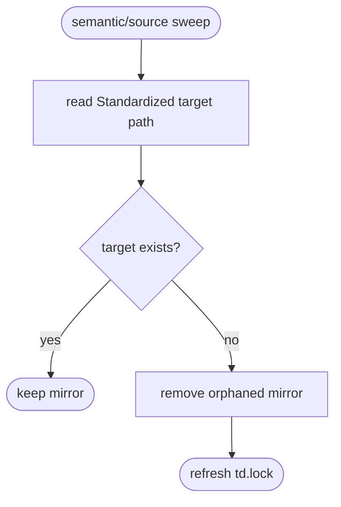

# TD: Orphaned semantic mirror snapshots for deleted wal_relay files

## Logic
<!-- type: logic lang: mermaid -->

```mermaid
---
id: lumen-orphaned-semantic-mirror-cleanup
entry: start
nodes:
  start: { kind: start, label: "sweep projects/lumen/tech-design/semantic/source/*.md" }
  extract: { kind: process, label: "extract '# Standardized <path>' target from each semantic source mirror" }
  exists: { kind: decision, label: "target exists on disk?" }
  keep: { kind: terminal, label: "keep mirror" }
  delete: { kind: process, label: "delete orphaned mirror snapshot" }
  lock: { kind: terminal, label: "refresh projects/lumen/tech-design/td.lock" }
edges:
  - { from: start, to: extract }
  - { from: extract, to: exists }
  - { from: exists, to: keep, label: "yes" }
  - { from: exists, to: delete, label: "no" }
  - { from: delete, to: lock }
---
flowchart TD
    start([semantic/source sweep]) --> extract[read Standardized target path]
    extract --> exists{target exists?}
    exists -->|yes| keep([keep mirror])
    exists -->|no| delete[remove orphaned mirror]
    delete --> lock([refresh td.lock])
```
